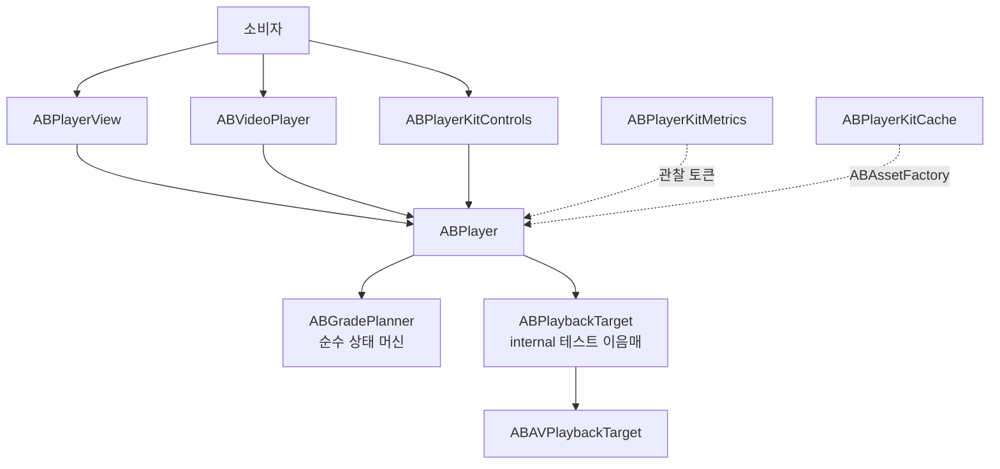

# ABPlayerKit

[English](README.md)


[](https://github.com/AppBoong/ABPlayerKit/actions/workflows/ci.yml)

ABPlayerKit은 `AVPlayer`를 얇게 감싸면서 측정 가능성을 제공하는 래퍼입니다. 네 단계 재생 등급 상태 머신으로 재생 자원 소유권을 명시하고, 첫 프레임 표시 시간(TTFF)을 정확히 정의합니다. 현재 아이템에 대해 `AVPlayerLayer.isReadyForDisplay`와 `AVPlayerItem.status == .readyToPlay`가 **모두** 참일 때만 첫 프레임이 표시된 것으로 판단합니다.

AVFoundation을 숨기지 않으면서 승격과 강등을 대칭으로 처리하고, 선택 기능인 컨트롤·메트릭·캐시는 독립적으로 링크하는 별도 타겟으로 분리합니다.

<table>
<tr>
<td align="center" width="50%">
<br>
<sub>재생 화면</sub>
</td>
<td align="center" width="50%">
<br>
<sub>컨트롤 오버레이</sub>
</td>
</tr>
<tr>
<td align="center" width="50%">
<br>
<sub>Tinted 스타일 변형</sub>
</td>
<td align="center" width="50%">
<br>
<sub>캐시 화면</sub>
</td>
</tr>
</table>

스크린샷은 `Examples/ABPlayerKitDemo` 앱에서 Apple HLS bipbop 테스트 스트림을 재생한 화면입니다.

## 요구 사항

- iOS 17+
- Swift 6 언어 모드
- Xcode 16+

## 설치

Xcode에서 **File → Add Package Dependencies**를 선택하고 다음 주소를 추가합니다.

```text
https://github.com/AppBoong/ABPlayerKit.git
```

또는 `Package.swift`에 추가합니다.

```swift
dependencies: [
    .package(
        url: "https://github.com/AppBoong/ABPlayerKit.git",
        from: "0.2.0"
    )
],
targets: [
    .target(
        name: "YourApp",
        dependencies: [
            .product(name: "ABPlayerKit", package: "ABPlayerKit"),
            // 필요할 때만 링크합니다.
            .product(name: "ABPlayerKitControls", package: "ABPlayerKit"),
            .product(name: "ABPlayerKitMetrics", package: "ABPlayerKit"),
            .product(name: "ABPlayerKitCache", package: "ABPlayerKit")
        ]
    )
]
```

릴리스 전 개발 버전을 사용하려면 `from: "0.2.0"`을 `branch: "main"`으로 바꾸세요. 애플리케이션에서는 위의 버전 조건 사용을 권장합니다.

## 빠른 시작

플레이어 하나를 만들고 모든 소스/등급 변경을 `set(source:grade:)`로 처리합니다.

```swift
import ABPlayerKit

let source = ABMediaSource(
    url: URL(string: "https://example.com/video.m3u8")!,
    kind: .hls
)

let player = ABPlayer()
player.set(source: source, grade: .preloaded)

// 미디어가 화면에 표시될 때
player.set(source: source, grade: .current)
player.play()

// 프리로드 윈도우를 벗어날 때
player.set(source: source, grade: .instanceOnly)
```

### UIKit과 `ABPlayerView`

```swift
import ABPlayerKit
import UIKit

@MainActor
final class PlayerViewController: UIViewController {
    private let player = ABPlayer()
    private let playerView = ABPlayerView()

    override func viewDidLoad() {
        super.viewDidLoad()

        playerView.frame = view.bounds
        playerView.autoresizingMask = [.flexibleWidth, .flexibleHeight]
        playerView.player = player
        view.addSubview(playerView)

        let source = ABMediaSource(
            url: URL(string: "https://example.com/video.mp4")!,
            kind: .progressive
        )
        player.set(source: source, grade: .current)
        player.play()
    }
}
```

### SwiftUI와 `ABVideoPlayer`

```swift
import ABPlayerKit
import SwiftUI

struct VideoScreen: View {
    @State private var player = ABPlayer()

    var body: some View {
        ABVideoPlayer(player: player, videoGravity: .resizeAspect)
            .aspectRatio(16 / 9, contentMode: .fit)
            .task {
                let source = ABMediaSource(
                    url: URL(string: "https://example.com/video.m3u8")!,
                    kind: .hls
                )
                player.set(source: source, grade: .current)
                player.play()
            }
            .onDisappear {
                player.release()
            }
    }
}
```

## 타겟

| 제품 | 추가 기능 | 링크 시점 |
|---|---|---|
| `ABPlayerKit` | 재생 엔진, UIKit 렌더링, SwiftUI 비디오 래퍼 | 항상 |
| `ABPlayerKitControls` | 타임라인, 버튼, 배속 선택, 자동 숨김, UIKit/SwiftUI 컨트롤 | 표준 컨트롤 레이어가 필요할 때 |
| `ABPlayerKitMetrics` | TTFF 기록, sink, 집계 | 재생을 측정할 때 |
| `ABPlayerKitCache` | 프로그레시브 캐시와 명시적 HLS 프리페치 | 오프라인/캐시 동작을 소유할 때 |

### `ABPlayerKit` — 코어

코어 타겟은 재생 상태 머신, UIKit 뷰, SwiftUI 래퍼, 튜닝, 백그라운드/오디오 정책, 토큰 기반 이벤트를 소유합니다.

| 등급 | 보유 자원 | 용도 |
|---|---|---|
| `.released` | 없음 | 모든 재생 자원 반환 |
| `.instanceOnly` | `AVPlayer`, 아이템 없음 | 플레이어 식별성은 유지하면서 아이템 네트워크 활동을 0으로 보장 |
| `.preloaded` | 플레이어 + 아이템, 프리로드 튜닝 | `play()`를 허용하지 않고 인접 미디어 준비 |
| `.current` | 플레이어 + 아이템, 현재 재생 튜닝 | 화면에 보이는 미디어이며 재생 제어 허용 |

아이템을 보유한 모든 해제 경로는 `detachItem`을 거칩니다. `.preloaded`와 `.current` 사이를 이동할 때 대응하는 튜닝 역할을 다시 적용하므로 강등은 승격의 정확한 역연산입니다.

이벤트에는 여러 소비자가 독립적으로 연결할 수 있습니다.

```swift
let token = player.addObserver { event in
    if case .firstFrameDisplayed(let timestamp) = event {
        print("첫 프레임 표시 시각: \(timestamp)")
    }
}

// 관찰이 필요한 동안 token을 보관합니다.
token.cancel()
```

`ABPlayerEvent`는 비전수(non-exhaustive) 열거형으로 취급하세요. 마이너 릴리스에서 케이스가 추가될 수 있으므로 소비자 코드의 `switch`에는 반드시 `default` 분기를 두어야 합니다.

#### 오디오 세션과 인터럽션

`ABPlayer`는 명시적으로 옵트인하지 않는 한 프로세스 전역 `AVAudioSession`을 절대 건드리지 않습니다 — 둘 다 기본값이 꺼짐입니다.

```swift
var configuration = ABPlayerConfiguration()
configuration.audioSessionPolicy = .playback(mixWithOthers: false)
configuration.interruptionPolicy = .pauseAndResume
player.configuration = configuration
```

- **`audioSessionPolicy`** (기본값 `.unmanaged`): `.playback` 또는 `.ambient`로 설정하면 이 플레이어가 `.current`가 되는 순간(또는 `play()` 시작 시) 카테고리가 적용되고, 자동으로 복원됩니다. 여러 플레이어가 동시에 존재하는 경우(피드의 `.preloaded`/`.current` 셀들) 프로세스 전역 `ABAudioSessionCoordinator` 하나를 공유하므로, 카테고리는 *최초* 참여 플레이어가 적용하기 직전에만 캡처되고 *마지막* 참여 플레이어가 해제될 때만 복원됩니다 — 한 플레이어의 `release()`가 세션을 여전히 사용 중인 다른 플레이어를 방해하지 않습니다.
- **`interruptionPolicy`** (기본값 `.ignore`): `.pauseAndResume`으로 설정하면 전화, Siri, 다른 앱이 재생을 중단시켰을 때 자동으로 일시 정지하고, 인터럽션이 끝나면 재생을 재개합니다 — 단, 시스템이 `AVAudioSessionInterruptionOptionKey.shouldResume`을 보고하고 이 플레이어가 실제로 재생 중이었을 때만입니다. 재개 시 `audioSessionPolicy`가 사용하는 것과 동일한 coordinator를 통해 오디오 세션을 재활성화하므로 두 기능이 자동으로 함께 작동합니다.
- **`pausesOnRouteChangeDeviceUnavailable`** (기본값 `true`, `interruptionPolicy`와 무관): 현재 출력 장치가 사라지면(예: 헤드폰 분리) 일시 정지합니다 — 플랫폼 HIG 기대에 부합합니다. 원치 않으면 `false`로 설정하세요.

두 경로 모두 동일한 `ABPlayerEvent` 스트림으로 통지됩니다: `.audioInterruptionBegan`, `.audioInterruptionEnded(resumed:)`, `.audioRouteChangedDeviceUnavailable`.

### `ABPlayerKitControls` — 선택형 재생 컨트롤

UIKit 앱에서는 `ABPlayerControlsView`를 `ABPlayerView` 위에 배치하고 같은 플레이어를 연결합니다.

```swift
import ABPlayerKit
import ABPlayerKitControls

let videoView = ABPlayerView()
videoView.player = player

let controlsView = ABPlayerControlsView()
controlsView.player = player
```

SwiftUI 앱에서는 미리 조립된 편의 뷰를 사용할 수 있습니다.

```swift
import ABPlayerKit
import ABPlayerKitControls
import SwiftUI

ABVideoPlayerWithControls(
    player: player,
    videoGravity: .resizeAspect
)
.aspectRatio(16 / 9, contentMode: .fit)
```

표준 오버레이에서는 뒤로 건너뛰기, 재생/일시 정지, 앞으로 건너뛰기 버튼이 영상 중앙에 놓입니다. 탐색 막대는 하단에 붙고, `HH:mm:ss/HH:mm:ss` 형식의 경과/전체 시간은 탐색 막대 바로 위 왼쪽에, 재생 속도는 오른쪽 하단에 놓입니다. 기본 흰색/회색 컨트롤은 불투명도가 낮은 어두운 스크림을 사용해 영상이 선명하게 비치도록 합니다.

스타일은 기존 컨트롤 뷰에 즉시 반영됩니다. 뒷편 트랙, 재생 완료 구간, 썸 외형, 아이콘을 각각 바꿀 수 있습니다.

```swift
var style = ABPlayerControlsStyle.default
style.trackColor = .white.withAlphaComponent(0.2)
style.progressColor = .systemPink
style.thumbColor = .systemPink
style.thumbSize = CGSize(width: 14, height: 14)
style.playIcon = .system("play.circle.fill")
style.pauseIcon = .system("pause.circle.fill")

controlsView.style = style
```

동작은 `ABPlayerControlsConfiguration`으로 설정합니다. 주기 UI 갱신 간격 기본값은 0.25초이고, 지원되는 스킵 간격에 맞춰 아이콘을 동기화하며, 배속 선택은 메뉴·순환·숨김 모드를 지원합니다. VoiceOver 실행 중에는 자동 숨김을 억제하고 Reduce Motion에서는 페이드를 제거합니다.

컨트롤을 별도 제품으로 둔 이유는 피드나 백그라운드 플레이어가 자체 제스처를 제공하거나 UI가 전혀 없는 경우가 많기 때문입니다. 그런 소비자는 작은 코어만 링크하고, 표준 플레이어 화면만 UIKit 컨트롤과 SwiftUI 래퍼를 import 한 줄로 선택합니다.

### `ABPlayerKitMetrics` — 링크로 선택하는 메트릭

`ABPlayerKitMetrics` 제품을 링크하지 않으면 메트릭 코드는 앱에 포함되지 않습니다. `ABMetricsRecorder`는 관찰 토큰으로 연결되고, sink가 이벤트의 목적지를 결정합니다. 메모리, 내부 직렬 큐를 사용하는 JSON Lines, OSLog 구현을 제공합니다.

```swift
import ABPlayerKit
import ABPlayerKitMetrics

@MainActor
final class PlaybackSession {
    let player = ABPlayer()

    private let sink: ABInMemoryMetricsSink
    private let recorder: ABMetricsRecorder
    private var tokens: Set<ABObservationToken> = []

    init() {
        let sink = ABInMemoryMetricsSink()
        self.sink = sink
        self.recorder = ABMetricsRecorder(sink: sink)

        recorder.attach(to: player).store(in: &tokens)
        player.addObserver { [weak self] event in
            guard case .firstFrameDisplayed = event else { return }
            Task { @MainActor [weak self] in
                self?.refreshStatistics()
            }
        }.store(in: &tokens)
    }

    func play(_ source: ABMediaSource) {
        let startedAt = ABMonotonicClock().now
        player.set(source: source, grade: .current)
        recorder.beginTTFF(for: player, at: startedAt)
        player.play()
    }

    private func refreshStatistics() {
        let samples = sink.events.compactMap { event -> ABMetricSample? in
            guard case .ttff(let sample) = event else { return nil }
            return sample
        }
        let statistics = ABPlaybackStatistics.aggregate(samples)
        print(statistics.p50, statistics.p95, statistics.hitRate)
    }
}
```

`PlaybackSession`은 측정이 끝날 때까지 화면이나 코디네이터의 프로퍼티로 보관하세요. sink, recorder, 관찰 토큰은 모두 비동기 첫 프레임 이벤트보다 오래 유지되어야 합니다.

중도 이탈한 TTFF 표본은 `hitRate`와 `abandonRate`의 분모에 남습니다. 측정에서 조용히 제외하지 않습니다.

### `ABPlayerKitCache` — 프로그레시브 캐시와 HLS 프리페치

캐시 타겟은 의도적으로 서로 다른 두 범위를 가집니다.

| 미디어 | 동작 |
|---|---|
| 프로그레시브 MP4 | 커스텀 스킴을 사용하는 투명한 `AVAssetResourceLoader` 가로채기, HTTP Range 처리, 순차 디스크 채움, LRU 축출 |
| HLS | `AVAssetDownloadURLSession`을 통한 명시적 전체 자산 프리페치. 완료된 다운로드만 로컬 재생에 사용 |

```swift
import ABPlayerKitCache

let cache = try ABMediaCache()
let hlsPrefetcher = ABHLSPrefetcher()

// 이 팩토리는 한 번 만들고 보관합니다. 교체 전에는 현재 아이템을 release해야 합니다.
let assetFactory = cache.makeAssetFactory(hlsPrefetcher: hlsPrefetcher)
player.release()
var configuration = player.configuration
configuration.assetFactory = assetFactory
player.configuration = configuration

let handle = hlsPrefetcher.prefetch(hlsSource)
if await handle.result == .completed {
    player.set(source: hlsSource, grade: .current)
    player.play() // 팩토리가 완료된 로컬 HLS 자산을 선택합니다.
}
```

투명한 HLS 세그먼트 캐싱은 의도적으로 v1 범위에서 제외했습니다. `AVAssetResourceLoader`는 일반 HTTP(S) HLS 마스터/미디어 플레이리스트를 가로챌 수 없습니다. 투명 캐싱에는 플레이리스트를 재작성하고 상대 URL, 암호화 키, 백그라운드 수명을 처리하는 로컬 리버스 프록시가 필요합니다. 이는 훨씬 크고 다른 실패 영역이므로 확정된 [Q1 설계 결정](docs/DESIGN-OPEN-QUESTIONS.md)에 따라 별도 범위로 둡니다. [DESIGN-ABPlayerKit §9](docs/DESIGN-ABPlayerKit.md)도 참고하세요.

프로그레시브 MP4 캐싱은 **선형 prefix**이지 sparse range가 아닙니다: 하나의 순차 fill이 파일을 0바이트부터 앞으로 채워나가며, `load(_:range:)`는 일반적으로 그 fill이 요청된 오프셋에 도달할 때까지 기다립니다. non-faststart 파일에서 멀리 떨어진 위치로 시크하면 fill이 순차적으로 그곳까지 도달할 때까지 무한정 기다리게 됩니다. 이를 제한하기 위해, 요청 오프셋이 현재 fill prefix보다 `ABCacheConfiguration.passthroughGapThreshold`(기본 2MB) 이상 앞서 있으면 대기 없이 곧바로 네트워크 직행 passthrough로 처리합니다 — 한 번의 왕복당 최대 1MB로 제한해 간격 전체를 메모리에 한 번에 적재하지 않고 청크 단위로 스트리밍합니다. 백그라운드 fill은 건드리지 않고 계속 앞으로 진행합니다 — 이는 해당 요청 하나를 위한 일회성 폴백일 뿐, 캐시 자체를 그 위치로 재시작하는 것이 아닙니다. 전면적인 sparse range 캐싱은 여전히 범위 밖입니다.

## 튜닝

ABPlayerKit은 프리로드와 현재 재생을 서로 다른 두 튜닝 역할로 모델링합니다. `preloadTuning`은 보수적으로 유지하고, 화면에 보이는 재생에는 `currentTuning`을 선택한 뒤 모든 등급 전환에서 올바른 역할이 적용되도록 합니다.

| 프리셋 | 최대 비트레이트 | 전방 버퍼 | 해상도 | 권장 역할 |
|---|---:|---:|---|---|
| `.conservativePreload` | 2 Mbps | 5초(AVFoundation의 soft hint) | 제한 없음 | `preloadTuning` |
| `.displayCapped` | 무제한 | 자동 | 현재 디스플레이 픽셀 크기 | 기본 `currentTuning` |
| `.resolutionCapped` | 2 Mbps | 5초 | 960×540 | 셀룰러용 `currentTuning` |
| `.unrestricted` | 무제한 | 자동 | 제한 없음 | 제한이 필요 없을 때 명시적으로 선택 |

```swift
var configuration = ABPlayerConfiguration()
configuration.preloadTuning = .conservativePreload
configuration.currentTuning = .displayCapped

let player = ABPlayer(configuration: configuration)
player.set(source: source, grade: .preloaded) // preloadTuning 적용
player.set(source: source, grade: .current)   // currentTuning 적용
player.set(source: source, grade: .preloaded) // preloadTuning 복원
```

이 대칭성은 강등된 아이템에 unrestricted/current 정책이 실수로 남는 것을 막습니다.

## 아키텍처



- UI와 `ABPlayer`는 `@MainActor`로 격리됩니다.
- 등급 계획과 설정은 `Sendable` 값입니다.
- AVFoundation 콜백은 콜백 경계에서 시간을 캡처한 뒤 메인 액터로 이동하고 아이템 식별성을 다시 검증합니다.
- 메트릭과 캐시는 독립적인 소유권과 실패 모드를 가진 선택 제품입니다.

## 설계 근거

### delegate나 `AsyncStream` 대신 옵저버와 토큰을 선택한 이유

delegate 슬롯 하나를 사용하면 앱 동작과 메트릭이 소유권을 놓고 경쟁합니다. 다중 옵저버는 두 소비자가 독립적으로 연결되게 하고, `ABObservationToken`은 명시적 취소와 deinit 자동 취소를 보장합니다. `AsyncStream`은 팬아웃, 버퍼/드롭 정책, 백프레셔, `for await` 태스크 수명 결정을 추가합니다. 스케줄링 때문에 TTFF가 의존하는 콜백 경계 타임스탬프가 흐려질 수도 있습니다. 스트림은 나중에 토큰 API를 깨지 않고 추가할 수 있습니다.

### DI 컨테이너를 사용하지 않는 이유

패키지는 initializer 주입과 `ABPlayerConfiguration`을 사용합니다. 자원 상태를 보이게 만드는 것이 핵심인 라이브러리에서 컨테이너는 소유권과 생명주기를 숨깁니다.

### 테스트 이음매에만 protocol을 두는 이유

ABPlayerKit은 의도적으로 얇은 AVFoundation 래퍼입니다. 대체가 유용한 재생 타겟, 에셋 팩토리, 옵저버, 메트릭 sink, clock에만 protocol을 두고 `avPlayer`와 `avPlayerItem`은 탈출구로 공개합니다. AVFoundation 이름만 바꾸는 추상화 계층을 피하기 위한 선택입니다.

전체 근거는 [DESIGN-ABPlayerKit](docs/DESIGN-ABPlayerKit.md)과 [DESIGN-OPEN-QUESTIONS](docs/DESIGN-OPEN-QUESTIONS.md)에 기록되어 있습니다.

## 데모 앱

독립 iOS 17 데모는 HLS/MP4 재생, 네 등급, 튜닝 역할, TTFF 통계, 프로그레시브 캐싱, 명시적 HLS 프리페치를 실행합니다.

```bash
open Examples/ABPlayerKitDemo/ABPlayerKitDemo.xcodeproj
```

**ABPlayerKitDemo** 스킴을 선택하고 iOS 시뮬레이터에서 실행하세요. 프로젝트가 `../..` 상대 경로로 이 패키지를 참조하므로 클론한 뒤 별도 경로 설정 없이 열립니다.

명령줄 빌드:

```bash
xcodebuild \
  -project Examples/ABPlayerKitDemo/ABPlayerKitDemo.xcodeproj \
  -scheme ABPlayerKitDemo \
  -destination 'platform=iOS Simulator,name=iPhone 16 Pro' \
  build
```

세로 숏폼 피드와 프리로드 윈도우 오케스트레이션은 [ABShortsKit](https://github.com/AppBoong/ABShortsKit)을 참고하세요.

## 라이선스

ABPlayerKit은 [MIT License](LICENSE)로 제공됩니다. Copyright © 2026 AppBoong.
