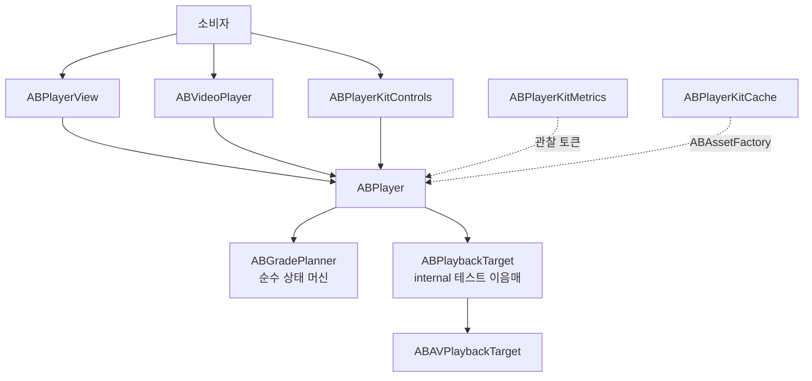

# ABPlayerKit

[English](README.md)


[](https://github.com/AppBoong/ABPlayerKit/actions/workflows/ci.yml)
[](https://github.com/AppBoong/ABPlayerKit/actions/workflows/ci.yml)

ABPlayerKit은 `AVPlayer`를 얇게 감싸면서 측정 가능성을 제공하는 래퍼입니다. 네 단계 재생 등급 상태 머신으로 재생 자원 소유권을 명시하고, 첫 프레임 표시 시간(TTFF)을 정확히 정의합니다. 현재 아이템에 대해 `AVPlayerLayer.isReadyForDisplay`와 `AVPlayerItem.status == .readyToPlay`가 **모두** 참일 때만 첫 프레임이 표시된 것으로 판단합니다.

AVFoundation을 숨기지 않으면서 승격과 강등을 대칭으로 처리하고, 선택 기능인 컨트롤·메트릭·캐시는 독립적으로 링크하는 별도 타겟으로 분리합니다.

<table>
<tr>
<td align="center" width="50%">
<br>
<sub>재생 화면</sub>
</td>
<td align="center" width="50%">
<br>
<sub>컨트롤 오버레이</sub>
</td>
</tr>
<tr>
<td align="center" width="50%">
<br>
<sub>Tinted 스타일 변형</sub>
</td>
<td align="center" width="50%">
<br>
<sub>캐시 화면</sub>
</td>
</tr>
</table>

스크린샷은 `Examples/ABPlayerKitDemo` 앱에서 Apple HLS bipbop 테스트 스트림을 재생한 화면입니다.

## 요구 사항

- iOS 17+
- Swift 6 언어 모드
- Xcode 16+

## 설치

Xcode에서 **File → Add Package Dependencies**를 선택하고 다음 주소를 추가합니다.

```text
https://github.com/AppBoong/ABPlayerKit.git
```

또는 `Package.swift`에 추가합니다.

```swift
dependencies: [
    .package(
        url: "https://github.com/AppBoong/ABPlayerKit.git",
        from: "0.3.0"
    )
],
targets: [
    .target(
        name: "YourApp",
        dependencies: [
            .product(name: "ABPlayerKit", package: "ABPlayerKit"),
            // 필요할 때만 링크합니다.
            .product(name: "ABPlayerKitControls", package: "ABPlayerKit"),
            .product(name: "ABPlayerKitMetrics", package: "ABPlayerKit"),
            .product(name: "ABPlayerKitCache", package: "ABPlayerKit"),
            .product(name: "ABPlayerKitNowPlaying", package: "ABPlayerKit")
        ]
    )
]
```

릴리스 전 개발 버전을 사용하려면 `from: "0.3.0"`을 `branch: "main"`으로 바꾸세요. 애플리케이션에서는 위의 버전 조건 사용을 권장합니다.

## 빠른 시작

URL 하나로 표준 컨트롤까지 재생합니다 — 이게 통합의 전부입니다.

```swift
import ABPlayerKit
import ABPlayerKitControls
import SwiftUI

struct VideoScreen: View {
    var body: some View {
        ABVideoPlayerWithControls(url: URL(string: "https://example.com/video.m3u8")!)
            .aspectRatio(16 / 9, contentMode: .fit)
    }
}
```

이 뷰는 스스로 `ABPlayer`를 만들고, 재생을 시작하며, SwiftUI가 뷰를 폐기할 때 모든 재생 자원을 해제합니다. 미디어 종류는 URL에서 추론됩니다(`.m3u8` → HLS, 그 외 → progressive).

컨트롤 오버레이 없이 코어 타겟만 쓰려면:

```swift
import ABPlayerKit
import SwiftUI

ABVideoPlayer(url: url, videoGravity: .resizeAspect)
```

### 커스터마이징

컨트롤의 외형과 동작은 view modifier로 설정하므로, modifier 하나로 화면 전체의 플레이어를 한 번에 다룰 수 있습니다.

```swift
var style = ABPlayerControlsStyle.default
style.progressColor = .systemPink

var controls = ABPlayerControlsConfiguration()
controls.skipInterval = 15

ABVideoPlayerWithControls(url: url)
    .playerControlsStyle(style)
    .playerControlsConfiguration(controls)
```

플레이어 단 설정(음소거, 반복, 오디오 세션, 배속)은 생성 시점에 `ABPlayerConfiguration`으로 전달합니다.

```swift
var configuration = ABPlayerConfiguration()
configuration.isMuted = true
configuration.audioSessionPolicy = .playback(mixWithOthers: false)

ABVideoPlayerWithControls(url: url, playerConfiguration: configuration)
```

> 뷰가 화면 밖으로 나가도 살아 있는 동안에는 재생이 계속됩니다. 화면 전환에 따라 일시정지가 필요한 화면은 아래처럼 플레이어를 직접 소유하세요.

### 플레이어를 직접 소유하기

여러 뷰가 플레이어를 공유하거나, 재생이 뷰 하나보다 오래 유지되어야 하거나, 피드 전반에 걸쳐 프리로드를 직접 제어해야 할 때는 `ABPlayer`를 직접 소유합니다.

```swift
struct VideoScreen: View {
    @State private var player = ABPlayer()

    var body: some View {
        ABVideoPlayerWithControls(player: player, videoGravity: .resizeAspect) {}
            .aspectRatio(16 / 9, contentMode: .fit)
            .task {
                player.set(source: ABMediaSource(url: url), grade: .current)
                player.play()
            }
            .onDisappear {
                player.release()
            }
    }
}
```

### UIKit과 `ABPlayerView`

```swift
import ABPlayerKit
import UIKit

@MainActor
final class PlayerViewController: UIViewController {
    private let player = ABPlayer()
    private let playerView = ABPlayerView()

    override func viewDidLoad() {
        super.viewDidLoad()

        playerView.frame = view.bounds
        playerView.autoresizingMask = [.flexibleWidth, .flexibleHeight]
        playerView.player = player
        view.addSubview(playerView)

        let source = ABMediaSource(url: URL(string: "https://example.com/video.mp4")!)
        player.set(source: source, grade: .current)
        player.play()
    }
}
```

### 고급 — 등급과 프리로드

화면이 아직 보이지 않는 미디어를 미리 준비해야 할 때(예: 몇 줄 아래 있는 피드 셀) 플레이어 하나를 만들고 모든 소스/등급 변경을 `set(source:grade:)`로 처리합니다.

```swift
import ABPlayerKit

let source = ABMediaSource(
    url: URL(string: "https://example.com/video.m3u8")!,
    kind: .hls
)

let player = ABPlayer()
player.set(source: source, grade: .preloaded)

// 미디어가 화면에 표시될 때
player.set(source: source, grade: .current)
player.play()

// 프리로드 윈도우를 벗어날 때
player.set(source: source, grade: .instanceOnly)
```

| 등급 | 보유 자원 | 용도 |
|---|---|---|
| `.released` | 없음 | 모든 재생 자원 반환 |
| `.instanceOnly` | `AVPlayer`, 아이템 없음 | 플레이어 식별성은 유지하면서 아이템 네트워크 활동을 0으로 보장 |
| `.preloaded` | 플레이어 + 아이템, 프리로드 튜닝 | `play()`를 허용하지 않고 인접 미디어 준비 |
| `.current` | 플레이어 + 아이템, 현재 재생 튜닝 | 화면에 보이는 미디어이며 재생 제어 허용 |

아이템을 보유한 모든 해제 경로는 `detachItem`을 거칩니다. `.preloaded`와 `.current` 사이를 이동할 때 대응하는 튜닝 역할을 다시 적용하므로 강등은 승격의 정확한 역연산입니다.

`ABMediaSource`의 `kind:`는 URL의 확장자에서 추론됩니다(`.m3u8` → `.hls`, 그 외 → `.progressive`) — 이 추론이 틀릴 수 있는 서명된/확장자 없는 URL일 때만 명시적으로 지정하세요.

## 타겟

| 제품 | 추가 기능 | 링크 시점 |
|---|---|---|
| `ABPlayerKit` | 재생 엔진, UIKit 렌더링, SwiftUI 비디오 래퍼 | 항상 |
| `ABPlayerKitControls` | 타임라인, 버튼, 배속 선택, 자동 숨김, UIKit/SwiftUI 컨트롤 | 표준 컨트롤 레이어가 필요할 때 |
| `ABPlayerKitMetrics` | TTFF 기록, sink, 집계 | 재생을 측정할 때 |
| `ABPlayerKitCache` | 프로그레시브 캐시와 명시적 HLS 프리페치 | 오프라인/캐시 동작을 소유할 때 |
| `ABPlayerKitNowPlaying` | 잠금화면/제어 센터 연동(`MPNowPlayingInfoCenter`, `MPRemoteCommandCenter`) | 원격 커맨드/잠금화면 재생을 원할 때 |

### `ABPlayerKit` — 코어

코어 타겟은 재생 상태 머신, UIKit 뷰, SwiftUI 래퍼, 튜닝, 백그라운드/오디오 정책, 토큰 기반 이벤트를 소유합니다.

재생은 네 단계 등급을 거쳐 이동합니다 — 전체 표와 `.preloaded`/`.instanceOnly` 예제는 위의 [고급 — 등급과 프리로드](#고급--등급과-프리로드)를 참고하세요. 아이템을 보유한 모든 해제 경로는 `detachItem`을 거치며, `.preloaded`와 `.current` 사이를 이동할 때 대응하는 튜닝 역할을 다시 적용하므로 강등은 승격의 정확한 역연산입니다.

이벤트에는 여러 소비자가 독립적으로 연결할 수 있습니다.

```swift
let token = player.addObserver { event in
    if case .firstFrameDisplayed(let timestamp) = event {
        print("첫 프레임 표시 시각: \(timestamp)")
    }
}

// 관찰이 필요한 동안 token을 보관합니다.
token.cancel()
```

`ABPlayerEvent`는 비전수(non-exhaustive) 열거형으로 취급하세요. 마이너 릴리스에서 케이스가 추가될 수 있으므로 소비자 코드의 `switch`에는 반드시 `default` 분기를 두어야 합니다.

#### 오디오 세션과 인터럽션

`ABPlayer`는 명시적으로 옵트인하지 않는 한 프로세스 전역 `AVAudioSession`을 절대 건드리지 않습니다 — 둘 다 기본값이 꺼짐입니다.

```swift
var configuration = ABPlayerConfiguration()
configuration.audioSessionPolicy = .playback(mixWithOthers: false)
configuration.interruptionPolicy = .pauseAndResume
player.configuration = configuration
```

- **`audioSessionPolicy`** (기본값 `.unmanaged`): `.playback` 또는 `.ambient`로 설정하면 이 플레이어가 `.current`가 되는 순간(또는 `play()` 시작 시) 카테고리가 적용되고, 자동으로 복원됩니다. 여러 플레이어가 동시에 존재하는 경우(피드의 `.preloaded`/`.current` 셀들) 프로세스 전역 `ABAudioSessionCoordinator` 하나를 공유하므로, 카테고리는 *최초* 참여 플레이어가 적용하기 직전에만 캡처되고 *마지막* 참여 플레이어가 해제될 때만 복원됩니다 — 한 플레이어의 `release()`가 세션을 여전히 사용 중인 다른 플레이어를 방해하지 않습니다.
  - **주의**: 호스트 앱이 이 플레이어의 첫 참여자가 정책을 적용하기 전에 이미 `AVAudioSession`을 스스로 활성화해 둔 상태였다면(자체 오디오가 이미 재생 중이었다면), 마지막 해제 시점의 복원이 호스트가 활성화해 둔 세션을 그대로 비활성화할 수 있습니다. `AVAudioSession`은 "이미 활성 상태였는지"를 조회할 수 있는 공개 API를 제공하지 않으므로 스냅샷으로 남길 방법이 없고, "우리가 활성화했다"와 구분할 수도 없습니다 — 세션을 공유하는 호스트 앱이라면 이 점을 감안해 자체 세션 처리를 설계하세요.
- **`interruptionPolicy`** (기본값 `.ignore`): `.pauseAndResume`으로 설정하면 전화, Siri, 다른 앱이 재생을 중단시켰을 때 자동으로 일시 정지하고, 인터럽션이 끝나면 재생을 재개합니다 — 단, 시스템이 `AVAudioSessionInterruptionOptionKey.shouldResume`을 보고하고 이 플레이어가 실제로 재생 중이었을 때만입니다. 재개 시 `audioSessionPolicy`가 사용하는 것과 동일한 coordinator를 통해 오디오 세션을 재활성화하므로 두 기능이 자동으로 함께 작동합니다.
- **`pausesOnRouteChangeDeviceUnavailable`** (기본값 `true`, `interruptionPolicy`와 무관): 현재 출력 장치가 사라지면(예: 헤드폰 분리) 일시 정지합니다 — 플랫폼 HIG 기대에 부합합니다. 원치 않으면 `false`로 설정하세요.

두 경로 모두 동일한 `ABPlayerEvent` 스트림으로 통지됩니다: `.audioInterruptionBegan`, `.audioInterruptionEnded(resumed:)`, `.audioRouteChangedDeviceUnavailable`.

#### 백그라운드 정책

`ABPlayerConfiguration.backgroundPolicy`는 `.current` 플레이어가 앱이 포그라운드를 벗어날 때 어떻게 반응할지 결정합니다. 기본값은 `.pause`입니다.

| 정책 | 백그라운드 진입 시 | 포그라운드 복귀 시 |
|---|---|---|
| `.ignore` | 아무것도 하지 않음 | 아무것도 하지 않음(오디오 세션을 재활성화 대상으로 표시하는 것 제외) |
| `.pause` (기본값) | `.current`면 일시정지 | 재생 중이었다면 재개 |
| `.pauseAndDetachLayer` | `.current`면 일시정지, `AVPlayerLayer.player`를 뗌(디코더 해제) | 레이어 재부착, 재생 중이었다면 재개 |
| `.demoteToInstance` | `.instanceOnly`로 강등(아이템 폐기, 네트워크 완전 차단) | 이전 등급 복원 |
| `.continueAudioOnly` | `AVPlayerLayer.player`만 뗌 — 재생은 계속됨 | 레이어 재부착, 시스템이 재생을 멈췄을 때만 재개 — 명시적 `pause()`는 절대 덮어쓰지 않음 |

`.continueAudioOnly`는 백그라운드 상태에서도 재생이 계속되는 유일한 정책이라, 사용자가 그 상태에서 일시정지할 수 있는 유일한 정책이기도 합니다 — 잠금 화면, Now Playing Center, 또는 Controls를 통해서요. 백그라운드 중 명시적으로 호출된 `pause()`는 그대로 우선하며 포그라운드 복귀 시에도 재개되지 않습니다. 위의 안전망 재개는 그 사이에 `pause()` 호출 없이 시스템이 스스로 재생을 멈춘 경우에만 적용됩니다.

`.continueAudioOnly`는 아래 세 조건이 모두 갖춰져야 하며, 하나라도 빠지면 `.pause`처럼 조용히 동작합니다(시스템이 앱을 서스펜드하고, 이 정책은 포그라운드 복귀 시 안전망으로 재생을 재개합니다).

| # | 조건 | 설정 주체 |
|---|---|---|
| 1 | `UIBackgroundModes`에 `audio` 포함 | 호스트 앱의 `Info.plist` — 라이브러리가 대신 해 줄 수 없음 |
| 2 | `configuration.audioSessionPolicy = .playback(mixWithOthers: false)`(또는 `.ambient`) | 앱이 `ABPlayerConfiguration`으로 설정 |
| 3 | `configuration.backgroundPolicy = .continueAudioOnly` | 앱이 `ABPlayerConfiguration`으로 설정 |

`ABBackgroundPolicy`는 비전수(non-exhaustive)입니다 — 라이브러리 밖에서 이 타입을 `switch`할 때는 `default` 분기를 포함해야 합니다.

#### Picture in Picture

`ABPictureInPictureSession`을 `ABPlayerView`에 바인딩하거나, `ABVideoPlayer`의 **명시 소유** 이니셜라이저에 전달합니다.

```swift
import ABPlayerKit
import SwiftUI

struct VideoScreen: View {
    let player: ABPlayer
    @State private var pictureInPicture = ABPictureInPictureSession()

    var body: some View {
        ABVideoPlayer(player: player, pictureInPicture: pictureInPicture)
            .aspectRatio(16 / 9, contentMode: .fit)
            .overlay(alignment: .topTrailing) {
                if pictureInPicture.isPossible {
                    Button(pictureInPicture.isActive ? "PiP 종료" : "PiP 시작") {
                        pictureInPicture.isActive ? pictureInPicture.stop() : pictureInPicture.start()
                    }
                }
            }
    }
}
```

세션이 활성인 동안에는 그 플레이어에 대해 모든 `ABBackgroundPolicy`의 자동 백그라운드/포그라운드 부작용이 억제됩니다 — PiP가 자기 자신에 의해 일시정지되거나 레이어가 떨어져 나가지 않고 계속 렌더링·재생됩니다. 억제되는 것은 *자동* 부작용뿐이며, `release()` 같은 명시적 호출은 여전히 PiP를 종료시킵니다.

| 전제조건 | 제공 주체 |
|---|---|
| `UIBackgroundModes`에 `audio` 포함(PiP가 백그라운드에서도 유지되어야 한다면) | 호스트 앱의 `Info.plist` — 라이브러리가 대신 해 줄 수 없음 |
| `configuration.audioSessionPolicy != .unmanaged` | 앱이 `ABPlayerConfiguration`으로 설정 |
| 기기/OS가 Picture in Picture 지원 | `ABPictureInPictureSession.isSupported` 확인 — 시뮬레이터에서는 대체로 `false` |
| 바인딩된 레이어가 표시 준비됨 | `session.isPossible`에 반영됨 |

**Picture in Picture는 명시 소유 경로(`player:` 이니셜라이저)에서만 지원됩니다.** `url:`/`source:` 편의 이니셜라이저는 SwiftUI identity가 폐기될 때 소유한 플레이어를 해제하므로 PiP가 도중에 끊길 수 있습니다 — 그래서 이 이니셜라이저들은 `pictureInPicture:` 파라미터를 받지 않습니다.

#### AirPlay

`ABPlayerConfiguration`의 세 프로퍼티가 대응하는 `AVPlayer` 프로퍼티로 그대로 전달되며, 모두 `AVPlayer` 자체 기본값과 동일합니다(기존 소비자의 동작이 바뀌지 않습니다).

```swift
var configuration = ABPlayerConfiguration()
configuration.allowsExternalPlayback = true                          // 기본값
configuration.usesExternalPlaybackWhileExternalScreenIsActive = false // 기본값
configuration.externalPlaybackVideoGravity = .resizeAspect            // 기본값
```

AirPlay가 현재 활성인지는 `player.isExternalPlaybackActive`로 확인합니다 — 매번 `AVPlayer`를 다시 읽는 평범한 computed 프로퍼티이며 `@Observable` 추적 대상이 아닙니다. 반응형 신호가 필요하면 `player.avPlayer`를 직접 KVO하거나 `AVRoutePickerView`가 자체 관리하는 상태를 사용하세요.

```swift
import AVKit
import SwiftUI

struct AirPlayButton: UIViewRepresentable {
    func makeUIView(context: Context) -> AVRoutePickerView { AVRoutePickerView() }
    func updateUIView(_ uiView: AVRoutePickerView, context: Context) {}
}
```

여러 플레이어가 동시에 살아 있는 화면(피드)에서는 현재 셀을 제외한 나머지 인스턴스에 `allowsExternalPlayback = false`를 설정하세요.

#### 자막과 오디오 트랙

자막/오디오 트랙 선택 UI와 상태 관리는 이 라이브러리가 **제공하지 않습니다.** 탈출구를 통해 `AVMediaSelectionGroup`에 직접 접근하세요.

```swift
if let item = player.avPlayerItem,
   let group = item.asset.mediaSelectionGroup(forMediaCharacteristic: .audible) {
    let options = group.options
    // options를 표시한 뒤:
    item.select(options[0], in: group)
}
```

세 가지 제약이 있습니다.

1. `player.avPlayerItem`은 `.preloaded` 이상 등급에서만 `nil`이 아닙니다(`ABPlaybackGrade.holdsItem`).
2. 소스 교체·강등·`release()`마다 아이템이 **새로** 만들어집니다(`ABAVPlaybackTarget`이 처음부터 다시 attach). 이전 아이템에서 선택한 값은 이어지지 않습니다 — 매 `.itemAttached(source:)` 이벤트마다 다시 적용하세요.
3. 이 라이브러리는 attach 사이에 선택 상태를 기억하지 않습니다. 그 책임은 전적으로 소비자에게 있습니다.

### `ABPlayerKitControls` — 선택형 재생 컨트롤

UIKit 앱에서는 `ABPlayerControlsView`를 `ABPlayerView` 위에 배치하고 같은 플레이어를 연결합니다.

```swift
import ABPlayerKit
import ABPlayerKitControls

let videoView = ABPlayerView()
videoView.player = player

let controlsView = ABPlayerControlsView()
controlsView.player = player
```

SwiftUI 앱에서는 미리 조립된 편의 뷰를 사용할 수 있습니다.

```swift
import ABPlayerKit
import ABPlayerKitControls
import SwiftUI

ABVideoPlayerWithControls(
    player: player,
    videoGravity: .resizeAspect
) {}
.aspectRatio(16 / 9, contentMode: .fit)
```

표준 오버레이에서는 뒤로 건너뛰기, 재생/일시 정지, 앞으로 건너뛰기 버튼이 영상 중앙에 놓입니다. 탐색 막대는 하단에 붙고, `HH:mm:ss/HH:mm:ss` 형식의 경과/전체 시간은 탐색 막대의 보이는 트랙 바로 아래 왼쪽에, 재생 속도는 오른쪽 하단에 놓입니다. 기본 흰색/회색 컨트롤은 불투명도가 낮은 어두운 스크림을 사용해 영상이 선명하게 비치도록 합니다.

스타일은 기존 컨트롤 뷰에 즉시 반영됩니다. 뒷편 트랙, 재생 완료 구간, 썸 외형, 아이콘을 각각 바꿀 수 있습니다.

```swift
var style = ABPlayerControlsStyle.default
style.trackColor = .white.withAlphaComponent(0.2)
style.progressColor = .systemPink
style.thumbColor = .systemPink
style.thumbSize = CGSize(width: 14, height: 14)
style.playIcon = .system("play.circle.fill")
style.pauseIcon = .system("pause.circle.fill")

controlsView.style = style
```

동작은 `ABPlayerControlsConfiguration`으로 설정합니다. 주기 UI 갱신 간격 기본값은 0.25초이고, 지원되는 스킵 간격에 맞춰 아이콘을 동기화하며, 배속 선택은 메뉴·순환·숨김 모드를 지원합니다. VoiceOver 실행 중에는 자동 숨김을 억제하고 Reduce Motion에서는 페이드를 제거합니다. 재생이 끝에 도달한 뒤 재생 버튼을 누르면(끝에서는 아무 일도 하지 않는 단순 `play()` 대신) 처음으로 되감은 뒤 재생합니다(replay-from-start).

레이아웃 코드를 건드리지 않고도 개별 컨트롤을 숨길 수 있습니다 — `showsPlayPauseButton`/`showsSeekBar`(둘 다 기본값 `true`)는 기존 `showsSkipButtons`와 같은 방식으로 동작합니다. 탐색 막대를 숨기면 그 막대가 차지하던 행이 접힙니다.

`ABPlayer.isBuffering`이 `true`인 동안에는 재생/일시정지 버튼의 아이콘 위에 스피너가 겹쳐 표시됩니다 — 버튼 자체는 계속 활성화된 채 히트 테스트가 가능합니다(멈춘 상태에서도 일시정지는 가능해야 하므로). `showsBufferingIndicator`(기본값 `true`)와 `ABPlayerControlsStyle.bufferingIndicatorColor`(기본값 `nil`, `tintColor`를 따름)로 제어합니다. 버퍼링 중에는 컨트롤을 강제로 보이게 하지는 않으면서 자동 숨김만 억제합니다.

```swift
var configuration = ABPlayerControlsConfiguration()
configuration.showsBufferingIndicator = true
configuration.touchPassthrough = .whenControlsHidden
configuration.doubleTapSeek = .edges(edgeWidthFraction: 0.3)
configuration.providesHapticFeedback = true
configuration.rateLabelFormat = .automatic
configuration.timeLabelSeparator = "/"

controlsView.configuration = configuration
```

- **`touchPassthrough`**(`ABControlsTouchPassthrough`, 기본값 `.never`): 어떤 컨트롤에도 맞지 않은 터치를 오버레이 뒤에 있는 뷰로 통과시킬지 결정합니다 — `.never`(기존 동작), `.whenControlsHidden`, `.always` 중 선택합니다. 기존 히트 테스트 우선순위를 덮어쓰지 않으며, 다른 무언가가 이미 그 터치를 처리하지 않았을 때만 적용됩니다.
- **`doubleTapSeek`**(`ABDoubleTapSeek`, 기본값 `.disabled`): 오버레이의 좌우 가장자리 밴드를 더블탭하면 `skipInterval`만큼 시크합니다. `.edges(edgeWidthFraction:)`는 각 밴드의 너비를 오버레이 전체 너비의 비율로 지정합니다(`0.1...0.5`로 클램프). 옵트인하지 않은 소비자가 매 싱글탭마다 더블탭 타임아웃을 기다리게 되지 않도록 기본값은 비활성화입니다. `providesHapticFeedback`(기본값 `true`)은 더블탭 시크가 인정될 때 가벼운 햅틱을 울립니다.
- **`rateLabelFormat`**(`ABPlayerControlsConfiguration.RateLabelFormat`, 기본값 `.automatic`): `.automatic`은 로케일을 인식하는 `NumberFormatter`로 배속을 표시합니다(`en`에서 `"1.5"`, `de`에서 `"1,5"`). `.custom { rate in ... }`는 레이블 전체 텍스트를 직접 제공합니다.
- **`timeLabelSeparator`**(기본값 `"/"`): 시간 레이블의 경과 필드와 보조 필드 사이에 놓는 문자열입니다.

스킵/더블탭/VoiceOver 조정 시크가 연속으로 발생하는 동안에는 누적 피드백 배지(`"+20s"`/`"-10s"`)가 표시됩니다. 이는 전적으로 코어의 `pendingSeekTime`/`seekTargetChanged`가 구동하며, Controls가 직접 델타를 누적하지 않습니다. `ABPlayerControlsStyle.seekFeedbackTextColor`/`.seekFeedbackBackgroundColor`/`.seekFeedbackFont`로 스타일을 지정합니다.

단일 `accessoryViews` 위치 외에도, `ABControlsSlot`(`.topTrailing`, `.transportTrailing`, `.bottomTrailing`)을 사용하면 `ABPlayerControlsView.accessoryViews(in:)`/`setAccessoryViews(_:in:)`를 통해 소비자 뷰를 오버레이의 다른 위치에 배치할 수 있습니다. 기존 `accessoryViews` 프로퍼티는 `.bottomTrailing`의 별칭이며 동작은 동일합니다.

```swift
controlsView.setAccessoryViews([captionsButton], in: .topTrailing)
controlsView.setAccessoryViews([fullscreenButton], in: .transportTrailing)
```

컨트롤을 별도 제품으로 둔 이유는 피드나 백그라운드 플레이어가 자체 제스처를 제공하거나 UI가 전혀 없는 경우가 많기 때문입니다. 그런 소비자는 작은 코어만 링크하고, 표준 플레이어 화면만 UIKit 컨트롤과 SwiftUI 래퍼를 import 한 줄로 선택합니다.

### `ABPlayerKitMetrics` — 링크로 선택하는 메트릭

`ABPlayerKitMetrics` 제품을 링크하지 않으면 메트릭 코드는 앱에 포함되지 않습니다. `ABMetricsRecorder`는 관찰 토큰으로 연결되고, sink가 이벤트의 목적지를 결정합니다. 메모리, 내부 직렬 큐를 사용하는 JSON Lines, OSLog 구현을 제공합니다.

```swift
import ABPlayerKit
import ABPlayerKitMetrics

@MainActor
final class PlaybackSession {
    let player = ABPlayer()

    private let sink: ABInMemoryMetricsSink
    private let recorder: ABMetricsRecorder
    private var tokens: Set<ABObservationToken> = []

    init() {
        let sink = ABInMemoryMetricsSink()
        self.sink = sink
        self.recorder = ABMetricsRecorder(sink: sink)

        recorder.attach(to: player).store(in: &tokens)
        player.addObserver { [weak self] event in
            guard case .firstFrameDisplayed = event else { return }
            Task { @MainActor [weak self] in
                self?.refreshStatistics()
            }
        }.store(in: &tokens)
    }

    func play(_ source: ABMediaSource) {
        let startedAt = ABMonotonicClock().now
        player.set(source: source, grade: .current)
        recorder.beginTTFF(for: player, at: startedAt)
        player.play()
    }

    private func refreshStatistics() {
        let samples = sink.events.compactMap { event -> ABMetricSample? in
            guard case .ttff(let sample) = event else { return nil }
            return sample
        }
        let statistics = ABPlaybackStatistics.aggregate(samples)
        print(statistics.p50, statistics.p95, statistics.hitRate)
    }
}
```

`PlaybackSession`은 측정이 끝날 때까지 화면이나 코디네이터의 프로퍼티로 보관하세요. sink, recorder, 관찰 토큰은 모두 비동기 첫 프레임 이벤트보다 오래 유지되어야 합니다.

중도 이탈한 TTFF 표본은 `hitRate`와 `abandonRate`의 분모에 남습니다. 측정에서 조용히 제외하지 않습니다.

#### QoE 세션

같은 `attach(to:)`가 TTFF뿐 아니라 재생 세션 전체도 추적합니다 — 별도의 세션 식별자가 없으므로 `(playerID, sessionStartedAt)`을 키로 사용합니다. 세션은 `ABPlayerEvent.itemAttached(source:)`에서 열리고 `ABPlayerEvent.itemDetached(reason:)`에서 닫히며, 각각 `ABMetricEvent.sessionStarted(_:)`와 `.sessionSummary(_:)`를 방출합니다.

```swift
recorder.attach(to: player).store(in: &tokens)

// 토큰을 취소하기 전에 최종 요약이 필요하다면:
recorder.endSession(for: player)

// 또는 언제든 아직 열려 있는 실시간 요약을 읽으려면:
let inProgress = recorder.snapshot(for: player)
```

- `attach(to:)`가 반환하는 토큰에는 recorder가 관찰할 수 있는 취소 훅이 없으므로, 토큰만 취소해서는 최종 `.sessionSummary`가 생성되지 않습니다 — 최종 요약이 필요하면 먼저 `ABMetricsRecorder.endSession(for:)`을 호출하세요.
- `ABMetricsRecorder.snapshot(for:)`은 아직 열려 있는 세션의 실시간, 미확정 `ABSessionSummary`를 반환합니다.
- `ABSessionSummary.rebufferRatio`는 `rebufferMilliseconds / (rebufferMilliseconds + watchedMilliseconds)`이며 둘 다 `0`이면 `nil`입니다. 첫 프레임 이전의 버퍼링은 `rebufferMilliseconds`가 아니라 `startupBufferMilliseconds`에 집계됩니다 — TTFF가 이미 그 대기 시간을 측정하므로, 리버퍼로도 집계하면 같은 지연을 이중으로 계산하게 됩니다.
- `ABSessionSummary.completionRatio`의 정밀도는 `ABPlayerConfiguration.periodicTimeInterval`을 설정하면 향상됩니다. `watchedMilliseconds`는 주기적 위치 샘플이 아니라 `ABPlayerEvent.timeControlStatusChanged(_:)` 전이에서 유도되므로 설정과 무관하게 정확합니다.
- `ABSessionAnchor.sourceURL`/`ABSessionSummary.sourceURL`은 서버 측 로그와 조인하기 위한 미디어 URL을 담습니다. 서명되거나 토큰이 포함된 URL을 사용하는 소스는 `ABMetricsRecorder.init(sink:clock:includesSourceURL:)`에 `includesSourceURL: false`를 전달하거나, 커스텀 `ABMetricsSink`에서 해당 필드를 마스킹해야 합니다 — 이 패키지는 자체 마스킹 정책을 내장하지 않습니다.

이 세션들을 뒷받침하는 새 공개 타입들: `ABSessionAnchor`(세션 식별), `ABBufferingInterval`/`ABFailureRecord`(세션별 원시 기록), `ABSessionSummary`(세션 하나의 롤업), `ABQoESummary`(세션 전체 집계), `ABLatencyDistribution`(p50/p95/max/waited 분포 — `ABPlaybackStatistics.waited`는 `.waited` TTFF 표본만을 대상으로 한 같은 형태이며, 기존 `.hit`를 `0`ms로 접어 넣는 레거시 `p50`/`p95`/`max`와 나란히 있습니다).

`ABMetricEvent`는 `ABPlayerEvent`와 같은 관례로 비전수(non-exhaustive)입니다 — 마이너 릴리스에서 케이스가 추가될 수 있으므로(가장 최근에 추가된 네 케이스는 `.sessionStarted`, `.buffering`, `.failure`, `.sessionSummary`) 이 패키지 밖의 `switch`에는 `default` 분기를 두어야 합니다.

`ABAccessSnapshot`도 마지막 항목뿐 아니라 접근 로그 *전체*에 걸쳐 필드를 접어 넣습니다 — `totalBytesTransferred`, `totalStallCount`, `droppedVideoFrameCount`, `bitrateSwitchCount`, `mediaRequestCount`, `durationWatchedSeconds`, `observedBitrateAverage`, `initialStartupTimeSeconds`, `entryCount`, 그리고 `segmentsDownloadedCount`(항상 `0` — `AVPlayerItemAccessLogEvent.numberOfSegmentsDownloaded`는 iOS 7부터 Swift에서 API 사용 불가 상태이며, 향후 호환을 위해 스키마에는 남겨 둡니다)가 있습니다. `ABClock.wallClockEpoch`(기본값 `Date().timeIntervalSince1970`)는 세션이 열리는 시점에 한 번, 세션의 단조 시간축을 벽시계 시각에 대응시켜 서버 측 로그와의 조인에 사용합니다.

`ABJSONLinesMetricsSink.flush()`는 `public`입니다. `init(fileURL:maxFileSizeBytes:maxRotatedFiles:)`를 전달하면 파일이 `maxFileSizeBytes`를 넘는 순간 로테이션하며 `maxRotatedFiles`개의 회전된 사본(`.1`, `.2`, …)을 유지합니다. 영구적인 쓰기 실패는 더 이상 조용히 무시되지 않습니다 — `writeFailureCount`/`lastWriteErrorDescription`을 확인하세요.

### `ABPlayerKitCache` — 프로그레시브 캐시와 HLS 프리페치

캐시 타겟은 의도적으로 서로 다른 두 범위를 가집니다.

| 미디어 | 동작 |
|---|---|
| 프로그레시브 MP4 | 커스텀 스킴을 사용하는 투명한 `AVAssetResourceLoader` 가로채기, HTTP Range 처리, 순차 디스크 채움, LRU 축출 |
| HLS | `AVAssetDownloadURLSession`을 통한 명시적 전체 자산 프리페치. 완료된 다운로드만 로컬 재생에 사용 |

```swift
import ABPlayerKitCache

let cache = try ABMediaCache()
let hlsPrefetcher = ABHLSPrefetcher()

// 이 팩토리는 한 번 만들고 보관합니다. 교체 전에는 현재 아이템을 release해야 합니다.
let assetFactory = cache.makeAssetFactory(hlsPrefetcher: hlsPrefetcher)
player.release()
var configuration = player.configuration
configuration.assetFactory = assetFactory
player.configuration = configuration

let handle = hlsPrefetcher.prefetch(hlsSource)
if await handle.result == .completed {
    player.set(source: hlsSource, grade: .current)
    player.play() // 팩토리가 완료된 로컬 HLS 자산을 선택합니다.
}
```

투명한 HLS 세그먼트 캐싱은 의도적으로 v1 범위에서 제외했습니다. `AVAssetResourceLoader`는 일반 HTTP(S) HLS 마스터/미디어 플레이리스트를 가로챌 수 없습니다. 투명 캐싱에는 플레이리스트를 재작성하고 상대 URL, 암호화 키, 백그라운드 수명을 처리하는 로컬 리버스 프록시가 필요합니다. 이는 훨씬 크고 다른 실패 영역이므로 확정된 [Q1 설계 결정](docs/DESIGN-OPEN-QUESTIONS.md)에 따라 별도 범위로 둡니다. [DESIGN-ABPlayerKit §9](docs/DESIGN-ABPlayerKit.md)도 참고하세요.

프로그레시브 MP4 캐싱은 **선형 prefix**이지 sparse range가 아닙니다: 하나의 순차 fill이 파일을 0바이트부터 앞으로 채워나가며, `load(_:range:)`는 일반적으로 그 fill이 요청된 오프셋에 도달할 때까지 기다립니다. non-faststart 파일에서 멀리 떨어진 위치로 시크하면 fill이 순차적으로 그곳까지 도달할 때까지 무한정 기다리게 됩니다. 이를 제한하기 위해, 요청 오프셋이 현재 fill prefix보다 `ABCacheConfiguration.passthroughGapThreshold`(기본 2MB) 이상 앞서 있으면 대기 없이 곧바로 네트워크 직행 passthrough로 처리합니다 — 한 번의 왕복당 최대 1MB로 제한해 간격 전체를 메모리에 한 번에 적재하지 않고 청크 단위로 스트리밍합니다. 백그라운드 fill은 건드리지 않고 계속 앞으로 진행합니다 — 이는 해당 요청 하나를 위한 일회성 폴백일 뿐, 캐시 자체를 그 위치로 재시작하는 것이 아닙니다. 전면적인 sparse range 캐싱은 여전히 범위 밖입니다.

### `ABPlayerKitNowPlaying` — Now Playing과 원격 커맨드

이 타겟은 `ABPlayer`를 `MPNowPlayingInfoCenter`와 `MPRemoteCommandCenter`에 연결합니다. `audioSessionPolicy`와 마찬가지로 프로세스 전역 자원이며, 첫 `attach` 호출 전까지는 이 라이브러리가 아무것도 읽거나 쓰지 않습니다.

```swift
import ABPlayerKit
import ABPlayerKitNowPlaying

let token = ABNowPlayingCenter.shared.attach(
    player,
    metadata: ABNowPlayingMetadata(title: "12화", artist: "내 프로그램"),
    configuration: ABNowPlayingConfiguration(skipInterval: 15),
    artwork: ABStaticArtworkProvider(image: episodeArtwork)
)

// 이 플레이어가 Now Playing을 소유할 자격을 유지하는 동안 token을 보관하세요.
// 취소하거나(또는 deinit되면) 반납됩니다.
```

소유권은 배타적이며 규칙 하나로 자동 결정됩니다: **`ABPlaybackGrade.current`인 플레이어만 소유할 수 있고, 가장 최근에 그 자격을 얻은 플레이어가 소유합니다**(last-eligible-wins, LIFO). 여러 `ABPlayer` 인스턴스가 있는 피드에서 중요합니다.

- 플레이어는 `.current`가 되는 순간 자격을 얻고, `.current`를 벗어나는 순간 자격을 잃습니다.
- 두 플레이어가 동시에 `.current`이면 더 나중에 `.current`가 된 쪽이 Now Playing을 소유하고, 다른 쪽은 스택에서 대기합니다.
- 현재 소유자가 자격을 잃거나, 토큰이 취소되거나, 인스턴스 자체가 소멸하면 스택에서 가장 최근에 자격을 얻은 다음 플레이어가 자동으로 이어받습니다.
- 마지막 자격 있는 플레이어가 반납하면, 첫 `attach` 이전에 존재하던 `MPNowPlayingInfoCenter`/`MPRemoteCommandCenter` 상태가 정확히 복원됩니다 — 아무도 쓰지 않는 동안에는 이 라이브러리가 흔적을 남기지 않습니다.

원격 커맨드는 **두 조건이 모두** 충족될 때만 잠금화면에 나타납니다: (a) `ABNowPlayingConfiguration.commands`(`ABRemoteCommandSet`)에 포함되어 있을 것, (b) 그 커맨드가 매핑하는 동작이 실제로 존재할 것 — 눌러도 아무 일도 안 일어나는 잠금화면 버튼은 버튼이 없는 것보다 나쁩니다. `commands`의 기본값은 `ABRemoteCommandSet.default`이며 `[.play, .pause, .togglePlayPause, .skipForward, .skipBackward, .changePlaybackPosition]`입니다 — `.changePlaybackRate`, `.nextTrack`, `.previousTrack`는 **제외**됩니다. `ABNowPlayingConfiguration()`을 그대로 둔 채 핸들러나 배속 목록만 추가하는 것으로는 이 세 커맨드를 켤 수 없습니다 — `commands`를 명시적으로 확장해야 합니다.

```swift
var configuration = ABNowPlayingConfiguration()
configuration.commands = .default.union([.nextTrack, .previousTrack, .changePlaybackRate])
configuration.supportedPlaybackRates = [1, 1.5, 2] // 아래 표대로 여전히 필요합니다

let token = ABNowPlayingCenter.shared.attach(player, metadata: metadata, configuration: configuration)
ABNowPlayingCenter.shared.setTrackNavigationHandlers(
    // 이 라이브러리에는 큐/재생목록 개념이 없습니다 — 두 클로저의 내용은
    // 소비자가 채웁니다. 보통 자체 큐를 넘긴 뒤 다음 플레이어를 attach합니다.
    next: { /* 큐를 다음으로 */ },
    previous: { /* 큐를 이전으로 */ },
    for: player
)
```

| 커맨드 | `.default`에 포함? | 추가로 필요한 것 |
|---|---|---|
| 재생 / 일시정지 / 토글 | 예 | 없음 — 항상 활성화 |
| 앞으로/뒤로 건너뛰기 | 예 | 없음 — 간격은 `ABNowPlayingConfiguration.skipInterval` |
| 재생 위치 변경 | 예 | 현재 아이템의 duration이 유한할 것 |
| 재생 속도 변경 | **아니오** | `commands`가 `.changePlaybackRate`를 포함해야 **하고**, `ABNowPlayingConfiguration.supportedPlaybackRates`가 비어 있지 않아야 함 |
| 다음/이전 트랙 | **아니오** | `commands`가 `.nextTrack`/`.previousTrack`를 포함해야 **하고**, `setTrackNavigationHandlers(next:previous:for:)`로 핸들러가 설치돼야 함 |

메타데이터를 갱신할 때(예: 트랙 변경)는 `ABNowPlayingCenter.shared.update(_:for:)`를 사용하세요 — 그 플레이어가 현재 Now Playing을 소유하고 있으면 즉시 재발행되고, 아니면 다음에 소유권을 얻을 때 반영됩니다.

## 튜닝

ABPlayerKit은 프리로드와 현재 재생을 서로 다른 두 튜닝 역할로 모델링합니다. `preloadTuning`은 보수적으로 유지하고, 화면에 보이는 재생에는 `currentTuning`을 선택한 뒤 모든 등급 전환에서 올바른 역할이 적용되도록 합니다.

| 프리셋 | 최대 비트레이트 | 전방 버퍼 | 해상도 | 권장 역할 |
|---|---:|---:|---|---|
| `.conservativePreload` | 2 Mbps | 5초(AVFoundation의 soft hint) | 제한 없음 | `preloadTuning` |
| `.displayCapped` | 무제한 | 자동 | 현재 디스플레이 픽셀 크기 | 기본 `currentTuning` |
| `.resolutionCapped` | 2 Mbps | 5초 | 960×540 | 셀룰러용 `currentTuning` |
| `.unrestricted` | 무제한 | 자동 | 제한 없음 | 제한이 필요 없을 때 명시적으로 선택 |

```swift
var configuration = ABPlayerConfiguration()
configuration.preloadTuning = .conservativePreload
configuration.currentTuning = .displayCapped

let player = ABPlayer(configuration: configuration)
player.set(source: source, grade: .preloaded) // preloadTuning 적용
player.set(source: source, grade: .current)   // currentTuning 적용
player.set(source: source, grade: .preloaded) // preloadTuning 복원
```

이 대칭성은 강등된 아이템에 unrestricted/current 정책이 실수로 남는 것을 막습니다.

## 아키텍처



- UI와 `ABPlayer`는 `@MainActor`로 격리됩니다.
- 등급 계획과 설정은 `Sendable` 값입니다.
- AVFoundation 콜백은 콜백 경계에서 시간을 캡처한 뒤 메인 액터로 이동하고 아이템 식별성을 다시 검증합니다.
- 메트릭과 캐시는 독립적인 소유권과 실패 모드를 가진 선택 제품입니다.

## 설계 근거

### delegate나 `AsyncStream` 대신 옵저버와 토큰을 선택한 이유

delegate 슬롯 하나를 사용하면 앱 동작과 메트릭이 소유권을 놓고 경쟁합니다. 다중 옵저버는 두 소비자가 독립적으로 연결되게 하고, `ABObservationToken`은 명시적 취소와 deinit 자동 취소를 보장합니다. `AsyncStream`은 팬아웃, 버퍼/드롭 정책, 백프레셔, `for await` 태스크 수명 결정을 추가합니다. 스케줄링 때문에 TTFF가 의존하는 콜백 경계 타임스탬프가 흐려질 수도 있습니다. 스트림은 나중에 토큰 API를 깨지 않고 추가할 수 있습니다.

### DI 컨테이너를 사용하지 않는 이유

패키지는 initializer 주입과 `ABPlayerConfiguration`을 사용합니다. 자원 상태를 보이게 만드는 것이 핵심인 라이브러리에서 컨테이너는 소유권과 생명주기를 숨깁니다.

### 테스트 이음매에만 protocol을 두는 이유

ABPlayerKit은 의도적으로 얇은 AVFoundation 래퍼입니다. 대체가 유용한 재생 타겟, 에셋 팩토리, 옵저버, 메트릭 sink, clock에만 protocol을 두고 `avPlayer`와 `avPlayerItem`은 탈출구로 공개합니다. AVFoundation 이름만 바꾸는 추상화 계층을 피하기 위한 선택입니다.

전체 근거는 [DESIGN-ABPlayerKit](docs/DESIGN-ABPlayerKit.md)과 [DESIGN-OPEN-QUESTIONS](docs/DESIGN-OPEN-QUESTIONS.md)에 기록되어 있습니다.

## API 안정성

이 패키지가 `0.x`인 동안 대체 API는 항상 additive로 먼저 추가되고, 같은 마이너 릴리스에서 deprecate됩니다(조용히 제거하지 않음). 제거 전 최소 한 개 마이너의 중첩 기간을 보장하며, `1.0.0` 이전에는 아무것도 제거하지 않습니다. `ABPlayerEvent`/`ABPlayerError`가 비전수(non-exhaustive) `enum`으로 남아 있는 것도 같은 이유입니다 — 소비자의 `switch`는 `default` 분기를 포함해야 합니다. 전체 정책과, 배열 기반 `accessoryViews:` 이니셜라이저를 `@ViewBuilder accessories:`로 대체하며 deprecate한 실제 사례는 [POLICY-api-stability](docs/POLICY-api-stability.md)에 있습니다.

> 지금까지 `accessoryViews`를 쓰지 않았다면, `ABPlayerControls(player: player)` / `ABVideoPlayerWithControls(player: player)` 그대로의 호출이 이제 deprecated 이니셜라이저로 해석되어 경고가 납니다. 빈 트레일링 클로저 `ABPlayerControls(player: player) {}`를 추가해 신규 이니셜라이저로 이관하세요 — 이걸 피할 기본값이 없는 이유는 CHANGELOG `[0.3.0]`의 **Migration notes**를 참고하세요.

## 데모 앱

독립 iOS 17 데모는 HLS/MP4 재생, 네 등급, 튜닝 역할, TTFF 통계, 프로그레시브 캐싱, 명시적 HLS 프리페치를 실행합니다.

```bash
open Examples/ABPlayerKitDemo/ABPlayerKitDemo.xcodeproj
```

**ABPlayerKitDemo** 스킴을 선택하고 iOS 시뮬레이터에서 실행하세요. 프로젝트가 `../..` 상대 경로로 이 패키지를 참조하므로 클론한 뒤 별도 경로 설정 없이 열립니다.

명령줄 빌드:

```bash
xcodebuild \
  -project Examples/ABPlayerKitDemo/ABPlayerKitDemo.xcodeproj \
  -scheme ABPlayerKitDemo \
  -destination 'platform=iOS Simulator,name=iPhone 16 Pro' \
  build
```

세로 숏폼 피드와 프리로드 윈도우 오케스트레이션은 [ABShortsKit](https://github.com/AppBoong/ABShortsKit)을 참고하세요.

## 라이선스

ABPlayerKit은 [MIT License](LICENSE)로 제공됩니다. Copyright © 2026 AppBoong.
