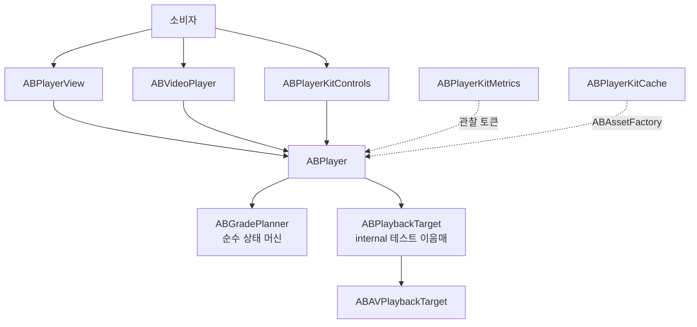

# ABPlayerKit

[English](README.md)


[](https://github.com/AppBoong/ABPlayerKit/actions/workflows/ci.yml)
[](https://github.com/AppBoong/ABPlayerKit/actions/workflows/ci.yml)
[](https://appboong.github.io/ABPlayerKit/documentation/)

**`AVPlayer`를 얇게 감싸면서 재생 자원의 소유권을 명시하는, 측정 가능한 래퍼입니다.**

한 줄로 영상을 재생하거나, 화면에 들어오기 전에 미디어를 미리 준비하고 벗어나면 디코더를 모두 반납하는 피드를 직접 제어할 수 있습니다 — 그 아래의 AVFoundation을 가리지 않으면서요.

```swift
ABVideoPlayerWithControls(url: url)
```

<p align="center">
<br>
<sub>위 한 줄이 실제로 동작하는 모습. 탭하면 오버레이가 나타나고, 배속을 고르고, 스크럽하고 — 그리고 저절로 비켜섭니다.</sub>
</p>

### 주요 기능

- **한 줄 재생.** 표준 컨트롤 오버레이를 그대로 쓰거나, 직접 만든 UI를 얹을 수 있습니다.
- **네 단계 소유권 모델**(`.released` → `.instanceOnly` → `.preloaded` → `.current`). 피드가 인접 미디어를 미리 준비하면서도, 화면 밖 셀의 네트워크 활동이 0임을 보장합니다. 강등은 승격의 정확한 역연산입니다.
- **정확한 첫 프레임 표시 시간(TTFF).** 현재 아이템에 대해 `AVPlayerLayer.isReadyForDisplay`와 `AVPlayerItem.status == .readyToPlay`가 **모두** 참일 때만 첫 프레임이 표시된 것으로 봅니다 — 단순히 재생이 시작된 시점이 아닙니다.
- **커스터마이즈 가능한 컨트롤** — 색상, 아이콘, 스킵 간격, 더블탭 시크, 액세서리 슬롯, 배속 메뉴. 뷰마다 지정하거나 view modifier로 화면 전체에 한 번에 적용합니다.
- **백그라운드·PiP·AirPlay·잠금화면 재생**을 명시적인 옵트인 정책으로 제공합니다.
- **선택형 메트릭과 캐시**를 별도 링크 타겟으로 분리했습니다. QoE 세션 요약, 프로그레시브 MP4 캐싱, 명시적 HLS 프리페치.
- **Swift 6 언어 모드**, `@MainActor`로 격리된 UI, `Sendable` 설정 값.

> **[Engineering Notes](docs/ENGINEERING-NOTES.md)** (영문) — 커버리지 91%의 테스트 743건이 전부 그린인 채로 놓친 AVFoundation 결함 3건. 그중 하나는 백그라운드 오디오 정책이 실기기에서 완전히 죽어 있던 것입니다. 셋 다 그 결함을 정면으로 겨냥한 테스트가 있었고 전부 통과했습니다 — 최종 상태만 단언하고 iOS가 실제로 보는 타이밍은 보지 않았기 때문입니다. 테스트가 대신 무엇을 재고 있었는지, 그리고 거기서 나온 다섯 가지 규칙.

<table>
<tr>
<td align="center" width="50%">
<br>
<sub>재생 화면</sub>
</td>
<td align="center" width="50%">
<br>
<sub>컨트롤 오버레이</sub>
</td>
</tr>
<tr>
<td align="center" width="50%">
<br>
<sub>Tinted 스타일 변형</sub>
</td>
<td align="center" width="50%">
<br>
<sub>캐시 화면</sub>
</td>
</tr>
</table>

위 애니메이션과 아래 스크린샷은 `Examples/ABPlayerKitDemo` 앱에서 Apple HLS bipbop 테스트 스트림을 재생한 화면입니다.

## 왜 ABPlayerKit인가

**`AVKit.VideoPlayer`와 비교하면** — AVKit은 플레이어와 시스템 컨트롤을 한 줄로 제공하며, 상세 화면에 영상 하나를 띄우는 경우라면 그게 정답입니다. 다만 자원 소유권을 통제할 수단이 없고, 화면에 나타나기 전에 미디어를 준비할 방법도, 시스템 외형을 벗어난 스타일링도, 측정 훅도 없습니다. ABPlayerKit은 한 줄짜리 사용법을 유지하면서 그 네 가지를 더합니다.

**`AVPlayer`를 직접 쓰는 것과 비교하면** — 같은 `AVPlayer`를 그대로 쓰되(`player.avPlayer`로 계속 접근 가능합니다), 미묘하게 틀리기 쉬운 부분을 매번 손으로 짜지 않아도 됩니다. 아이템 상태와 레이어 준비 여부에 대한 KVO, 아이템 해제 순서, 여러 플레이어가 공유하는 오디오 세션 활성화, 백그라운드/포그라운드 부작용, 그리고 "재생이 시작됐다"와 "화면에 프레임이 떴다"의 차이 같은 것들입니다.

**필요하지 않을 수도 있는 경우** — 영상 하나, 시스템 컨트롤, 프리로드 없음, 측정 없음. 그렇다면 `AVKit.VideoPlayer`가 코드도 적고 의존성도 하나 줄어듭니다.

이 라이브러리는 의도적으로 얇게 유지됩니다. AVFoundation을 추상화해 감추지 않고, 큐/재생목록 모델을 제공하지 않으며, 자막 선택 상태를 관리하지 않습니다 — [설계 근거](#설계-근거)를 참고하세요.

## 목차

- [요구 사항](#요구-사항)
- [설치](#설치)
- [빠른 시작](#빠른-시작)
  - [커스터마이징](#커스터마이징)
  - [플레이어를 직접 소유하기](#플레이어를-직접-소유하기)
  - [UIKit과 `ABPlayerView`](#uikit과-abplayerview)
  - [고급 — 등급과 프리로드](#고급--등급과-프리로드)
- [타겟별 사용법](#타겟별-사용법)
  - [`ABPlayerKit` — 코어](#abplayerkit--코어)
  - [`ABPlayerKitControls` — 재생 컨트롤](#abplayerkitcontrols--재생-컨트롤)
  - [`ABPlayerKitMetrics` — TTFF와 QoE](#abplayerkitmetrics--ttff와-qoe)
  - [`ABPlayerKitCache` — 캐시와 HLS 프리페치](#abplayerkitcache--캐시와-hls-프리페치)
  - [`ABPlayerKitNowPlaying` — 잠금화면과 원격 커맨드](#abplayerkitnowplaying--잠금화면과-원격-커맨드)
- [튜닝](#튜닝)
- [문제 해결](#문제-해결)
- [데모 앱](#데모-앱)
- [아키텍처](#아키텍처)
- [설계 근거](#설계-근거)
- [API 안정성](#api-안정성)
- [기여하기](#기여하기)
- [라이선스](#라이선스)

## 요구 사항

- iOS 17+
- Swift 6 언어 모드
- Xcode 16+

**iOS 전용입니다.** 코어가 UIKit과 AVKit을 직접 사용하므로 빌드 가능한 다른 플랫폼이 없습니다. Xcode에서 iOS 앱에 패키지를 추가할 때는 따로 할 일이 없습니다 — Xcode가 플랫폼을 알아서 해석합니다. 다만 체크아웃해서 패키지 자체를 빌드할 때는 `swift build`가 호스트(macOS)를 대상으로 하므로 다릅니다:

```bash
# 이건 안 됩니다 — macOS를 대상으로 잡고, 이유를 설명하며 멈춥니다
swift build

# 이렇게 하세요
xcodebuild -scheme ABPlayerKit-Package -destination 'generic/platform=iOS' build
xcodebuild -scheme ABPlayerKit-Package -destination 'platform=iOS Simulator,name=iPhone 16 Pro' test
```

## 설치

Xcode에서 **File → Add Package Dependencies**를 선택하고 다음 주소를 추가합니다.

```text
https://github.com/AppBoong/ABPlayerKit.git
```

또는 `Package.swift`에 추가합니다.

```swift
dependencies: [
    .package(
        url: "https://github.com/AppBoong/ABPlayerKit.git",
        from: "0.4.1"
    )
],
targets: [
    .target(
        name: "YourApp",
        dependencies: [
            .product(name: "ABPlayerKit", package: "ABPlayerKit"),
            // 필요할 때만 링크합니다.
            .product(name: "ABPlayerKitControls", package: "ABPlayerKit"),
            .product(name: "ABPlayerKitMetrics", package: "ABPlayerKit"),
            .product(name: "ABPlayerKitCache", package: "ABPlayerKit"),
            .product(name: "ABPlayerKitNowPlaying", package: "ABPlayerKit")
        ]
    )
]
```

릴리스 전 개발 버전을 사용하려면 `from: "0.4.1"`을 `branch: "main"`으로 바꾸세요. 애플리케이션에서는 위의 버전 조건 사용을 권장합니다.

필수는 `ABPlayerKit` 하나뿐입니다. 나머지 선택 제품은 링크하지 않으면 코드 자체가 앱에 포함되지 않습니다 — [타겟별 사용법](#타겟별-사용법)을 참고하세요.

## 빠른 시작

URL 하나로 표준 컨트롤까지 재생합니다 — 이게 통합의 전부입니다.

```swift
import ABPlayerKit
import ABPlayerKitControls
import SwiftUI

struct VideoScreen: View {
    var body: some View {
        ABVideoPlayerWithControls(url: URL(string: "https://example.com/video.m3u8")!)
            .aspectRatio(16 / 9, contentMode: .fit)
    }
}
```

이 뷰는 스스로 `ABPlayer`를 만들고, 재생을 시작하며, SwiftUI가 뷰를 폐기할 때 모든 재생 자원을 해제합니다. 미디어 종류는 URL에서 추론됩니다(`.m3u8` → HLS, 그 외 → progressive).

컨트롤 오버레이 없이 코어 타겟만 쓰려면:

```swift
import ABPlayerKit
import SwiftUI

ABVideoPlayer(url: url, videoGravity: .resizeAspect)
```

> **왜 어떤 예제 끝에는 `{}`가 붙나요?**
> 위의 `url:`/`source:` 이니셜라이저는 트레일링 클로저를 받지 않습니다. 반면 `player:` 이니셜라이저는 받습니다 — `ABVideoPlayerWithControls(player: player) {}` 처럼요. 배열 기반의 구형 `accessoryViews:` 이니셜라이저가 아직 deprecated 상태로 남아 있어서, 클로저 없이 호출하면 그쪽으로 해석되어 경고가 나기 때문입니다. 빈 중괄호는 현재 이니셜라이저를 고르게 합니다. `{}` 자리에 실제 뷰를 넣으면 직접 만든 컨트롤을 오버레이할 수 있습니다. [API 안정성](#api-안정성)을 참고하세요.

### 커스터마이징

컨트롤의 외형과 동작은 view modifier로 설정하므로, modifier 하나로 화면 전체의 플레이어를 한 번에 다룰 수 있습니다.

```swift
var style = ABPlayerControlsStyle.default
style.progressColor = .systemPink

var controls = ABPlayerControlsConfiguration()
controls.skipInterval = 15

ABVideoPlayerWithControls(url: url)
    .playerControlsStyle(style)
    .playerControlsConfiguration(controls)
```

플레이어 단 설정(음소거, 반복, 오디오 세션, 배속)은 생성 시점에 `ABPlayerConfiguration`으로 전달합니다.

```swift
var configuration = ABPlayerConfiguration()
configuration.isMuted = true
configuration.audioSessionPolicy = .playback(mixWithOthers: false)

ABVideoPlayerWithControls(url: url, playerConfiguration: configuration)
```

> 뷰가 화면 밖으로 나가도 살아 있는 동안에는 재생이 계속됩니다. 화면 전환에 따라 일시정지가 필요한 화면은 아래처럼 플레이어를 직접 소유하세요.

### 플레이어를 직접 소유하기

여러 뷰가 플레이어를 공유하거나, 재생이 뷰 하나보다 오래 유지되어야 하거나, 피드 전반에 걸쳐 프리로드를 직접 제어해야 할 때는 `ABPlayer`를 직접 소유합니다.

```swift
struct VideoScreen: View {
    @State private var player = ABPlayer()

    var body: some View {
        ABVideoPlayerWithControls(player: player, videoGravity: .resizeAspect) {}
            .aspectRatio(16 / 9, contentMode: .fit)
            .task {
                player.set(source: ABMediaSource(url: url), grade: .current)
                player.play()
            }
            .onDisappear {
                player.release()
            }
    }
}
```

Picture in Picture는 이 경로에서만 동작합니다 — [배경 정책과 Picture in Picture](https://appboong.github.io/ABPlayerKit/documentation/abplayerkit/backgroundandpictureinpicture/)를 참고하세요.

### UIKit과 `ABPlayerView`

```swift
import ABPlayerKit
import UIKit

@MainActor
final class PlayerViewController: UIViewController {
    private let player = ABPlayer()
    private let playerView = ABPlayerView()

    override func viewDidLoad() {
        super.viewDidLoad()

        playerView.frame = view.bounds
        playerView.autoresizingMask = [.flexibleWidth, .flexibleHeight]
        playerView.player = player
        view.addSubview(playerView)

        let source = ABMediaSource(url: URL(string: "https://example.com/video.mp4")!)
        player.set(source: source, grade: .current)
        player.play()
    }
}
```

### 고급 — 등급과 프리로드

화면이 아직 보이지 않는 미디어를 미리 준비해야 할 때(예: 몇 줄 아래 있는 피드 셀) 플레이어 하나를 만들고 모든 소스/등급 변경을 `set(source:grade:)`로 처리합니다.

```swift
import ABPlayerKit

let source = ABMediaSource(
    url: URL(string: "https://example.com/video.m3u8")!,
    kind: .hls
)

let player = ABPlayer()
player.set(source: source, grade: .preloaded)

// 미디어가 화면에 표시될 때
player.set(source: source, grade: .current)
player.play()

// 프리로드 윈도우를 벗어날 때
player.set(source: source, grade: .instanceOnly)
```

| 등급 | 보유 자원 | 용도 |
|---|---|---|
| `.released` | 없음 | 모든 재생 자원 반환 |
| `.instanceOnly` | `AVPlayer`, 아이템 없음 | 플레이어 식별성은 유지하면서 아이템 네트워크 활동을 0으로 보장 |
| `.preloaded` | 플레이어 + 아이템, 프리로드 튜닝 | `play()`를 허용하지 않고 인접 미디어 준비 |
| `.current` | 플레이어 + 아이템, 현재 재생 튜닝 | 화면에 보이는 미디어이며 재생 제어 허용 |

- 아이템을 보유한 모든 해제 경로는 `detachItem`을 거칩니다.
- `.preloaded`와 `.current` 사이를 이동할 때 대응하는 튜닝 역할을 다시 적용하므로 강등은 승격의 정확한 역연산입니다.
- 재생 제어 호출은 `.current`에서만 받아들여집니다 — [실패·진단·거부된 호출](https://appboong.github.io/ABPlayerKit/documentation/abplayerkit/failuresanddiagnostics/)을 참고하세요.
- `ABMediaSource`의 `kind:`는 URL의 확장자에서 추론됩니다(`.m3u8` → `.hls`, 그 외 → `.progressive`). 이 추론이 틀릴 수 있는 서명된/확장자 없는 URL일 때만 명시적으로 지정하세요.

## 타겟별 사용법

| 제품 | 추가 기능 | 링크 시점 |
|---|---|---|
| `ABPlayerKit` | 재생 엔진, UIKit 렌더링, SwiftUI 비디오 래퍼 | 항상 |
| `ABPlayerKitControls` | 타임라인, 버튼, 배속 선택, 자동 숨김, UIKit/SwiftUI 컨트롤 | 표준 컨트롤 레이어가 필요할 때 |
| `ABPlayerKitMetrics` | TTFF 기록, QoE 세션, sink, 집계 | 재생을 측정할 때 |
| `ABPlayerKitCache` | 프로그레시브 캐시와 명시적 HLS 프리페치 | 오프라인/캐시 동작을 소유할 때 |
| `ABPlayerKitNowPlaying` | 잠금화면/제어 센터 연동(`MPNowPlayingInfoCenter`, `MPRemoteCommandCenter`) | 원격 커맨드/잠금화면 재생을 원할 때 |

다섯 타겟의 전체 API 레퍼런스는 **[appboong.github.io/ABPlayerKit](https://appboong.github.io/ABPlayerKit/documentation/)** 에 공개되어 있으며, `main`에 푸시될 때마다 DocC 카탈로그에서 다시 빌드됩니다. 오프라인으로 보려면 Xcode의 **Product → Build Documentation**으로 빌드하세요.

### `ABPlayerKit` — 코어

코어 타겟은 재생 상태 머신, UIKit 뷰, SwiftUI 래퍼, 튜닝, 백그라운드/오디오 정책, 토큰 기반 이벤트를 소유합니다. 등급은 [고급 — 등급과 프리로드](#고급--등급과-프리로드)에서 다룹니다.

이벤트에는 여러 소비자가 독립적으로 연결할 수 있습니다. 반환된 토큰이 구독을 살아 있게 하므로, 버리면 관찰이 중단됩니다.

```swift
let token = player.addObserver { event in
    if case .firstFrameDisplayed(let timestamp) = event {
        print("첫 프레임 표시 시각: \(timestamp)")
    }
}

// 관찰이 필요한 동안 token을 보관합니다.
token.cancel()
```

`ABPlayer`는 명시적으로 옵트인하지 않는 한 프로세스 전역 `AVAudioSession`을 절대 건드리지 않습니다 — 두 정책 모두 기본값이 꺼짐입니다.

```swift
var configuration = ABPlayerConfiguration()
configuration.audioSessionPolicy = .playback(mixWithOthers: false)
configuration.interruptionPolicy = .pauseAndResume
player.configuration = configuration
```

무엇보다 먼저 걸리는 두 가지입니다.

- **`ABBackgroundPolicy.continueAudioOnly`는 세 조건이 모두** 필요합니다: 호스트 앱 `Info.plist`의 `audio` 백그라운드 모드, `.unmanaged`가 아닌 `audioSessionPolicy`, 그리고 정책 자체. 하나라도 빠지면 아무 경고 없이 `.pause`처럼 조용히 동작합니다.
- **자막/오디오 트랙 선택 UI는 제공하지 않습니다.** `player.avPlayerItem`을 통해 `AVMediaSelectionGroup`에 직접 접근하세요. 어태치마다 새 아이템이 만들어지므로 선택은 매번 다시 적용해야 합니다.

레퍼런스: [오디오 세션과 인터럽션](https://appboong.github.io/ABPlayerKit/documentation/abplayerkit/audiosessionandinterruptions/) · [배경 정책과 Picture in Picture](https://appboong.github.io/ABPlayerKit/documentation/abplayerkit/backgroundandpictureinpicture/) · [실패·진단·거부된 호출](https://appboong.github.io/ABPlayerKit/documentation/abplayerkit/failuresanddiagnostics/) · [AirPlay와 외부 재생](https://appboong.github.io/ABPlayerKit/documentation/abplayerkit/airplayandexternalplayback/) · [자막과 오디오 트랙](https://appboong.github.io/ABPlayerKit/documentation/abplayerkit/subtitlesandaudiotracks/)

### `ABPlayerKitControls` — 재생 컨트롤

`ABPlayerControlsView`가 표준 오버레이입니다. 전송 버튼이 영상 중앙에, 탐색 막대가 하단에, 경과/전체 시간과 재생 속도가 그 아래에 놓입니다. UIKit에서는 `ABPlayerView` 위에 겹치고 같은 플레이어를 물리며, SwiftUI에서는 `ABVideoPlayerWithControls`가 둘을 합쳐 줍니다.

컨트롤을 별도 제품으로 둔 이유는 피드나 백그라운드 플레이어가 자체 제스처를 제공하거나 UI가 전혀 없는 경우가 많기 때문입니다. 그런 소비자는 작은 코어만 링크하고, 표준 플레이어 화면만 UIKit 컨트롤과 SwiftUI 래퍼를 import 한 줄로 선택합니다.

레퍼런스: [컨트롤 커스터마이징](https://appboong.github.io/ABPlayerKit/documentation/abplayerkitcontrols/customizingcontrols/) — 스타일, 동작, 액세서리 슬롯, 환경 수정자.

### `ABPlayerKitMetrics` — TTFF와 QoE

`ABPlayerKitMetrics` 제품을 링크하지 않으면 메트릭 코드는 앱에 포함되지 않습니다. `ABMetricsRecorder`는 관찰 토큰으로 연결되고, sink가 이벤트의 목적지를 결정합니다. 메모리, 내부 직렬 큐를 사용하는 JSON Lines, OSLog 구현을 제공합니다.

**`includesSourceURL`의 기본값은 `true`입니다.** 서명되거나 토큰이 붙은 미디어 URL이 그대로 기록되므로, `ABMetricsRecorder.init(sink:clock:includesSourceURL:)`에 `false`를 넘기거나 커스텀 `ABMetricsSink`에서 마스킹하세요.

레퍼런스: [ABPlayerKitMetrics](https://appboong.github.io/ABPlayerKit/documentation/abplayerkitmetrics/) — TTFF·QoE 예제, 각 비율의 분모에 무엇이 포함되는지, 각 sink가 어디에 쓰는지.

### `ABPlayerKitCache` — 캐시와 HLS 프리페치

캐시 타겟은 의도적으로 서로 다른 두 범위를 가집니다.

| 미디어 | 동작 |
|---|---|
| 프로그레시브 MP4 | 커스텀 스킴을 사용하는 투명한 `AVAssetResourceLoader` 가로채기, HTTP Range 처리, 순차 디스크 채움, LRU 축출 |
| HLS | `AVAssetDownloadURLSession`을 통한 명시적 전체 자산 프리페치. 완료된 다운로드만 로컬 재생에 사용 |

레퍼런스: [ABPlayerKitCache](https://appboong.github.io/ABPlayerKit/documentation/abplayerkitcache/) — 에셋 팩토리 배선, 투명한 HLS 캐싱이 범위 밖인 이유, 알려진 제약.

### `ABPlayerKitNowPlaying` — 잠금화면과 원격 커맨드

이 타겟은 `ABPlayer`를 `MPNowPlayingInfoCenter`와 `MPRemoteCommandCenter`에 연결합니다. `audioSessionPolicy`와 마찬가지로 프로세스 전역 자원이며, 첫 `attach` 호출 전까지는 이 라이브러리가 아무것도 읽거나 쓰지 않습니다.

레퍼런스: [원격 커맨드](https://appboong.github.io/ABPlayerKit/documentation/abplayerkitnowplaying/remotecommands/) — 활성화 표, 소유권 규칙, 각 커맨드가 추가로 요구하는 것.


## 튜닝

ABPlayerKit은 프리로드와 현재 재생을 서로 다른 두 튜닝 역할로 모델링합니다. `preloadTuning`은 보수적으로 유지하고, 화면에 보이는 재생에는 `currentTuning`을 선택한 뒤 모든 등급 전환에서 올바른 역할이 적용되도록 합니다.

| 프리셋 | 최대 비트레이트 | 전방 버퍼 | 해상도 | 권장 역할 |
|---|---:|---:|---|---|
| `.conservativePreload` | 2 Mbps | 5초(AVFoundation의 soft hint) | 제한 없음 | `preloadTuning` |
| `.displayCapped` | 무제한 | 자동 | 현재 디스플레이 픽셀 크기 | 기본 `currentTuning` |
| `.resolutionCapped` | 2 Mbps | 5초 | 960×540 | 셀룰러용 `currentTuning` |
| `.unrestricted` | 무제한 | 자동 | 제한 없음 | 제한이 필요 없을 때 명시적으로 선택 |

```swift
var configuration = ABPlayerConfiguration()
configuration.preloadTuning = .conservativePreload
configuration.currentTuning = .displayCapped

let player = ABPlayer(configuration: configuration)
player.set(source: source, grade: .preloaded) // preloadTuning 적용
player.set(source: source, grade: .current)   // currentTuning 적용
player.set(source: source, grade: .preloaded) // preloadTuning 복원
```

이 대칭성은 강등된 아이템에 unrestricted/current 정책이 실수로 남는 것을 막습니다.

`ABPlaybackTuning.audioTimePitchAlgorithm`(기본값 `nil` — AVFoundation의 기본 알고리즘을 그대로 둠)은 `AVPlayerItem.audioTimePitchAlgorithm`으로 그대로 전달됩니다 — 1.0이 아닌 `ABPlaybackRate` 값을 쓰면서 타임피치 보정을 켜거나(또는 명시적으로 끄고) 싶다면 역할별로 설정하세요.

## 문제 해결

**영상 영역이 검은 화면이고 아무것도 재생되지 않습니다.**
플레이어는 아이템을 보유해야만 미디어를 로드합니다. `player.set(source:grade:)`를 `.current`로(또는 `.preloaded` 후 승격으로) 호출했는지 확인하세요 — `.instanceOnly`에 머문 플레이어는 의도적으로 아이템을 보유하지 않고 네트워크 요청도 하지 않습니다. 그다음 `player.lastFailure`에서 종료성 실패를 확인하세요. `lastDiagnostic`에 `.itemErrorLogEntry`가 담기는 것은 정상 스트림에서도 흔한 일이며 원인이 아닙니다.

**`play()`, `pause()`, `seek()`가 아무 반응이 없습니다.**
재생 제어 호출은 `grade != .current`인 동안 예외를 던지지 않고 무시됩니다. `.callRejected(ABRejectedCall, grade:)`를 관찰하면 어떤 호출이 어떤 등급에서 버려졌는지 알 수 있습니다.

**소리가 안 나거나, 무음 스위치를 켜면 소리가 멈춥니다.**
`audioSessionPolicy`의 기본값은 `.unmanaged`이며, 이 상태에서는 라이브러리가 `AVAudioSession`을 전혀 건드리지 않습니다. 무음 스위치와 무관하게 재생하려면 `configuration.audioSessionPolicy = .playback(mixWithOthers: false)`로 설정하세요.

**플레이어를 해제하니 호스트 앱 자체의 오디오가 멈춥니다.**
첫 관리 플레이어가 정책을 적용하기 전에 앱이 이미 `AVAudioSession`을 활성화해 뒀다면, 마지막 해제 시점의 복원이 세션을 비활성화할 수 있습니다. `AVAudioSession`에는 "이미 활성 상태였는지"를 조회할 공개 API가 없어 감지할 수 없습니다 — [오디오 세션과 인터럽션](https://appboong.github.io/ABPlayerKit/documentation/abplayerkit/audiosessionandinterruptions/)을 참고하세요.

**앱이 백그라운드로 가자마자 오디오가 멈춥니다.**
`.continueAudioOnly`는 [배경 정책과 Picture in Picture](https://appboong.github.io/ABPlayerKit/documentation/abplayerkit/backgroundandpictureinpicture/)의 세 조건이 모두 필요하며, 여기에는 **호스트 앱**의 `Info.plist`에 `UIBackgroundModes`로 `audio`가 포함되는 것도 들어갑니다. 하나라도 빠지면 조용히 `.pause`처럼 동작합니다.

**백그라운드에서 돌아왔는데 계속 일시정지 상태입니다.**
백그라운드 중에 `pause()`를 호출했다면 의도된 동작입니다 — 명시적 일시정지가 우선합니다. 자동 재개는 시스템이 스스로 재생을 멈춘 경우만 대상으로 합니다.

**Picture in Picture 버튼을 눌러도 아무 일도 없습니다.**
`ABPictureInPictureSession.isSupported`(시뮬레이터에서는 대체로 `false` — 실기기에서 확인하세요)와, 바인딩된 레이어가 표시 준비되어야 하는 `session.isPossible`을 확인하세요. PiP는 `audioSessionPolicy != .unmanaged`도 필요하며, `player:` 명시 소유 이니셜라이저에서**만** 동작합니다.

**잠금화면 컨트롤이 안 뜨거나 일부 버튼이 없습니다.**
`ABPlayerKitNowPlaying`을 링크하고 `attach`를 호출한 뒤 반환된 토큰을 보관해야 합니다. `.current` 플레이어만 자격이 있습니다. 배속 변경과 다음/이전 트랙은 `ABRemoteCommandSet.default`에 **포함되지 않아** 명시적 옵트인이 필요합니다 — 위의 커맨드 표를 참고하세요.

**`ABVideoPlayerWithControls(player:)` 호출에서 deprecated 이니셜라이저 경고가 납니다.**
빈 트레일링 클로저를 붙이세요: `ABVideoPlayerWithControls(player: player) {}`. [API 안정성](#api-안정성)을 참고하세요.

**업데이트 후 `ABPlayerEvent`·`ABMetricEvent`·`ABBackgroundPolicy`에 대한 `switch`가 컴파일되지 않습니다.**
이 타입들은 정책상 비전수(non-exhaustive)이며 마이너 릴리스에서 케이스가 추가될 수 있습니다. `default` 분기를 추가하세요.

**자막이나 오디오 트랙 선택이 사라집니다.**
소스 교체·강등·`release()`마다 **새** `AVPlayerItem`이 attach됩니다. 매 `.itemAttached(source:)` 이벤트마다 선택을 다시 적용하세요 — 이 라이브러리는 선택 상태를 저장하지 않습니다.

**플레이어가 여러 개 살아 있는 피드에서 재생이 끊깁니다.**
화면 밖 셀은 `.current`가 아니라 `.preloaded`나 `.instanceOnly`로 두고, `preloadTuning`을 보수적으로 유지하며, 현재 셀을 제외한 인스턴스에는 `allowsExternalPlayback = false`를 설정하세요.

## 데모 앱

독립 iOS 17 데모는 HLS/MP4 재생, 네 등급, 튜닝 역할, TTFF 통계, 프로그레시브 캐싱, 명시적 HLS 프리페치, Picture in Picture, 백그라운드 오디오를 실행합니다.

```bash
open Examples/ABPlayerKitDemo/ABPlayerKitDemo.xcodeproj
```

**ABPlayerKitDemo** 스킴을 선택하고 iOS 시뮬레이터에서 실행하세요. 프로젝트가 `../..` 상대 경로로 이 패키지를 참조하므로 클론한 뒤 별도 경로 설정 없이 열립니다.

명령줄 빌드:

```bash
xcodebuild \
  -project Examples/ABPlayerKitDemo/ABPlayerKitDemo.xcodeproj \
  -scheme ABPlayerKitDemo \
  -destination 'platform=iOS Simulator,name=iPhone 16 Pro' \
  build
```

Picture in Picture, 백그라운드 오디오, 잠금화면 컨트롤, AirPlay는 시뮬레이터에서 검증할 수 없습니다. [`docs/CHECKLIST-device-verification.md`](docs/CHECKLIST-device-verification.md)가 릴리스 전 실기기에서 수행하는 수동 확인 목록입니다.

세로 숏폼 피드와 프리로드 윈도우 오케스트레이션은 [ABShortsKit](https://github.com/AppBoong/ABShortsKit)을 참고하세요.

## 아키텍처



- UI와 `ABPlayer`는 `@MainActor`로 격리됩니다.
- 등급 계획과 설정은 `Sendable` 값입니다.
- AVFoundation 콜백은 콜백 경계에서 시간을 캡처한 뒤 메인 액터로 이동하고 아이템 식별성을 다시 검증합니다.
- 메트릭과 캐시는 독립적인 소유권과 실패 모드를 가진 선택 제품입니다.

## 설계 근거

### delegate나 `AsyncStream` 대신 옵저버와 토큰을 선택한 이유

delegate 슬롯 하나를 사용하면 앱 동작과 메트릭이 소유권을 놓고 경쟁합니다. 다중 옵저버는 두 소비자가 독립적으로 연결되게 하고, `ABObservationToken`은 명시적 취소와 deinit 자동 취소를 보장합니다. `AsyncStream`은 팬아웃, 버퍼/드롭 정책, 백프레셔, `for await` 태스크 수명 결정을 추가합니다. 스케줄링 때문에 TTFF가 의존하는 콜백 경계 타임스탬프가 흐려질 수도 있습니다. 스트림은 나중에 토큰 API를 깨지 않고 추가할 수 있습니다.

### DI 컨테이너를 사용하지 않는 이유

패키지는 initializer 주입과 `ABPlayerConfiguration`을 사용합니다. 자원 상태를 보이게 만드는 것이 핵심인 라이브러리에서 컨테이너는 소유권과 생명주기를 숨깁니다.

### 테스트 이음매에만 protocol을 두는 이유

ABPlayerKit은 의도적으로 얇은 AVFoundation 래퍼입니다. 대체가 유용한 재생 타겟, 에셋 팩토리, 옵저버, 메트릭 sink, clock에만 protocol을 두고 `avPlayer`와 `avPlayerItem`은 탈출구로 공개합니다. AVFoundation 이름만 바꾸는 추상화 계층을 피하기 위한 선택입니다.

전체 근거는 [DESIGN-ABPlayerKit](docs/DESIGN-ABPlayerKit.md)과 [DESIGN-OPEN-QUESTIONS](docs/DESIGN-OPEN-QUESTIONS.md)에 기록되어 있습니다.

## API 안정성

이 패키지가 `0.x`인 동안 대체 API는 항상 additive로 먼저 추가되고, 같은 마이너 릴리스에서 deprecate됩니다(조용히 제거하지 않음). 제거 전 최소 한 개 마이너의 중첩 기간을 보장하며, `1.0.0` 이전에는 아무것도 제거하지 않습니다. `ABPlayerEvent`/`ABPlayerError`가 비전수(non-exhaustive) `enum`으로 남아 있는 것도 같은 이유입니다 — 소비자의 `switch`는 `default` 분기를 포함해야 합니다. 전체 정책은 [POLICY-api-stability](docs/POLICY-api-stability.md)에 있고, 모든 릴리스는 [CHANGELOG](CHANGELOG.md)에 기록됩니다.

> **deprecated된 `accessoryViews:` 이니셜라이저.** `ABPlayerControls(player: player)` / `ABVideoPlayerWithControls(player: player)` 그대로의 호출은 배열 기반의 deprecated 이니셜라이저로 해석되어 경고가 납니다. 빈 트레일링 클로저 `ABPlayerControls(player: player) {}`를 추가해 현재의 `@ViewBuilder accessories:` 쪽으로 이관하세요. 이걸 피할 기본값이 없는 이유는 CHANGELOG의 [`[0.3.0]` Migration notes](CHANGELOG.md#030---2026-08-05)를 참고하세요.

## 기여하기

이슈와 풀 리퀘스트를 환영합니다. [CONTRIBUTING.md](CONTRIBUTING.md)에 개발 환경, 코드·커밋 규약, 풀 리퀘스트 규칙이 정리돼 있습니다 — 모든 변경은 PR을 거쳐 메인테이너 승인과 CI 그린을 받아야 하며, 빌드는 경고가 0이어야 합니다.

PR을 열기 전에 전체 테스트를 실행하세요.

```bash
xcodebuild -scheme ABPlayerKit-Package \
  -destination 'platform=iOS Simulator,name=iPhone 16 Pro' test
```

보안 관련 이슈는 공개 이슈 대신 [SECURITY.md](SECURITY.md)의 절차를 따라 주세요.

## 라이선스

ABPlayerKit은 [MIT License](LICENSE)로 제공됩니다. Copyright © 2026 AppBoong.
