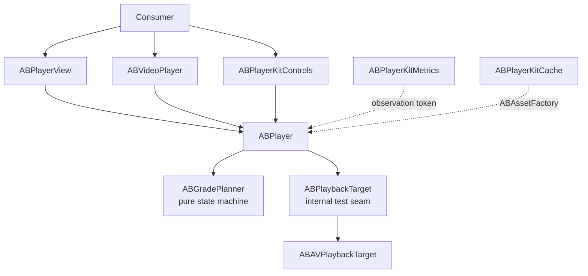

# ABPlayerKit

[한국어](README.ko.md)


[](https://github.com/AppBoong/ABPlayerKit/actions/workflows/ci.yml)

ABPlayerKit is a thin, measurable wrapper around `AVPlayer`. It makes playback resource ownership explicit with a four-grade state machine and defines time to first frame (TTFF) precisely: the first frame is displayed only when `AVPlayerLayer.isReadyForDisplay` **and** `AVPlayerItem.status == .readyToPlay` are both true for the current item.

The package keeps AVFoundation visible, adds symmetric promotion and demotion, and separates optional controls, metrics, and cache behavior into independently linked targets.

## Requirements

- iOS 17+
- Swift 6 language mode
- Xcode 16+

## Installation

Add the package in Xcode with **File → Add Package Dependencies**:

```text
https://github.com/AppBoong/ABPlayerKit.git
```

Or add it to `Package.swift`:

```swift
dependencies: [
    .package(
        url: "https://github.com/AppBoong/ABPlayerKit.git",
        from: "0.2.0"
    )
],
targets: [
    .target(
        name: "YourApp",
        dependencies: [
            .product(name: "ABPlayerKit", package: "ABPlayerKit"),
            // Link only when needed:
            .product(name: "ABPlayerKitControls", package: "ABPlayerKit"),
            .product(name: "ABPlayerKitMetrics", package: "ABPlayerKit"),
            .product(name: "ABPlayerKitCache", package: "ABPlayerKit")
        ]
    )
]
```

For unreleased development, replace `from: "0.2.0"` with `branch: "main"`. Applications should prefer the version requirement shown above.

## Quick Start

Create one player and drive all source/grade changes through `set(source:grade:)`:

```swift
import ABPlayerKit

let source = ABMediaSource(
    url: URL(string: "https://example.com/video.m3u8")!,
    kind: .hls
)

let player = ABPlayer()
player.set(source: source, grade: .preloaded)

// When the media becomes visible:
player.set(source: source, grade: .current)
player.play()

// When it leaves the preload window:
player.set(source: source, grade: .instanceOnly)
```

### UIKit with `ABPlayerView`

```swift
import ABPlayerKit
import UIKit

@MainActor
final class PlayerViewController: UIViewController {
    private let player = ABPlayer()
    private let playerView = ABPlayerView()

    override func viewDidLoad() {
        super.viewDidLoad()

        playerView.frame = view.bounds
        playerView.autoresizingMask = [.flexibleWidth, .flexibleHeight]
        playerView.player = player
        view.addSubview(playerView)

        let source = ABMediaSource(
            url: URL(string: "https://example.com/video.mp4")!,
            kind: .progressive
        )
        player.set(source: source, grade: .current)
        player.play()
    }
}
```

### SwiftUI with `ABVideoPlayer`

```swift
import ABPlayerKit
import SwiftUI

struct VideoScreen: View {
    @State private var player = ABPlayer()

    var body: some View {
        ABVideoPlayer(player: player, videoGravity: .resizeAspect)
            .aspectRatio(16 / 9, contentMode: .fit)
            .task {
                let source = ABMediaSource(
                    url: URL(string: "https://example.com/video.m3u8")!,
                    kind: .hls
                )
                player.set(source: source, grade: .current)
                player.play()
            }
            .onDisappear {
                player.release()
            }
    }
}
```

## Targets

| Product | What it adds | Link when |
|---|---|---|
| `ABPlayerKit` | Playback engine, UIKit rendering, SwiftUI video wrapper | Always |
| `ABPlayerKitControls` | Timeline, buttons, rate selection, auto-hide, UIKit and SwiftUI controls | The app wants the standard controls layer |
| `ABPlayerKitMetrics` | TTFF recording, sinks, and aggregation | The app measures playback |
| `ABPlayerKitCache` | Progressive caching and explicit HLS prefetch | The app owns offline/cache behavior |

### `ABPlayerKit` — Core

The core target owns the playback state machine, UIKit view, SwiftUI wrapper, tuning, background/audio policies, and token-based events.

| Grade | Resources held | Intended use |
|---|---|---|
| `.released` | Nothing | Return all playback resources |
| `.instanceOnly` | `AVPlayer`, no item | Keep identity while guaranteeing zero item network activity |
| `.preloaded` | Player + item, preload tuning | Prepare nearby media without allowing `play()` |
| `.current` | Player + item, current tuning | Visible media; playback controls are accepted |

Every release path that holds an item routes through `detachItem`. Moving between `.preloaded` and `.current` reapplies the matching tuning role, so demotion is the exact inverse of promotion.

Events support multiple independent consumers:

```swift
let token = player.addObserver { event in
    if case .firstFrameDisplayed(let timestamp) = event {
        print("First frame displayed at \(timestamp)")
    }
}

// Retain token for as long as observation is needed.
token.cancel()
```

Treat `ABPlayerEvent` as non-exhaustive. Minor releases may add cases, so consumer switches must include a `default` branch.

### `ABPlayerKitControls` — Opt-in Playback Controls

UIKit applications place `ABPlayerControlsView` over `ABPlayerView` and attach the same player:

```swift
import ABPlayerKit
import ABPlayerKitControls

let videoView = ABPlayerView()
videoView.player = player

let controlsView = ABPlayerControlsView()
controlsView.player = player
```

SwiftUI applications can use the ready-made composition:

```swift
import ABPlayerKit
import ABPlayerKitControls
import SwiftUI

ABVideoPlayerWithControls(
    player: player,
    videoGravity: .resizeAspect
)
.aspectRatio(16 / 9, contentMode: .fit)
```

The standard overlay keeps skip-backward, play/pause, and skip-forward centered over the video. Its seek bar hugs the bottom; `HH:mm:ss/HH:mm:ss` elapsed/total time sits directly above the seek bar at the left, and playback rate sits at the bottom-right. The default white/grey controls use a low-opacity dark scrim so the video remains clearly visible.

Style changes apply live to the existing controls. Track, played progress, thumb appearance, and icons are independent:

```swift
var style = ABPlayerControlsStyle.default
style.trackColor = .white.withAlphaComponent(0.2)
style.progressColor = .systemPink
style.thumbColor = .systemPink
style.thumbSize = CGSize(width: 14, height: 14)
style.playIcon = .system("play.circle.fill")
style.pauseIcon = .system("pause.circle.fill")

controlsView.style = style
```

Behavior lives in `ABPlayerControlsConfiguration`: the default periodic UI update interval is 0.25 seconds, skip icons synchronize with supported intervals, and rate selection supports menu, cycle, and hidden modes. VoiceOver suppresses auto-hide; Reduce Motion removes fades.

The controls remain a separate product because many feeds and background players provide their own gestures or no UI at all. Those consumers link only the small core, while standard-player screens opt into UIKit controls and their SwiftUI wrapper with one additional import.

### `ABPlayerKitMetrics` — Opt-in by Linkage

Metrics code is absent from an app unless the `ABPlayerKitMetrics` product is linked. `ABMetricsRecorder` attaches through an observation token, and sinks decide where events go: memory, JSON Lines on an internal serial queue, or OSLog.

```swift
import ABPlayerKit
import ABPlayerKitMetrics

@MainActor
final class PlaybackSession {
    let player = ABPlayer()

    private let sink: ABInMemoryMetricsSink
    private let recorder: ABMetricsRecorder
    private var tokens: Set<ABObservationToken> = []

    init() {
        let sink = ABInMemoryMetricsSink()
        self.sink = sink
        self.recorder = ABMetricsRecorder(sink: sink)

        recorder.attach(to: player).store(in: &tokens)
        player.addObserver { [weak self] event in
            guard case .firstFrameDisplayed = event else { return }
            Task { @MainActor [weak self] in
                self?.refreshStatistics()
            }
        }.store(in: &tokens)
    }

    func play(_ source: ABMediaSource) {
        let startedAt = ABMonotonicClock().now
        player.set(source: source, grade: .current)
        recorder.beginTTFF(for: player, at: startedAt)
        player.play()
    }

    private func refreshStatistics() {
        let samples = sink.events.compactMap { event -> ABMetricSample? in
            guard case .ttff(let sample) = event else { return nil }
            return sample
        }
        let statistics = ABPlaybackStatistics.aggregate(samples)
        print(statistics.p50, statistics.p95, statistics.hitRate)
    }
}
```

Store `PlaybackSession` as a property of the screen or coordinator for the entire measurement. The sink, recorder, and observation tokens must all outlive the asynchronous first-frame event.

An abandoned TTFF sample remains in the denominator of `hitRate` and `abandonRate`; it is never silently discarded from the measurement.

### `ABPlayerKitCache` — Progressive Cache and HLS Prefetch

The cache target deliberately has two different scopes:

| Media | Behavior |
|---|---|
| Progressive MP4 | Transparent `AVAssetResourceLoader` interception using a custom scheme, HTTP range handling, sequential disk fill, and LRU eviction |
| HLS | Explicit full-asset prefetch through `AVAssetDownloadURLSession`; only completed downloads are used for local playback |

```swift
import ABPlayerKitCache

let cache = try ABMediaCache()
let hlsPrefetcher = ABHLSPrefetcher()

// Build and retain this factory. Release the current item before replacing it.
let assetFactory = cache.makeAssetFactory(hlsPrefetcher: hlsPrefetcher)
player.release()
var configuration = player.configuration
configuration.assetFactory = assetFactory
player.configuration = configuration

let handle = hlsPrefetcher.prefetch(hlsSource)
if await handle.result == .completed {
    player.set(source: hlsSource, grade: .current)
    player.play() // the factory resolves the completed local HLS asset
}
```

Transparent HLS segment caching is intentionally outside v1. `AVAssetResourceLoader` cannot intercept ordinary HTTP(S) HLS master/media playlists; transparent caching would require a local reverse proxy that rewrites playlists and handles relative URLs, encryption keys, and background lifetime. That has a different and much larger failure surface, so the accepted [Q1 design decision](docs/DESIGN-OPEN-QUESTIONS.md) keeps it separate. See also [DESIGN-ABPlayerKit §9](docs/DESIGN-ABPlayerKit.md).

## Tuning

ABPlayerKit models preload and current playback as two distinct tuning roles. Keep `preloadTuning` conservative, choose `currentTuning` for visible playback, and let every grade transition apply the correct role.

| Preset | Peak bitrate | Forward buffer | Resolution | Recommended role |
|---|---:|---:|---|---|
| `.conservativePreload` | 2 Mbps | 5 seconds (soft AVFoundation hint) | Uncapped | `preloadTuning` |
| `.displayCapped` | Unlimited | Automatic | Current display pixel size | Default `currentTuning` |
| `.resolutionCapped` | 2 Mbps | 5 seconds | 960×540 | Cellular-oriented current tuning |
| `.unrestricted` | Unlimited | Automatic | Uncapped | Explicit opt-in when no cap is desired |

```swift
var configuration = ABPlayerConfiguration()
configuration.preloadTuning = .conservativePreload
configuration.currentTuning = .displayCapped

let player = ABPlayer(configuration: configuration)
player.set(source: source, grade: .preloaded) // applies preloadTuning
player.set(source: source, grade: .current)   // applies currentTuning
player.set(source: source, grade: .preloaded) // restores preloadTuning
```

This symmetry prevents a demoted item from retaining the unrestricted/current policy by accident.

## Architecture



- UI and `ABPlayer` are `@MainActor` isolated.
- Grade planning and configuration are `Sendable` values.
- AVFoundation callbacks capture timing at the callback boundary, then hop to the main actor and revalidate item identity.
- Metrics and cache are optional products with independent ownership and failure modes.

## Design Rationale

### Why observers and tokens instead of a delegate or `AsyncStream`?

A single delegate slot would force application behavior and metrics to compete for ownership. Multiple observers allow both to attach independently, while `ABObservationToken` guarantees explicit cancellation and automatic cancellation on deinitialization. An `AsyncStream` would add fan-out, buffering/drop policy, backpressure, and `for await` task-lifetime decisions; its scheduling can also blur the callback-boundary timestamp that TTFF depends on. A stream can be added later without breaking the token API.

### Why no dependency-injection container?

The package uses initializer injection and `ABPlayerConfiguration`. A container would hide ownership and lifecycle in a library whose primary job is to make resource state visible.

### Why protocols only at test seams?

ABPlayerKit intentionally remains a thin AVFoundation wrapper. Protocols exist where substitution is valuable—playback target, asset factory, observer, metrics sink, and clock—while `avPlayer` and `avPlayerItem` remain available as escape hatches. This avoids an abstraction layer that merely renames AVFoundation.

The complete rationale is recorded in [DESIGN-ABPlayerKit](docs/DESIGN-ABPlayerKit.md) and [DESIGN-OPEN-QUESTIONS](docs/DESIGN-OPEN-QUESTIONS.md).

## Demo App

The standalone iOS 17 demo exercises HLS/MP4 playback, all four grades, tuning roles, TTFF statistics, progressive caching, and explicit HLS prefetch.

```bash
open Examples/ABPlayerKitDemo/ABPlayerKitDemo.xcodeproj
```

Select the **ABPlayerKitDemo** scheme and run on an iOS simulator. The project references this package through `../..`, so a clone opens without package-path setup.

Command-line build:

```bash
xcodebuild \
  -project Examples/ABPlayerKitDemo/ABPlayerKitDemo.xcodeproj \
  -scheme ABPlayerKitDemo \
  -destination 'platform=iOS Simulator,name=iPhone 16 Pro' \
  build
```

For a vertical short-form feed and preload-window orchestration, see [ABShortsKit](https://github.com/AppBoong/ABShortsKit).

## License

ABPlayerKit is available under the [MIT License](LICENSE). Copyright © 2026 AppBoong.
