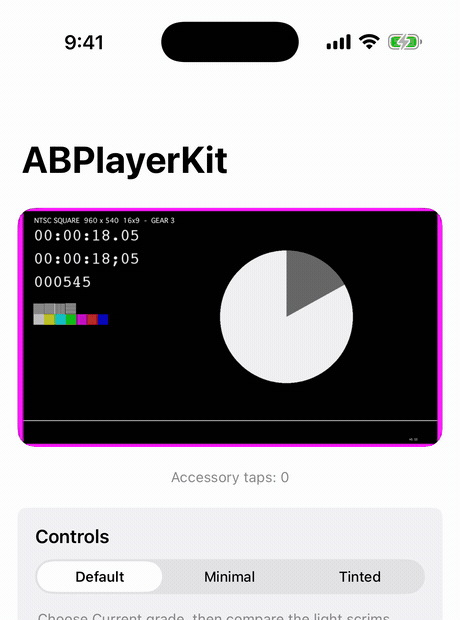
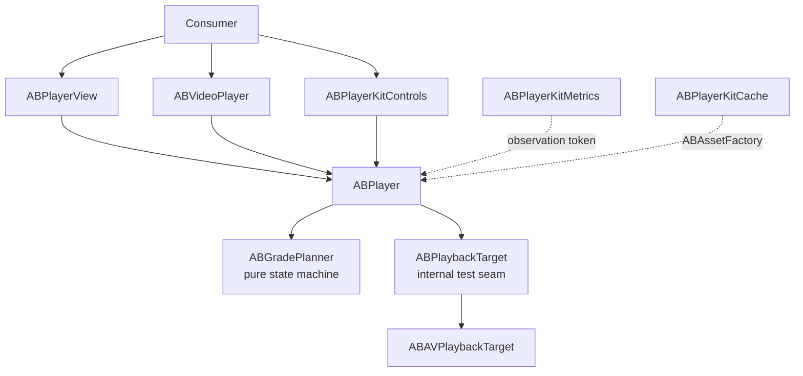

# ABPlayerKit

[한국어](README.ko.md)


[](https://github.com/AppBoong/ABPlayerKit/actions/workflows/ci.yml)
[](https://github.com/AppBoong/ABPlayerKit/actions/workflows/ci.yml)
[](https://appboong.github.io/ABPlayerKit/documentation/)

**A thin, measurable wrapper around `AVPlayer` that makes playback resource ownership explicit.**

Play a video in one line, or drive a feed that preloads media before it scrolls into view and releases every decoder when it scrolls away — without losing sight of AVFoundation underneath.

```swift
ABVideoPlayerWithControls(url: url)
```

<p align="center">
<br>
<sub>That one line, running. Tap to reveal the overlay, pick a rate, scrub — and it gets out of the way on its own.</sub>
</p>

### Features

- **One-line playback** with a standard controls overlay, or bring your own UI.
- **A four-grade ownership model** (`.released` → `.instanceOnly` → `.preloaded` → `.current`) so a feed can prepare nearby media and guarantee that off-screen cells hold zero network activity. Demotion is the exact inverse of promotion.
- **Precise time-to-first-frame.** The first frame counts as displayed only when `AVPlayerLayer.isReadyForDisplay` **and** `AVPlayerItem.status == .readyToPlay` are both true for the current item — not when playback merely started.
- **Customizable controls** — colors, icons, skip intervals, double-tap seek, accessory slots, rate menu — set per view or once for a whole screen with view modifiers.
- **Background, PiP, AirPlay, and lock-screen playback** as explicit, opt-in policies.
- **Optional metrics and caching** in separately linked targets: QoE session summaries, progressive MP4 caching, and explicit HLS prefetch.
- **Swift 6 language mode**, `@MainActor`-isolated UI, `Sendable` configuration values.

> **[Engineering Notes](docs/ENGINEERING-NOTES.md)** — three AVFoundation defects that a green 743-test suite at 91% coverage did not catch, including a background-audio policy that was completely dead on hardware. Each had a test aimed directly at it that passed, because it measured the end state and never the timing iOS actually cares about. What the tests were measuring instead, and the five rules that came out of it.

<table>
<tr>
<td align="center" width="50%">
<br>
<sub>Playback screen</sub>
</td>
<td align="center" width="50%">
<br>
<sub>Controls overlay</sub>
</td>
</tr>
<tr>
<td align="center" width="50%">
<br>
<sub>Tinted style variant</sub>
</td>
<td align="center" width="50%">
<br>
<sub>Cache screen</sub>
</td>
</tr>
</table>

The animation above and these screenshots are from the `Examples/ABPlayerKitDemo` app running the Apple HLS bipbop test stream.

## Why ABPlayerKit?

**Compared to `AVKit.VideoPlayer`** — AVKit gives you a player and system controls in one line, which is the right answer for a single video on a detail screen. It gives you no say over resource ownership, no way to prepare media before it appears, no styling beyond the system look, and no measurement hook. ABPlayerKit keeps the one-liner and adds all four.

**Compared to using `AVPlayer` directly** — you keep the same `AVPlayer` (it stays reachable as `player.avPlayer`), but stop hand-writing the parts that are easy to get subtly wrong: KVO on item status and layer readiness, item teardown ordering, audio-session activation shared across several players, background/foreground side effects, and the difference between "playback started" and "a frame is on screen."

**When you probably don't need it** — a single video, system controls, no preloading, no metrics. `AVKit.VideoPlayer` is less code and one less dependency.

This library deliberately stays thin. It does not abstract AVFoundation away, does not provide a queue or playlist model, and does not manage subtitle selection state — see [Design Rationale](#design-rationale).

## Table of Contents

- [Requirements](#requirements)
- [Installation](#installation)
- [Quick Start](#quick-start)
  - [Customizing](#customizing)
  - [Owning the Player Yourself](#owning-the-player-yourself)
  - [UIKit with `ABPlayerView`](#uikit-with-abplayerview)
  - [Advanced — Grades and Preloading](#advanced--grades-and-preloading)
- [Usage by Target](#usage-by-target)
  - [`ABPlayerKit` — Core](#abplayerkit--core)
  - [`ABPlayerKitControls` — Playback Controls](#abplayerkitcontrols--playback-controls)
  - [`ABPlayerKitMetrics` — TTFF and QoE](#abplayerkitmetrics--ttff-and-qoe)
  - [`ABPlayerKitCache` — Cache and HLS Prefetch](#abplayerkitcache--cache-and-hls-prefetch)
  - [`ABPlayerKitNowPlaying` — Lock Screen and Remote Commands](#abplayerkitnowplaying--lock-screen-and-remote-commands)
- [Tuning](#tuning)
- [Troubleshooting](#troubleshooting)
- [Demo App](#demo-app)
- [Architecture](#architecture)
- [Design Rationale](#design-rationale)
- [API Stability](#api-stability)
- [Contributing](#contributing)
- [License](#license)

## Requirements

- iOS 17+
- Swift 6 language mode
- Xcode 16+

**iOS only.** The core reaches UIKit and AVKit directly, so there is no other platform this builds for. Adding the package to an iOS app in Xcode needs nothing special — Xcode resolves the platform itself. Building the package on its own from a checkout does, because `swift build` targets the host:

```bash
# Not this — it targets macOS and stops with an explanation
swift build

# This
xcodebuild -scheme ABPlayerKit-Package -destination 'generic/platform=iOS' build
xcodebuild -scheme ABPlayerKit-Package -destination 'platform=iOS Simulator,name=iPhone 16 Pro' test
```

## Installation

Add the package in Xcode with **File → Add Package Dependencies**:

```text
https://github.com/AppBoong/ABPlayerKit.git
```

Or add it to `Package.swift`:

```swift
dependencies: [
    .package(
        url: "https://github.com/AppBoong/ABPlayerKit.git",
        from: "0.4.0"
    )
],
targets: [
    .target(
        name: "YourApp",
        dependencies: [
            .product(name: "ABPlayerKit", package: "ABPlayerKit"),
            // Link only when needed:
            .product(name: "ABPlayerKitControls", package: "ABPlayerKit"),
            .product(name: "ABPlayerKitMetrics", package: "ABPlayerKit"),
            .product(name: "ABPlayerKitCache", package: "ABPlayerKit"),
            .product(name: "ABPlayerKitNowPlaying", package: "ABPlayerKit")
        ]
    )
]
```

For unreleased development, replace `from: "0.4.0"` with `branch: "main"`. Applications should prefer the version requirement shown above.

Only `ABPlayerKit` is required. Each optional product's code is absent from your app unless you link it — see [Usage by Target](#usage-by-target).

## Quick Start

Play a URL with the standard controls — this is the whole integration:

```swift
import ABPlayerKit
import ABPlayerKitControls
import SwiftUI

struct VideoScreen: View {
    var body: some View {
        ABVideoPlayerWithControls(url: URL(string: "https://example.com/video.m3u8")!)
            .aspectRatio(16 / 9, contentMode: .fit)
    }
}
```

The view creates its own `ABPlayer`, starts playback, and releases every playback resource when SwiftUI discards the view. Media type is inferred from the URL (`.m3u8` → HLS, anything else → progressive).

Without the controls overlay, use the core target alone:

```swift
import ABPlayerKit
import SwiftUI

ABVideoPlayer(url: url, videoGravity: .resizeAspect)
```

> **Why do some examples end in `{}`?**
> The `url:`/`source:` initializers above take no trailing closure. The `player:` initializers do — `ABVideoPlayerWithControls(player: player) {}` — because an older array-based `accessoryViews:` initializer is still present and deprecated, and a call with no closure at all resolves to that one and warns. The empty braces pick the current initializer. Pass real views instead of `{}` to overlay your own controls. See [API Stability](#api-stability).

### Customizing

Controls appearance and behavior are set with view modifiers, so one modifier can cover a whole screen of players:

```swift
var style = ABPlayerControlsStyle.default
style.progressColor = .systemPink

var controls = ABPlayerControlsConfiguration()
controls.skipInterval = 15

ABVideoPlayerWithControls(url: url)
    .playerControlsStyle(style)
    .playerControlsConfiguration(controls)
```

Player-level settings (mute, loop, audio session, rate) go through `ABPlayerConfiguration` at creation time:

```swift
var configuration = ABPlayerConfiguration()
configuration.isMuted = true
configuration.audioSessionPolicy = .playback(mixWithOthers: false)

ABVideoPlayerWithControls(url: url, playerConfiguration: configuration)
```

> Playback keeps running while the view stays alive but off-screen. Screens that need visibility-driven pausing should own the player explicitly (below).

### Owning the Player Yourself

Own an `ABPlayer` when several views share it, when playback must outlive one view, or when you drive preloading across a feed:

```swift
struct VideoScreen: View {
    @State private var player = ABPlayer()

    var body: some View {
        ABVideoPlayerWithControls(player: player, videoGravity: .resizeAspect) {}
            .aspectRatio(16 / 9, contentMode: .fit)
            .task {
                player.set(source: ABMediaSource(url: url), grade: .current)
                player.play()
            }
            .onDisappear {
                player.release()
            }
    }
}
```

Picture in Picture requires this path — see [Picture in Picture](#picture-in-picture).

### UIKit with `ABPlayerView`

```swift
import ABPlayerKit
import UIKit

@MainActor
final class PlayerViewController: UIViewController {
    private let player = ABPlayer()
    private let playerView = ABPlayerView()

    override func viewDidLoad() {
        super.viewDidLoad()

        playerView.frame = view.bounds
        playerView.autoresizingMask = [.flexibleWidth, .flexibleHeight]
        playerView.player = player
        view.addSubview(playerView)

        let source = ABMediaSource(url: URL(string: "https://example.com/video.mp4")!)
        player.set(source: source, grade: .current)
        player.play()
    }
}
```

### Advanced — Grades and Preloading

Create one player and drive all source/grade changes through `set(source:grade:)` when a screen needs to prepare media before it becomes visible — a feed cell a few rows away, for example:

```swift
import ABPlayerKit

let source = ABMediaSource(
    url: URL(string: "https://example.com/video.m3u8")!,
    kind: .hls
)

let player = ABPlayer()
player.set(source: source, grade: .preloaded)

// When the media becomes visible:
player.set(source: source, grade: .current)
player.play()

// When it leaves the preload window:
player.set(source: source, grade: .instanceOnly)
```

| Grade | Resources held | Intended use |
|---|---|---|
| `.released` | Nothing | Return all playback resources |
| `.instanceOnly` | `AVPlayer`, no item | Keep identity while guaranteeing zero item network activity |
| `.preloaded` | Player + item, preload tuning | Prepare nearby media without allowing `play()` |
| `.current` | Player + item, current tuning | Visible media; playback controls are accepted |

- Every release path that holds an item routes through `detachItem`.
- Moving between `.preloaded` and `.current` reapplies the matching tuning role, so demotion is the exact inverse of promotion.
- Playback control calls are accepted only at `.current` — see [Rejected calls](#failures-diagnostics-and-rejected-calls).
- `ABMediaSource`'s `kind:` is inferred from the URL's extension (`.m3u8` → `.hls`, anything else → `.progressive`). Pass it explicitly only for a signed or extensionless URL where that inference would guess wrong.

## Usage by Target

| Product | What it adds | Link when |
|---|---|---|
| `ABPlayerKit` | Playback engine, UIKit rendering, SwiftUI video wrapper | Always |
| `ABPlayerKitControls` | Timeline, buttons, rate selection, auto-hide, UIKit and SwiftUI controls | The app wants the standard controls layer |
| `ABPlayerKitMetrics` | TTFF recording, QoE sessions, sinks, and aggregation | The app measures playback |
| `ABPlayerKitCache` | Progressive caching and explicit HLS prefetch | The app owns offline/cache behavior |
| `ABPlayerKitNowPlaying` | Lock screen / Control Center integration (`MPNowPlayingInfoCenter`, `MPRemoteCommandCenter`) | The app wants remote-command/lock-screen playback |

Full API reference for all five targets is published at **[appboong.github.io/ABPlayerKit](https://appboong.github.io/ABPlayerKit/documentation/)**, rebuilt from the DocC catalogs on every push to `main`. To read it offline, build it in Xcode with **Product → Build Documentation**.

### `ABPlayerKit` — Core

The core target owns the playback state machine, UIKit view, SwiftUI wrapper, tuning, background/audio policies, and token-based events. Grades are covered in [Advanced — Grades and Preloading](#advanced--grades-and-preloading).

#### Events

Events support multiple independent consumers:

```swift
let token = player.addObserver { event in
    if case .firstFrameDisplayed(let timestamp) = event {
        print("First frame displayed at \(timestamp)")
    }
}

// Retain token for as long as observation is needed.
token.cancel()
```

Treat `ABPlayerEvent` as non-exhaustive. Minor releases may add cases, so consumer switches must include a `default` branch.

#### Failures, Diagnostics, and Rejected Calls

Failures are split across two properties so a routine diagnostic can never masquerade as a real failure:

| Property | Holds | Cleared on |
|---|---|---|
| `lastFailure` | The most recent **terminal** failure | Next attach, source change, detach, or release |
| `lastDiagnostic` | The one **non-terminal** case, `.itemErrorLogEntry` | Same |
| `lastError` | Computed projection of `lastFailure?.kind`, for code written before `lastFailure` existed | Same |

- An `ABPlayerFailure` is the existing `ABPlayerError` classification plus an optional `ABErrorOrigin` — the underlying `NSError`'s `domain`/`code`, when known — for cases where the classification alone doesn't say enough.
- A stream that's still loading or still playing routinely surfaces an `.itemErrorLogEntry` and recovers on its own, which is why it's kept off `lastFailure`.
- **Branch on `ABPlayerError.isTerminal`** (projected as `ABPlayerFailure.isTerminal`) rather than matching cases by hand, so a future release can classify a new case without breaking your handling.
- Both channels broadcast through the event stream: `.failureReported(ABPlayerFailure)` alongside the legacy `.failed(ABPlayerError)`, at the same site. New code should prefer `.failureReported` for the provenance.

A playback control call (`play`/`pause`/`seek`/`skip`/scrubbing) made while `grade != .current` is **ignored, not thrown**. `.playbackRejected` stays the legacy signal; `.callRejected(ABRejectedCall, grade:)` identifies which call was ignored and at what grade, broadcast alongside it at the same site.

#### Audio Session and Interruptions

`ABPlayer` never touches the process-global `AVAudioSession` unless you opt in — both policies are off by default:

```swift
var configuration = ABPlayerConfiguration()
configuration.audioSessionPolicy = .playback(mixWithOthers: false)
configuration.interruptionPolicy = .pauseAndResume
player.configuration = configuration
```

**`audioSessionPolicy`** (default `.unmanaged`)

- When set to `.playback` or `.ambient`, the category is applied the moment this player becomes `.current` (or `play()` starts), and restored automatically.
- Concurrent players (a feed of `.preloaded`/`.current` cells) share one process-wide `ABAudioSessionCoordinator`. The category is captured before the *first* participating player applies it and restored only once the *last* one releases, so one player's `release()` never disrupts a sibling still relying on the session.
- **Caveat**: if the host app had already activated `AVAudioSession` itself before this player's first participant applied a policy, restoring on the last release can still deactivate the session out from under the host. `AVAudioSession` exposes no public getter for "was already active," so this can't be distinguished from "we activated it" — plan the app's own session handling accordingly.

**`interruptionPolicy`** (default `.ignore`)

- Set to `.pauseAndResume` to pause automatically when a phone call, Siri, or another app interrupts playback, and resume once it ends.
- Resumption happens only if the system reports `AVAudioSessionInterruptionOptionKey.shouldResume` **and** this player was actually playing beforehand.
- Resuming reactivates the audio session through the same coordinator `audioSessionPolicy` uses, so the two compose automatically.

**`pausesOnRouteChangeDeviceUnavailable`** (default `true`, independent of `interruptionPolicy`) pauses when the current output device disappears — headphones unplugged, for example — matching platform HIG expectations. Set it to `false` to opt out.

All three broadcast through the same `ABPlayerEvent` stream: `.audioInterruptionBegan`, `.audioInterruptionEnded(resumed:)`, and `.audioRouteChangedDeviceUnavailable`.

#### Background Policy

`ABPlayerConfiguration.backgroundPolicy` controls what happens to a `.current` player when the app leaves the foreground. Default is `.pause`.

| Policy | On background entry | On foreground return |
|---|---|---|
| `.ignore` | Nothing | Nothing (besides re-marking the audio session for reactivation) |
| `.pause` (default) | Pauses if `.current` | Resumes if it was playing |
| `.pauseAndDetachLayer` | Pauses if `.current`; detaches `AVPlayerLayer.player` (releases the decoder) | Re-attaches the layer; resumes if it was playing |
| `.demoteToInstance` | Demotes to `.instanceOnly` (drops the item; blocks network entirely) | Restores the prior grade |
| `.continueAudioOnly` | Detaches `AVPlayerLayer.player` only — playback keeps running | Re-attaches the layer; resumes only if the system suspended playback anyway, never overriding an explicit `pause()` |

`.continueAudioOnly` is the only policy where playback keeps running while backgrounded, so it's the only one where a user can pause it there — from the lock screen, Now Playing Center, or Controls. An explicit `pause()` while backgrounded is authoritative and stays paused on foreground return; the safety-net resume above only covers the system suspending playback on its own, with no `pause()` in between.

It needs **all three** of the following, or it silently behaves like `.pause`:

| # | Condition | Who sets it |
|---|---|---|
| 1 | `UIBackgroundModes` includes `audio` | The host app's `Info.plist` — this library cannot do it for you |
| 2 | `configuration.audioSessionPolicy = .playback(mixWithOthers: false)` (or `.ambient`) | The app, via `ABPlayerConfiguration` |
| 3 | `configuration.backgroundPolicy = .continueAudioOnly` | The app, via `ABPlayerConfiguration` |

`ABBackgroundPolicy` is non-exhaustive — a `switch` over it outside this package should include a `default` branch.

#### Picture in Picture

Bind an `ABPictureInPictureSession` to an `ABPlayerView`, or pass one to `ABVideoPlayer`'s **explicit-ownership** initializer:

```swift
import ABPlayerKit
import SwiftUI

struct VideoScreen: View {
    let player: ABPlayer
    @State private var pictureInPicture = ABPictureInPictureSession()

    var body: some View {
        ABVideoPlayer(player: player, pictureInPicture: pictureInPicture)
            .aspectRatio(16 / 9, contentMode: .fit)
            .overlay(alignment: .topTrailing) {
                if pictureInPicture.isPossible {
                    Button(pictureInPicture.isActive ? "Stop PiP" : "Start PiP") {
                        pictureInPicture.isActive ? pictureInPicture.stop() : pictureInPicture.start()
                    }
                }
            }
    }
}
```

While a session is active, every `ABBackgroundPolicy`'s automatic background/foreground side effects are suppressed for that player — PiP keeps rendering and playing instead of being paused or detached out from under itself. The suppression covers only the *automatic* side effects; explicit calls like `release()` still end PiP.

| Prerequisite | Who provides it |
|---|---|
| `UIBackgroundModes` includes `audio` (if PiP should survive backgrounding) | The host app's `Info.plist` — this library cannot do it for you |
| `configuration.audioSessionPolicy != .unmanaged` | The app, via `ABPlayerConfiguration` |
| Device/OS supports Picture in Picture | Check `ABPictureInPictureSession.isSupported` — usually `false` in the simulator |
| The bound layer is ready for display | Reflected in `session.isPossible` |

**Picture in Picture is supported only on the explicit-ownership path** (`player:` initializers). The `url:`/`source:` convenience initializers release their owned player when the SwiftUI identity is discarded, which would cut PiP short — so they don't accept a `pictureInPicture:` parameter.

#### AirPlay

Three `ABPlayerConfiguration` properties pass straight through to the matching `AVPlayer` properties, all defaulting to `AVPlayer`'s own defaults (so existing consumers see no behavior change):

```swift
var configuration = ABPlayerConfiguration()
configuration.allowsExternalPlayback = true                          // default
configuration.usesExternalPlaybackWhileExternalScreenIsActive = false // default
configuration.externalPlaybackVideoGravity = .resizeAspect            // default
```

Check whether AirPlay is currently active with `player.isExternalPlaybackActive` — a plain computed property, not `@Observable`-tracked, since it re-reads `AVPlayer` on every access. For a reactive signal, KVO `player.avPlayer` directly, or use `AVRoutePickerView`'s own state:

```swift
import AVKit
import SwiftUI

struct AirPlayButton: UIViewRepresentable {
    func makeUIView(context: Context) -> AVRoutePickerView { AVRoutePickerView() }
    func updateUIView(_ uiView: AVRoutePickerView, context: Context) {}
}
```

A screen with several simultaneously-live players (a feed) should set `allowsExternalPlayback = false` on every instance except the current one.

#### Subtitles and Audio Tracks

Subtitle/audio track selection UI and state management are **not provided** by this library. Reach `AVMediaSelectionGroup` directly through the escape hatch — `loadMediaSelectionGroup(for:)` is `async`, so this needs an async context:

```swift
if let item = player.avPlayerItem,
   let group = try? await item.asset.loadMediaSelectionGroup(for: .audible) {
    let options = group.options
    // Present `options`, then:
    item.select(options[0], in: group)
}
```

Three constraints apply:

1. `player.avPlayerItem` is non-`nil` only from `.preloaded` upward (`ABPlaybackGrade.holdsItem`).
2. A source change, demotion, or `release()` creates a **new** item (`ABAVPlaybackTarget` re-attaches from scratch) — a selection made on a previous item does not carry over. Re-apply on every `.itemAttached(source:)` event.
3. This library remembers no selection state across attaches; that responsibility is entirely the consumer's.

### `ABPlayerKitControls` — Playback Controls

UIKit applications place `ABPlayerControlsView` over `ABPlayerView` and attach the same player:

```swift
import ABPlayerKit
import ABPlayerKitControls

let videoView = ABPlayerView()
videoView.player = player

let controlsView = ABPlayerControlsView()
controlsView.player = player
```

SwiftUI applications can use the ready-made composition:

```swift
ABVideoPlayerWithControls(player: player, videoGravity: .resizeAspect) {}
    .aspectRatio(16 / 9, contentMode: .fit)
```

The standard overlay keeps skip-backward, play/pause, and skip-forward centered over the video. Its seek bar hugs the bottom; `HH:mm:ss/HH:mm:ss` elapsed/total time sits directly below the seek bar's visible track at the left, and playback rate sits at the bottom-right. The default white/grey controls use a low-opacity dark scrim so the video remains clearly visible.

#### Style

Style changes apply live to the existing controls. Track, played progress, thumb appearance, and icons are independent:

```swift
var style = ABPlayerControlsStyle.default
style.trackColor = .white.withAlphaComponent(0.2)
style.progressColor = .systemPink
style.thumbColor = .systemPink
style.thumbSize = CGSize(width: 14, height: 14)
style.playIcon = .system("play.circle.fill")
style.pauseIcon = .system("pause.circle.fill")

controlsView.style = style
```

A seek streak's cumulative feedback badge (`"+20s"`/`"-10s"`) is styled with `seekFeedbackTextColor`/`seekFeedbackBackgroundColor`/`seekFeedbackFont`, and the buffering spinner with `bufferingIndicatorColor` (default `nil`, follows `tintColor`).

#### Behavior

```swift
var configuration = ABPlayerControlsConfiguration()
configuration.showsBufferingIndicator = true
configuration.touchPassthrough = .whenControlsHidden
configuration.doubleTapSeek = .edges(edgeWidthFraction: 0.3)
configuration.providesHapticFeedback = true
configuration.rateLabelFormat = .automatic
configuration.timeLabelSeparator = "/"

controlsView.configuration = configuration
```

| Property | Default | Effect |
|---|---|---|
| `touchPassthrough`<br/>(`ABControlsTouchPassthrough`) | `.never` | Whether touches that miss every control pass through to what sits behind the overlay. Also `.whenControlsHidden`, `.always`. Never overrides the existing hit-test priority order; applies only once nothing else has claimed the touch. |
| `doubleTapSeek`<br/>(`ABDoubleTapSeek`) | `.disabled` | `.edges(edgeWidthFraction:)` makes a double tap on the leading/trailing edge band seek by `skipInterval`. The fraction is each band's width relative to the overlay, clamped `0.1...0.5`. Disabled by default so the single-tap recognizer never waits out a double-tap timeout for consumers who don't opt in. |
| `providesHapticFeedback` | `true` | A light haptic on an accepted double-tap seek. |
| `rateLabelFormat`<br/>(`ABPlayerControlsConfiguration.RateLabelFormat`) | `.automatic` | `.automatic` formats the rate with a locale-aware `NumberFormatter` (`"1.5"` in `en`, `"1,5"` in `de`); `.custom { rate in ... }` supplies the entire label. |
| `timeLabelSeparator` | `"/"` | The string between a time label's elapsed and secondary fields. |
| `showsPlayPauseButton` / `showsSeekBar` | `true` | Hide either control without touching layout code, the same way `showsSkipButtons` works. Hiding the seek bar collapses the row it occupies. |
| `showsBufferingIndicator` | `true` | Overlays a spinner on the play/pause glyph while `ABPlayer.isBuffering`. The button stays enabled and hit-testable throughout, since a stall can still be paused. Auto-hide is suppressed while buffering, without forcing controls visible. |

Other defaults: the periodic UI update interval is 0.25 seconds, skip icons synchronize with supported intervals, and rate selection supports menu, cycle, and hidden modes. VoiceOver suppresses auto-hide; Reduce Motion removes fades. Tapping play after playback has reached the end seeks to zero before playing (replay-from-start), instead of a bare `play()` that would do nothing at the end of an item.

A skip/double-tap/VoiceOver-adjustment seek streak shows a cumulative feedback badge while it's outstanding, driven entirely by the core's `pendingSeekTime`/`seekTargetChanged` — Controls never accumulates the delta itself.

#### Accessory Slots

`ABControlsSlot` (`.topTrailing`, `.transportTrailing`, `.bottomTrailing`) lets consumer views land at additional overlay positions via `ABPlayerControlsView.accessoryViews(in:)`/`setAccessoryViews(_:in:)`. The existing `accessoryViews` property is an alias for `.bottomTrailing`, with identical behavior:

```swift
controlsView.setAccessoryViews([captionsButton], in: .topTrailing)
controlsView.setAccessoryViews([fullscreenButton], in: .transportTrailing)
```

The controls remain a separate product because many feeds and background players provide their own gestures or no UI at all. Those consumers link only the small core, while standard-player screens opt into UIKit controls and their SwiftUI wrapper with one additional import.

### `ABPlayerKitMetrics` — TTFF and QoE

Metrics code is absent from an app unless the `ABPlayerKitMetrics` product is linked. `ABMetricsRecorder` attaches through an observation token, and sinks decide where events go: memory, JSON Lines on an internal serial queue, or OSLog.

```swift
import ABPlayerKit
import ABPlayerKitMetrics

@MainActor
final class PlaybackSession {
    let player = ABPlayer()

    private let sink: ABInMemoryMetricsSink
    private let recorder: ABMetricsRecorder
    private var tokens: Set<ABObservationToken> = []

    init() {
        let sink = ABInMemoryMetricsSink()
        self.sink = sink
        self.recorder = ABMetricsRecorder(sink: sink)

        recorder.attach(to: player).store(in: &tokens)
        player.addObserver { [weak self] event in
            guard case .firstFrameDisplayed = event else { return }
            Task { @MainActor [weak self] in
                self?.refreshStatistics()
            }
        }.store(in: &tokens)
    }

    func play(_ source: ABMediaSource) {
        let startedAt = ABMonotonicClock().now
        player.set(source: source, grade: .current)
        recorder.beginTTFF(for: player, at: startedAt)
        player.play()
    }

    private func refreshStatistics() {
        let samples = sink.events.compactMap { event -> ABMetricSample? in
            guard case .ttff(let sample) = event else { return nil }
            return sample
        }
        let statistics = ABPlaybackStatistics.aggregate(samples)
        print(statistics.p50, statistics.p95, statistics.hitRate)
    }
}
```

Store `PlaybackSession` as a property of the screen or coordinator for the entire measurement — the sink, recorder, and observation tokens must all outlive the asynchronous first-frame event. An abandoned TTFF sample remains in the denominator of `hitRate` and `abandonRate`; it is never silently discarded.

#### QoE Sessions

The same `attach(to:)` also tracks whole playback sessions, not just TTFF — keyed by `(playerID, sessionStartedAt)`, since there's no separate session identifier. A session opens on `.itemAttached(source:)` and closes on `.itemDetached(reason:)`, emitting `ABMetricEvent.sessionStarted(_:)` and `.sessionSummary(_:)`:

```swift
recorder.attach(to: player).store(in: &tokens)

// Before cancelling the token, if a final summary is needed:
recorder.endSession(for: player)

// Or read a live, still-open summary at any point:
let inProgress = recorder.snapshot(for: player)
```

- `attach(to:)`'s returned token has no cancellation hook the recorder can observe, so cancelling it alone produces **no** final `.sessionSummary`. Call `endSession(for:)` first if you want one.
- `snapshot(for:)` returns a live, unsunk `ABSessionSummary` for a session that's still open.
- `rebufferRatio` is `rebufferMilliseconds / (rebufferMilliseconds + watchedMilliseconds)`, `nil` when both are `0`. Buffering before the first frame counts toward `startupBufferMilliseconds`, not `rebufferMilliseconds` — TTFF already measures that wait, so counting it twice would double-count the same stall.
- `completionRatio`'s precision improves when `ABPlayerConfiguration.periodicTimeInterval` is set. `watchedMilliseconds` stays accurate regardless, since it's derived from `.timeControlStatusChanged(_:)` transitions rather than periodic position samples.
- `ABSessionAnchor.sourceURL`/`ABSessionSummary.sourceURL` carry the media URL for joining against server-side logs. **A signed or tokenized URL should either pass `includesSourceURL: false` to `ABMetricsRecorder.init(sink:clock:includesSourceURL:)` or be masked in a custom `ABMetricsSink`** — this package bakes in no masking policy of its own. Where a record lands still matters after that: `ABJSONLinesMetricsSink` writes inside your app's container, but `ABOSLogMetricsSink` writes to the device-wide unified log, which a sysdiagnose collects. That sink therefore logs only the event's kind unredacted and leaves the payload under `OSLog`'s default `.private`, so its Console output reads `sessionStarted <private>` unless a logging profile is installed.

Supporting types: `ABSessionAnchor` (session identity), `ABBufferingInterval`/`ABFailureRecord` (raw per-session records), `ABSessionSummary` (one session's rollup), `ABQoESummary` (aggregate across sessions), and `ABLatencyDistribution` (p50/p95/max/waited). `ABPlaybackStatistics.waited` is the same shape over `.waited` TTFF samples only, alongside the legacy `p50`/`p95`/`max`, which keep folding `.hit` in as `0` ms.

`ABMetricEvent` is non-exhaustive, the same convention as `ABPlayerEvent` — a `switch` outside this package should include a `default` branch.

`ABAccessSnapshot` folds fields across the *entire* access log, not only its last entry: `totalBytesTransferred`, `totalStallCount`, `droppedVideoFrameCount`, `bitrateSwitchCount`, `mediaRequestCount`, `durationWatchedSeconds`, `observedBitrateAverage`, `initialStartupTimeSeconds`, and `entryCount`. `segmentsDownloadedCount` always reads `0` — `AVPlayerItemAccessLogEvent.numberOfSegmentsDownloaded` has been API-unavailable in Swift since iOS 7, and the field is kept in the schema for forward compatibility. `ABClock.wallClockEpoch` (default `Date().timeIntervalSince1970`) maps a session's monotonic timeline onto a wall-clock instant once, at session open.

`ABJSONLinesMetricsSink.flush()` is `public`. Pass `init(fileURL:maxFileSizeBytes:maxRotatedFiles:)` to rotate the file once it crosses `maxFileSizeBytes`, keeping `maxRotatedFiles` rotated copies (`.1`, `.2`, …). A persistent write failure does not fail silently — check `writeFailureCount`/`lastWriteErrorDescription`.

### `ABPlayerKitCache` — Cache and HLS Prefetch

The cache target deliberately has two different scopes:

| Media | Behavior |
|---|---|
| Progressive MP4 | Transparent `AVAssetResourceLoader` interception using a custom scheme, HTTP range handling, sequential disk fill, and LRU eviction |
| HLS | Explicit full-asset prefetch through `AVAssetDownloadURLSession`; only completed downloads are used for local playback |

```swift
import ABPlayerKitCache

let cache = try ABMediaCache()
let hlsPrefetcher = ABHLSPrefetcher()

// Build and retain this factory. Release the current item before replacing it.
let assetFactory = cache.makeAssetFactory(hlsPrefetcher: hlsPrefetcher)
player.release()
var configuration = player.configuration
configuration.assetFactory = assetFactory
player.configuration = configuration

let handle = hlsPrefetcher.prefetch(hlsSource)
if await handle.result == .completed {
    player.set(source: hlsSource, grade: .current)
    player.play() // the factory resolves the completed local HLS asset
}
```

**Transparent HLS segment caching is intentionally out of scope.** `AVAssetResourceLoader` cannot intercept ordinary HTTP(S) HLS master/media playlists; transparent caching would require a local reverse proxy that rewrites playlists and handles relative URLs, encryption keys, and background lifetime. That has a different and much larger failure surface, so the accepted [Q1 design decision](docs/DESIGN-OPEN-QUESTIONS.md) keeps it separate. See also [DESIGN-ABPlayerKit §9](docs/DESIGN-ABPlayerKit.md).

**Progressive MP4 caching is a linear prefix, not sparse ranges.** A single sequential fill grows the cached file from byte 0 forward, and `load(_:range:)` normally waits for that fill to reach a requested offset — so a distant seek in a non-faststart file would otherwise wait for the fill to crawl there. To bound that, a request whose offset sits `ABCacheConfiguration.passthroughGapThreshold` (default 2 MB) or more ahead of the current fill prefix skips waiting entirely and is served by a direct network passthrough, capped to ≤1 MB per round trip so it streams back in bounded chunks rather than buffering the whole gap in memory. The background fill keeps crawling forward untouched; this is a one-off fallback for that request, not a jump-start of the cache itself.

### `ABPlayerKitNowPlaying` — Lock Screen and Remote Commands

This target bridges `ABPlayer` to `MPNowPlayingInfoCenter` and `MPRemoteCommandCenter`. Like `audioSessionPolicy`, it is a process-wide resource this library never touches until you opt in — nothing is read or written until the first `attach` call.

```swift
import ABPlayerKit
import ABPlayerKitNowPlaying

let token = ABNowPlayingCenter.shared.attach(
    player,
    metadata: ABNowPlayingMetadata(title: "Episode 12", artist: "My Show"),
    configuration: ABNowPlayingConfiguration(skipInterval: 15),
    artwork: ABStaticArtworkProvider(image: episodeArtwork)
)

// Retain `token` for as long as this player should be eligible to own
// Now Playing. Cancelling it (or letting it deinitialize) detaches.
```

Ownership is exclusive and automatic, following one rule: **only a player at `.current` may own the surface, and the most recently promoted eligible player wins** (last-eligible-wins, LIFO). This matters for feeds with multiple `ABPlayer` instances:

- A player becomes eligible the moment it reaches `.current`, and loses eligibility the moment it leaves.
- If two players are simultaneously `.current`, the one that became `.current` more recently owns Now Playing; the other waits on a stack.
- When the current owner loses eligibility — or its token is cancelled, or the instance is deallocated — the next-most-recent eligible player takes over automatically.
- When the last eligible player relinquishes, whatever state existed before the first `attach` is restored exactly. This library leaves no trace once nobody is using it.

A remote command reaches the lock screen only when **both** hold: (a) it's included in `ABNowPlayingConfiguration.commands` (an `ABRemoteCommandSet`), and (b) the action it maps to actually exists — a lock-screen button that does nothing is worse than no button.

| Command | In `.default`? | Also requires |
|---|---|---|
| Play / Pause / Toggle Play-Pause | Yes | Nothing further — always enabled |
| Skip Forward / Backward | Yes | Nothing further — interval from `ABNowPlayingConfiguration.skipInterval` |
| Change Playback Position | Yes | The current item's duration to be finite |
| Change Playback Rate | **No** | `commands` must include `.changePlaybackRate`, **and** `supportedPlaybackRates` must be non-empty |
| Next / Previous Track | **No** | `commands` must include `.nextTrack`/`.previousTrack`, **and** a handler must be installed via `setTrackNavigationHandlers(next:previous:for:)` |

`commands` defaults to `[.play, .pause, .togglePlayPause, .skipForward, .skipBackward, .changePlaybackPosition]`. Passing `ABNowPlayingConfiguration()` unchanged, plus a handler or a rates list, is **not** enough to enable the last two rows — `commands` has to be expanded explicitly:

```swift
var configuration = ABNowPlayingConfiguration()
configuration.commands = .default.union([.nextTrack, .previousTrack, .changePlaybackRate])
configuration.supportedPlaybackRates = [1, 1.5, 2] // still required, see the table above

let token = ABNowPlayingCenter.shared.attach(player, metadata: metadata, configuration: configuration)
ABNowPlayingCenter.shared.setTrackNavigationHandlers(
    // This library has no queue or playlist concept — these bodies are yours
    // to fill in, typically by advancing your own queue and attaching the
    // next player.
    next: { /* advance your queue */ },
    previous: { /* step back in your queue */ },
    for: player
)
```

Update metadata (e.g. on a track change) with `ABNowPlayingCenter.shared.update(_:for:)` — it republishes immediately if the player currently owns Now Playing, or takes effect the next time it acquires ownership.

## Tuning

ABPlayerKit models preload and current playback as two distinct tuning roles. Keep `preloadTuning` conservative, choose `currentTuning` for visible playback, and let every grade transition apply the correct role.

| Preset | Peak bitrate | Forward buffer | Resolution | Recommended role |
|---|---:|---:|---|---|
| `.conservativePreload` | 2 Mbps | 5 seconds (soft AVFoundation hint) | Uncapped | `preloadTuning` |
| `.displayCapped` | Unlimited | Automatic | Current display pixel size | Default `currentTuning` |
| `.resolutionCapped` | 2 Mbps | 5 seconds | 960×540 | Cellular-oriented current tuning |
| `.unrestricted` | Unlimited | Automatic | Uncapped | Explicit opt-in when no cap is desired |

```swift
var configuration = ABPlayerConfiguration()
configuration.preloadTuning = .conservativePreload
configuration.currentTuning = .displayCapped

let player = ABPlayer(configuration: configuration)
player.set(source: source, grade: .preloaded) // applies preloadTuning
player.set(source: source, grade: .current)   // applies currentTuning
player.set(source: source, grade: .preloaded) // restores preloadTuning
```

This symmetry prevents a demoted item from retaining the unrestricted/current policy by accident.

`ABPlaybackTuning.audioTimePitchAlgorithm` (default `nil`, leaving AVFoundation's own default algorithm unchanged) passes straight through to `AVPlayerItem.audioTimePitchAlgorithm` — set it per role for a consumer using non-1.0 `ABPlaybackRate` values who wants to opt into (or explicitly out of) time-pitch correction.

## Troubleshooting

**The video area is black and nothing plays.**
A player only loads media once it holds an item. Confirm `player.set(source:grade:)` was called with `.current` (or `.preloaded` followed by a promotion) — a player left at `.instanceOnly` deliberately holds no item and makes no network requests. Then check `player.lastFailure` for a terminal failure. Note that `lastDiagnostic` carrying an `.itemErrorLogEntry` is normal for a healthy stream and is not the cause.

**`play()`, `pause()`, or `seek()` seem to do nothing.**
Playback control calls are ignored — not thrown — while `grade != .current`. Observe `.callRejected(ABRejectedCall, grade:)` to see which call was dropped and at what grade.

**There's no sound, or sound stops when the silent switch is on.**
`audioSessionPolicy` defaults to `.unmanaged`, meaning this library never touches `AVAudioSession`. Set `configuration.audioSessionPolicy = .playback(mixWithOthers: false)` for playback that ignores the silent switch.

**The host app's own audio stops when a player is released.**
If the app had already activated `AVAudioSession` before the first managed player applied a policy, the restore on last release can deactivate it. `AVAudioSession` has no public "was already active" getter, so this can't be detected — see [Audio Session and Interruptions](#audio-session-and-interruptions).

**Background audio stops as soon as the app backgrounds.**
`.continueAudioOnly` needs all three conditions in [Background Policy](#background-policy), including `UIBackgroundModes` containing `audio` in the **host app's** `Info.plist`. Missing any one makes it silently behave like `.pause`.

**Playback stays paused after returning from the background.**
That's intended if `pause()` was called while backgrounded — an explicit pause is authoritative. The automatic resume only covers the system suspending playback on its own.

**The Picture in Picture button does nothing.**
Check `ABPictureInPictureSession.isSupported` (usually `false` in the simulator — test on a device) and `session.isPossible`, which requires the bound layer to be ready for display. PiP also needs `audioSessionPolicy != .unmanaged`, and works **only** on the `player:` explicit-ownership initializers.

**Lock screen controls don't appear, or some buttons are missing.**
Link `ABPlayerKitNowPlaying` and call `attach`, retaining the returned token. Only a `.current` player is eligible. Change-rate and next/previous-track are **not** in `ABRemoteCommandSet.default` and need explicit opt-in — see the command table above.

**A bare `ABVideoPlayerWithControls(player:)` warns about a deprecated initializer.**
Add an empty trailing closure: `ABVideoPlayerWithControls(player: player) {}`. See [API Stability](#api-stability).

**A `switch` over `ABPlayerEvent`, `ABMetricEvent`, or `ABBackgroundPolicy` stopped compiling after an update.**
These are non-exhaustive by policy; minor releases may add cases. Add a `default` branch.

**A subtitle or audio track selection is lost.**
Every source change, demotion, or `release()` attaches a **new** `AVPlayerItem`. Re-apply the selection on each `.itemAttached(source:)` event — this library stores no selection state.

**Playback stutters in a feed with several live players.**
Keep off-screen cells at `.preloaded` or `.instanceOnly` rather than `.current`, keep `preloadTuning` conservative, and set `allowsExternalPlayback = false` on every instance except the current one.

## Demo App

The standalone iOS 17 demo exercises HLS/MP4 playback, all four grades, tuning roles, TTFF statistics, progressive caching, explicit HLS prefetch, Picture in Picture, and background audio.

```bash
open Examples/ABPlayerKitDemo/ABPlayerKitDemo.xcodeproj
```

Select the **ABPlayerKitDemo** scheme and run on an iOS simulator. The project references this package through `../..`, so a clone opens without package-path setup.

Command-line build:

```bash
xcodebuild \
  -project Examples/ABPlayerKitDemo/ABPlayerKitDemo.xcodeproj \
  -scheme ABPlayerKitDemo \
  -destination 'platform=iOS Simulator,name=iPhone 16 Pro' \
  build
```

Picture in Picture, background audio, lock-screen controls, and AirPlay cannot be verified in the simulator. [`docs/CHECKLIST-device-verification.md`](docs/CHECKLIST-device-verification.md) is the manual checklist used on a real device before each release.

For a vertical short-form feed and preload-window orchestration, see [ABShortsKit](https://github.com/AppBoong/ABShortsKit).

## Architecture



- UI and `ABPlayer` are `@MainActor` isolated.
- Grade planning and configuration are `Sendable` values.
- AVFoundation callbacks capture timing at the callback boundary, then hop to the main actor and revalidate item identity.
- Metrics and cache are optional products with independent ownership and failure modes.

## Design Rationale

### Why observers and tokens instead of a delegate or `AsyncStream`?

A single delegate slot would force application behavior and metrics to compete for ownership. Multiple observers allow both to attach independently, while `ABObservationToken` guarantees explicit cancellation and automatic cancellation on deinitialization. An `AsyncStream` would add fan-out, buffering/drop policy, backpressure, and `for await` task-lifetime decisions; its scheduling can also blur the callback-boundary timestamp that TTFF depends on. A stream can be added later without breaking the token API.

### Why no dependency-injection container?

The package uses initializer injection and `ABPlayerConfiguration`. A container would hide ownership and lifecycle in a library whose primary job is to make resource state visible.

### Why protocols only at test seams?

ABPlayerKit intentionally remains a thin AVFoundation wrapper. Protocols exist where substitution is valuable — playback target, asset factory, observer, metrics sink, and clock — while `avPlayer` and `avPlayerItem` remain available as escape hatches. This avoids an abstraction layer that merely renames AVFoundation.

The complete rationale is recorded in [DESIGN-ABPlayerKit](docs/DESIGN-ABPlayerKit.md) and [DESIGN-OPEN-QUESTIONS](docs/DESIGN-OPEN-QUESTIONS.md).

## API Stability

While this package is `0.x`, replacement APIs are always added additively and deprecated (never silently removed) in the same minor release, with at least one minor release of overlap before removal — nothing is removed before `1.0.0`. `ABPlayerEvent`/`ABPlayerError` stay non-exhaustive `enum`s for the same reason: consumer `switch` statements should include a `default` branch. The full policy is in [POLICY-api-stability](docs/POLICY-api-stability.md), and every release is recorded in the [CHANGELOG](CHANGELOG.md).

> **The deprecated `accessoryViews:` initializer.** A bare `ABPlayerControls(player: player)` / `ABVideoPlayerWithControls(player: player)` call resolves to the deprecated array-based initializer and warns. Add an empty trailing closure — `ABPlayerControls(player: player) {}` — to route to the current `@ViewBuilder accessories:` one. See the CHANGELOG's [`[0.3.0]` Migration notes](CHANGELOG.md#030---2026-08-05) for why there's no default that avoids this.

## Contributing

Issues and pull requests are welcome. [CONTRIBUTING.md](CONTRIBUTING.md) covers the development setup, the code and commit conventions, and the pull-request rules — every change goes through a PR with maintainer approval and green CI, and the build must be zero-warning.

Run the full test suite before opening a PR:

```bash
xcodebuild -scheme ABPlayerKit-Package \
  -destination 'platform=iOS Simulator,name=iPhone 16 Pro' test
```

Please report security-sensitive issues through [SECURITY.md](SECURITY.md) rather than a public issue.

## License

ABPlayerKit is available under the [MIT License](LICENSE). Copyright © 2026 AppBoong.
