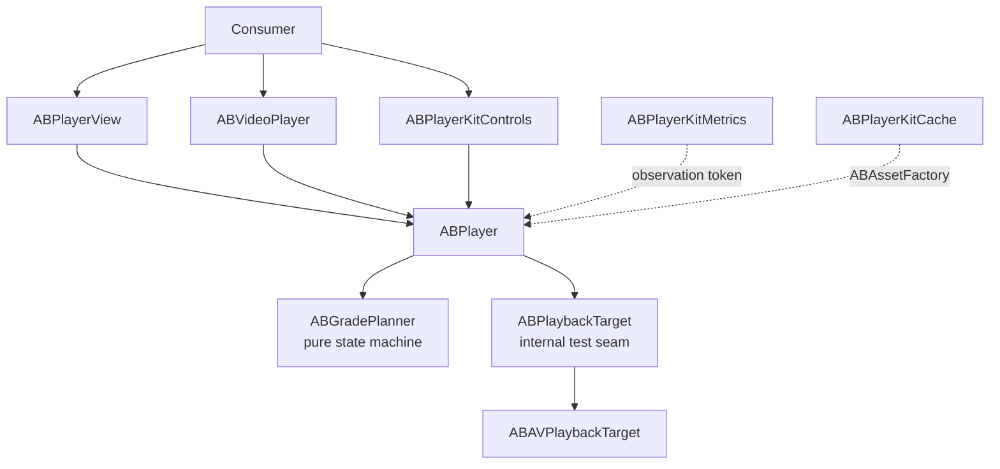

# ABPlayerKit

[한국어](README.ko.md)


[](https://github.com/AppBoong/ABPlayerKit/actions/workflows/ci.yml)
[](https://github.com/AppBoong/ABPlayerKit/actions/workflows/ci.yml)
[](https://appboong.github.io/ABPlayerKit/documentation/)

**A thin, measurable wrapper around `AVPlayer` that makes playback resource ownership explicit.**

Play a video in one line, or drive a feed that preloads media before it scrolls into view and releases every decoder when it scrolls away — without losing sight of AVFoundation underneath.

```swift
ABVideoPlayerWithControls(url: url)
```

<p align="center">
<br>
<sub>That one line, running. Tap to reveal the overlay, pick a rate, scrub — and it gets out of the way on its own.</sub>
</p>

### Features

- **One-line playback** with a standard controls overlay, or bring your own UI.
- **A four-grade ownership model** (`.released` → `.instanceOnly` → `.preloaded` → `.current`) so a feed can prepare nearby media and guarantee that off-screen cells hold zero network activity. Demotion is the exact inverse of promotion.
- **Precise time-to-first-frame.** The first frame counts as displayed only when `AVPlayerLayer.isReadyForDisplay` **and** `AVPlayerItem.status == .readyToPlay` are both true for the current item — not when playback merely started.
- **Customizable controls** — colors, icons, skip intervals, double-tap seek, accessory slots, rate menu — set per view or once for a whole screen with view modifiers.
- **Background, PiP, AirPlay, and lock-screen playback** as explicit, opt-in policies.
- **Optional metrics and caching** in separately linked targets: QoE session summaries, progressive MP4 caching, and explicit HLS prefetch.
- **Swift 6 language mode**, `@MainActor`-isolated UI, `Sendable` configuration values.

> **[Engineering Notes](docs/ENGINEERING-NOTES.md)** — three AVFoundation defects that a green 743-test suite at 91% coverage did not catch, including a background-audio policy that was completely dead on hardware. Each had a test aimed directly at it that passed, because it measured the end state and never the timing iOS actually cares about. What the tests were measuring instead, and the five rules that came out of it.

<table>
<tr>
<td align="center" width="50%">
<br>
<sub>Playback screen</sub>
</td>
<td align="center" width="50%">
<br>
<sub>Controls overlay</sub>
</td>
</tr>
<tr>
<td align="center" width="50%">
<br>
<sub>Tinted style variant</sub>
</td>
<td align="center" width="50%">
<br>
<sub>Cache screen</sub>
</td>
</tr>
</table>

The animation above and these screenshots are from the `Examples/ABPlayerKitDemo` app running the Apple HLS bipbop test stream.

## Why ABPlayerKit?

**Compared to `AVKit.VideoPlayer`** — AVKit gives you a player and system controls in one line, which is the right answer for a single video on a detail screen. It gives you no say over resource ownership, no way to prepare media before it appears, no styling beyond the system look, and no measurement hook. ABPlayerKit keeps the one-liner and adds all four.

**Compared to using `AVPlayer` directly** — you keep the same `AVPlayer` (it stays reachable as `player.avPlayer`), but stop hand-writing the parts that are easy to get subtly wrong: KVO on item status and layer readiness, item teardown ordering, audio-session activation shared across several players, background/foreground side effects, and the difference between "playback started" and "a frame is on screen."

**When you probably don't need it** — a single video, system controls, no preloading, no metrics. `AVKit.VideoPlayer` is less code and one less dependency.

This library deliberately stays thin. It does not abstract AVFoundation away, does not provide a queue or playlist model, and does not manage subtitle selection state — see [Design Rationale](#design-rationale).

## Table of Contents

- [Requirements](#requirements)
- [Installation](#installation)
- [Quick Start](#quick-start)
  - [Customizing](#customizing)
  - [Owning the Player Yourself](#owning-the-player-yourself)
  - [UIKit with `ABPlayerView`](#uikit-with-abplayerview)
  - [Advanced — Grades and Preloading](#advanced--grades-and-preloading)
- [Usage by Target](#usage-by-target)
  - [`ABPlayerKit` — Core](#abplayerkit--core)
  - [`ABPlayerKitControls` — Playback Controls](#abplayerkitcontrols--playback-controls)
  - [`ABPlayerKitMetrics` — TTFF and QoE](#abplayerkitmetrics--ttff-and-qoe)
  - [`ABPlayerKitCache` — Cache and HLS Prefetch](#abplayerkitcache--cache-and-hls-prefetch)
  - [`ABPlayerKitNowPlaying` — Lock Screen and Remote Commands](#abplayerkitnowplaying--lock-screen-and-remote-commands)
- [Tuning](#tuning)
- [Troubleshooting](#troubleshooting)
- [Demo App](#demo-app)
- [Architecture](#architecture)
- [Design Rationale](#design-rationale)
- [API Stability](#api-stability)
- [Contributing](#contributing)
- [License](#license)

## Requirements

- iOS 17+
- Swift 6 language mode
- Xcode 16+

**iOS only.** The core reaches UIKit and AVKit directly, so there is no other platform this builds for. Adding the package to an iOS app in Xcode needs nothing special — Xcode resolves the platform itself. Building the package on its own from a checkout does, because `swift build` targets the host:

```bash
# Not this — it targets macOS and stops with an explanation
swift build

# This
xcodebuild -scheme ABPlayerKit-Package -destination 'generic/platform=iOS' build
xcodebuild -scheme ABPlayerKit-Package -destination 'platform=iOS Simulator,name=iPhone 16 Pro' test
```

## Installation

Add the package in Xcode with **File → Add Package Dependencies**:

```text
https://github.com/AppBoong/ABPlayerKit.git
```

Or add it to `Package.swift`:

```swift
dependencies: [
    .package(
        url: "https://github.com/AppBoong/ABPlayerKit.git",
        from: "0.4.1"
    )
],
targets: [
    .target(
        name: "YourApp",
        dependencies: [
            .product(name: "ABPlayerKit", package: "ABPlayerKit"),
            // Link only when needed:
            .product(name: "ABPlayerKitControls", package: "ABPlayerKit"),
            .product(name: "ABPlayerKitMetrics", package: "ABPlayerKit"),
            .product(name: "ABPlayerKitCache", package: "ABPlayerKit"),
            .product(name: "ABPlayerKitNowPlaying", package: "ABPlayerKit")
        ]
    )
]
```

For unreleased development, replace `from: "0.4.1"` with `branch: "main"`. Applications should prefer the version requirement shown above.

Only `ABPlayerKit` is required. Each optional product's code is absent from your app unless you link it — see [Usage by Target](#usage-by-target).

## Quick Start

Play a URL with the standard controls — this is the whole integration:

```swift
import ABPlayerKit
import ABPlayerKitControls
import SwiftUI

struct VideoScreen: View {
    var body: some View {
        ABVideoPlayerWithControls(url: URL(string: "https://example.com/video.m3u8")!)
            .aspectRatio(16 / 9, contentMode: .fit)
    }
}
```

The view creates its own `ABPlayer`, starts playback, and releases every playback resource when SwiftUI discards the view. Media type is inferred from the URL (`.m3u8` → HLS, anything else → progressive).

Without the controls overlay, use the core target alone:

```swift
import ABPlayerKit
import SwiftUI

ABVideoPlayer(url: url, videoGravity: .resizeAspect)
```

> **Why do some examples end in `{}`?**
> The `url:`/`source:` initializers above take no trailing closure. The `player:` initializers do — `ABVideoPlayerWithControls(player: player) {}` — because an older array-based `accessoryViews:` initializer is still present and deprecated, and a call with no closure at all resolves to that one and warns. The empty braces pick the current initializer. Pass real views instead of `{}` to overlay your own controls. See [API Stability](#api-stability).

### Customizing

Controls appearance and behavior are set with view modifiers, so one modifier can cover a whole screen of players:

```swift
var style = ABPlayerControlsStyle.default
style.progressColor = .systemPink

var controls = ABPlayerControlsConfiguration()
controls.skipInterval = 15

ABVideoPlayerWithControls(url: url)
    .playerControlsStyle(style)
    .playerControlsConfiguration(controls)
```

Player-level settings (mute, loop, audio session, rate) go through `ABPlayerConfiguration` at creation time:

```swift
var configuration = ABPlayerConfiguration()
configuration.isMuted = true
configuration.audioSessionPolicy = .playback(mixWithOthers: false)

ABVideoPlayerWithControls(url: url, playerConfiguration: configuration)
```

> Playback keeps running while the view stays alive but off-screen. Screens that need visibility-driven pausing should own the player explicitly (below).

### Owning the Player Yourself

Own an `ABPlayer` when several views share it, when playback must outlive one view, or when you drive preloading across a feed:

```swift
struct VideoScreen: View {
    @State private var player = ABPlayer()

    var body: some View {
        ABVideoPlayerWithControls(player: player, videoGravity: .resizeAspect) {}
            .aspectRatio(16 / 9, contentMode: .fit)
            .task {
                player.set(source: ABMediaSource(url: url), grade: .current)
                player.play()
            }
            .onDisappear {
                player.release()
            }
    }
}
```

Picture in Picture requires this path — see [Background Policy and Picture in Picture](https://appboong.github.io/ABPlayerKit/documentation/abplayerkit/backgroundandpictureinpicture/).

### UIKit with `ABPlayerView`

```swift
import ABPlayerKit
import UIKit

@MainActor
final class PlayerViewController: UIViewController {
    private let player = ABPlayer()
    private let playerView = ABPlayerView()

    override func viewDidLoad() {
        super.viewDidLoad()

        playerView.frame = view.bounds
        playerView.autoresizingMask = [.flexibleWidth, .flexibleHeight]
        playerView.player = player
        view.addSubview(playerView)

        let source = ABMediaSource(url: URL(string: "https://example.com/video.mp4")!)
        player.set(source: source, grade: .current)
        player.play()
    }
}
```

### Advanced — Grades and Preloading

Create one player and drive all source/grade changes through `set(source:grade:)` when a screen needs to prepare media before it becomes visible — a feed cell a few rows away, for example:

```swift
import ABPlayerKit

let source = ABMediaSource(
    url: URL(string: "https://example.com/video.m3u8")!,
    kind: .hls
)

let player = ABPlayer()
player.set(source: source, grade: .preloaded)

// When the media becomes visible:
player.set(source: source, grade: .current)
player.play()

// When it leaves the preload window:
player.set(source: source, grade: .instanceOnly)
```

| Grade | Resources held | Intended use |
|---|---|---|
| `.released` | Nothing | Return all playback resources |
| `.instanceOnly` | `AVPlayer`, no item | Keep identity while guaranteeing zero item network activity |
| `.preloaded` | Player + item, preload tuning | Prepare nearby media without allowing `play()` |
| `.current` | Player + item, current tuning | Visible media; playback controls are accepted |

- Every release path that holds an item routes through `detachItem`.
- Moving between `.preloaded` and `.current` reapplies the matching tuning role, so demotion is the exact inverse of promotion.
- Playback control calls are accepted only at `.current` — see [Failures, Diagnostics, and Rejected Calls](https://appboong.github.io/ABPlayerKit/documentation/abplayerkit/failuresanddiagnostics/).
- `ABMediaSource`'s `kind:` is inferred from the URL's extension (`.m3u8` → `.hls`, anything else → `.progressive`). Pass it explicitly only for a signed or extensionless URL where that inference would guess wrong.

## Usage by Target

| Product | What it adds | Link when |
|---|---|---|
| `ABPlayerKit` | Playback engine, UIKit rendering, SwiftUI video wrapper | Always |
| `ABPlayerKitControls` | Timeline, buttons, rate selection, auto-hide, UIKit and SwiftUI controls | The app wants the standard controls layer |
| `ABPlayerKitMetrics` | TTFF recording, QoE sessions, sinks, and aggregation | The app measures playback |
| `ABPlayerKitCache` | Progressive caching and explicit HLS prefetch | The app owns offline/cache behavior |
| `ABPlayerKitNowPlaying` | Lock screen / Control Center integration (`MPNowPlayingInfoCenter`, `MPRemoteCommandCenter`) | The app wants remote-command/lock-screen playback |

Full API reference for all five targets is published at **[appboong.github.io/ABPlayerKit](https://appboong.github.io/ABPlayerKit/documentation/)**, rebuilt from the DocC catalogs on every push to `main`. To read it offline, build it in Xcode with **Product → Build Documentation**.

### `ABPlayerKit` — Core

The core target owns the playback state machine, UIKit view, SwiftUI wrapper, tuning, background/audio policies, and token-based events. Grades are covered in [Advanced — Grades and Preloading](#advanced--grades-and-preloading).

Events support multiple independent consumers. The returned token is what keeps the subscription alive — discard it and observation stops:

```swift
let token = player.addObserver { event in
    if case .firstFrameDisplayed(let timestamp) = event {
        print("First frame displayed at \(timestamp)")
    }
}

// Retain token for as long as observation is needed.
token.cancel()
```

`ABPlayer` never touches the process-global `AVAudioSession` unless you opt in — both policies are off by default:

```swift
var configuration = ABPlayerConfiguration()
configuration.audioSessionPolicy = .playback(mixWithOthers: false)
configuration.interruptionPolicy = .pauseAndResume
player.configuration = configuration
```

Two things that catch people before anything else does:

- **`ABBackgroundPolicy.continueAudioOnly` needs all three of**: the `audio` background mode in the host app's `Info.plist`, an `audioSessionPolicy` other than `.unmanaged`, and the policy itself. Missing any one, it silently behaves like `.pause` with no runtime warning.
- **Subtitle and audio track selection UI is not provided.** Reach `AVMediaSelectionGroup` through `player.avPlayerItem` yourself — and re-apply the selection after every attach, since each one builds a new item.

Reference: [Audio Session and Interruptions](https://appboong.github.io/ABPlayerKit/documentation/abplayerkit/audiosessionandinterruptions/) · [Background Policy and Picture in Picture](https://appboong.github.io/ABPlayerKit/documentation/abplayerkit/backgroundandpictureinpicture/) · [Failures, Diagnostics, and Rejected Calls](https://appboong.github.io/ABPlayerKit/documentation/abplayerkit/failuresanddiagnostics/) · [AirPlay and External Playback](https://appboong.github.io/ABPlayerKit/documentation/abplayerkit/airplayandexternalplayback/) · [Subtitles and Audio Tracks](https://appboong.github.io/ABPlayerKit/documentation/abplayerkit/subtitlesandaudiotracks/)

### `ABPlayerKitControls` — Playback Controls

`ABPlayerControlsView` is the standard overlay: transport buttons centered over the video, seek bar along the bottom, elapsed/total time and playback rate beneath it. In UIKit, place it over an `ABPlayerView` and give both the same player; in SwiftUI, `ABVideoPlayerWithControls` composes the two for you.

The controls remain a separate product because many feeds and background players provide their own gestures or no UI at all. Those consumers link only the small core, while standard-player screens opt into UIKit controls and their SwiftUI wrapper with one additional import.

Reference: [Customizing Controls](https://appboong.github.io/ABPlayerKit/documentation/abplayerkitcontrols/customizingcontrols/) — style, behavior, accessory slots, and the environment modifiers.

### `ABPlayerKitMetrics` — TTFF and QoE

Metrics code is absent from an app unless the `ABPlayerKitMetrics` product is linked. `ABMetricsRecorder` attaches through an observation token, and sinks decide where events go: memory, JSON Lines on an internal serial queue, or OSLog.

**`includesSourceURL` defaults to `true`**, so a signed or tokenized media URL is recorded verbatim unless you pass `false` to `ABMetricsRecorder.init(sink:clock:includesSourceURL:)` or mask the field in a custom `ABMetricsSink`.

Reference: [ABPlayerKitMetrics](https://appboong.github.io/ABPlayerKit/documentation/abplayerkitmetrics/) — TTFF and QoE samples, what each rate's denominator includes, and where each sink writes.

### `ABPlayerKitCache` — Cache and HLS Prefetch

The cache target deliberately has two different scopes:

| Media | Behavior |
|---|---|
| Progressive MP4 | Transparent `AVAssetResourceLoader` interception using a custom scheme, HTTP range handling, sequential disk fill, and LRU eviction |
| HLS | Explicit full-asset prefetch through `AVAssetDownloadURLSession`; only completed downloads are used for local playback |

Reference: [ABPlayerKitCache](https://appboong.github.io/ABPlayerKit/documentation/abplayerkitcache/) — wiring the asset factory, why transparent HLS caching is out of scope, and the known constraints.

### `ABPlayerKitNowPlaying` — Lock Screen and Remote Commands

This target bridges `ABPlayer` to `MPNowPlayingInfoCenter` and `MPRemoteCommandCenter`. Like `audioSessionPolicy`, it is a process-wide resource this library never touches until you opt in — nothing is read or written until the first `attach` call.

Reference: [Remote Commands](https://appboong.github.io/ABPlayerKit/documentation/abplayerkitnowplaying/remotecommands/) — the activation table, ownership rules, and what each command additionally requires.


## Tuning

ABPlayerKit models preload and current playback as two distinct tuning roles. Keep `preloadTuning` conservative, choose `currentTuning` for visible playback, and let every grade transition apply the correct role.

| Preset | Peak bitrate | Forward buffer | Resolution | Recommended role |
|---|---:|---:|---|---|
| `.conservativePreload` | 2 Mbps | 5 seconds (soft AVFoundation hint) | Uncapped | `preloadTuning` |
| `.displayCapped` | Unlimited | Automatic | Current display pixel size | Default `currentTuning` |
| `.resolutionCapped` | 2 Mbps | 5 seconds | 960×540 | Cellular-oriented current tuning |
| `.unrestricted` | Unlimited | Automatic | Uncapped | Explicit opt-in when no cap is desired |

```swift
var configuration = ABPlayerConfiguration()
configuration.preloadTuning = .conservativePreload
configuration.currentTuning = .displayCapped

let player = ABPlayer(configuration: configuration)
player.set(source: source, grade: .preloaded) // applies preloadTuning
player.set(source: source, grade: .current)   // applies currentTuning
player.set(source: source, grade: .preloaded) // restores preloadTuning
```

This symmetry prevents a demoted item from retaining the unrestricted/current policy by accident.

`ABPlaybackTuning.audioTimePitchAlgorithm` (default `nil`, leaving AVFoundation's own default algorithm unchanged) passes straight through to `AVPlayerItem.audioTimePitchAlgorithm` — set it per role for a consumer using non-1.0 `ABPlaybackRate` values who wants to opt into (or explicitly out of) time-pitch correction.

## Troubleshooting

**The video area is black and nothing plays.**
A player only loads media once it holds an item. Confirm `player.set(source:grade:)` was called with `.current` (or `.preloaded` followed by a promotion) — a player left at `.instanceOnly` deliberately holds no item and makes no network requests. Then check `player.lastFailure` for a terminal failure. Note that `lastDiagnostic` carrying an `.itemErrorLogEntry` is normal for a healthy stream and is not the cause.

**`play()`, `pause()`, or `seek()` seem to do nothing.**
Playback control calls are ignored — not thrown — while `grade != .current`. Observe `.callRejected(ABRejectedCall, grade:)` to see which call was dropped and at what grade.

**There's no sound, or sound stops when the silent switch is on.**
`audioSessionPolicy` defaults to `.unmanaged`, meaning this library never touches `AVAudioSession`. Set `configuration.audioSessionPolicy = .playback(mixWithOthers: false)` for playback that ignores the silent switch.

**The host app's own audio stops when a player is released.**
If the app had already activated `AVAudioSession` before the first managed player applied a policy, the restore on last release can deactivate it. `AVAudioSession` has no public "was already active" getter, so this can't be detected — see [Audio Session and Interruptions](https://appboong.github.io/ABPlayerKit/documentation/abplayerkit/audiosessionandinterruptions/).

**Background audio stops as soon as the app backgrounds.**
`.continueAudioOnly` needs all three conditions in [Background Policy and Picture in Picture](https://appboong.github.io/ABPlayerKit/documentation/abplayerkit/backgroundandpictureinpicture/), including `UIBackgroundModes` containing `audio` in the **host app's** `Info.plist`. Missing any one makes it silently behave like `.pause`.

**Playback stays paused after returning from the background.**
That's intended if `pause()` was called while backgrounded — an explicit pause is authoritative. The automatic resume only covers the system suspending playback on its own.

**The Picture in Picture button does nothing.**
Check `ABPictureInPictureSession.isSupported` (usually `false` in the simulator — test on a device) and `session.isPossible`, which requires the bound layer to be ready for display. PiP also needs `audioSessionPolicy != .unmanaged`, and works **only** on the `player:` explicit-ownership initializers.

**Lock screen controls don't appear, or some buttons are missing.**
Link `ABPlayerKitNowPlaying` and call `attach`, retaining the returned token. Only a `.current` player is eligible. Change-rate and next/previous-track are **not** in `ABRemoteCommandSet.default` and need explicit opt-in — see the command table above.

**A bare `ABVideoPlayerWithControls(player:)` warns about a deprecated initializer.**
Add an empty trailing closure: `ABVideoPlayerWithControls(player: player) {}`. See [API Stability](#api-stability).

**A `switch` over `ABPlayerEvent`, `ABMetricEvent`, or `ABBackgroundPolicy` stopped compiling after an update.**
These are non-exhaustive by policy; minor releases may add cases. Add a `default` branch.

**A subtitle or audio track selection is lost.**
Every source change, demotion, or `release()` attaches a **new** `AVPlayerItem`. Re-apply the selection on each `.itemAttached(source:)` event — this library stores no selection state.

**Playback stutters in a feed with several live players.**
Keep off-screen cells at `.preloaded` or `.instanceOnly` rather than `.current`, keep `preloadTuning` conservative, and set `allowsExternalPlayback = false` on every instance except the current one.

## Demo App

The standalone iOS 17 demo exercises HLS/MP4 playback, all four grades, tuning roles, TTFF statistics, progressive caching, explicit HLS prefetch, Picture in Picture, and background audio.

```bash
open Examples/ABPlayerKitDemo/ABPlayerKitDemo.xcodeproj
```

Select the **ABPlayerKitDemo** scheme and run on an iOS simulator. The project references this package through `../..`, so a clone opens without package-path setup.

Command-line build:

```bash
xcodebuild \
  -project Examples/ABPlayerKitDemo/ABPlayerKitDemo.xcodeproj \
  -scheme ABPlayerKitDemo \
  -destination 'platform=iOS Simulator,name=iPhone 16 Pro' \
  build
```

Picture in Picture, background audio, lock-screen controls, and AirPlay cannot be verified in the simulator. [`docs/CHECKLIST-device-verification.md`](docs/CHECKLIST-device-verification.md) is the manual checklist used on a real device before each release.

For a vertical short-form feed and preload-window orchestration, see [ABShortsKit](https://github.com/AppBoong/ABShortsKit).

## Architecture



- UI and `ABPlayer` are `@MainActor` isolated.
- Grade planning and configuration are `Sendable` values.
- AVFoundation callbacks capture timing at the callback boundary, then hop to the main actor and revalidate item identity.
- Metrics and cache are optional products with independent ownership and failure modes.

## Design Rationale

### Why observers and tokens instead of a delegate or `AsyncStream`?

A single delegate slot would force application behavior and metrics to compete for ownership. Multiple observers allow both to attach independently, while `ABObservationToken` guarantees explicit cancellation and automatic cancellation on deinitialization. An `AsyncStream` would add fan-out, buffering/drop policy, backpressure, and `for await` task-lifetime decisions; its scheduling can also blur the callback-boundary timestamp that TTFF depends on. A stream can be added later without breaking the token API.

### Why no dependency-injection container?

The package uses initializer injection and `ABPlayerConfiguration`. A container would hide ownership and lifecycle in a library whose primary job is to make resource state visible.

### Why protocols only at test seams?

ABPlayerKit intentionally remains a thin AVFoundation wrapper. Protocols exist where substitution is valuable — playback target, asset factory, observer, metrics sink, and clock — while `avPlayer` and `avPlayerItem` remain available as escape hatches. This avoids an abstraction layer that merely renames AVFoundation.

The complete rationale is recorded in [DESIGN-ABPlayerKit](docs/DESIGN-ABPlayerKit.md) and [DESIGN-OPEN-QUESTIONS](docs/DESIGN-OPEN-QUESTIONS.md).

## API Stability

While this package is `0.x`, replacement APIs are always added additively and deprecated (never silently removed) in the same minor release, with at least one minor release of overlap before removal — nothing is removed before `1.0.0`. `ABPlayerEvent`/`ABPlayerError` stay non-exhaustive `enum`s for the same reason: consumer `switch` statements should include a `default` branch. The full policy is in [POLICY-api-stability](docs/POLICY-api-stability.md), and every release is recorded in the [CHANGELOG](CHANGELOG.md).

> **The deprecated `accessoryViews:` initializer.** A bare `ABPlayerControls(player: player)` / `ABVideoPlayerWithControls(player: player)` call resolves to the deprecated array-based initializer and warns. Add an empty trailing closure — `ABPlayerControls(player: player) {}` — to route to the current `@ViewBuilder accessories:` one. See the CHANGELOG's [`[0.3.0]` Migration notes](CHANGELOG.md#030---2026-08-05) for why there's no default that avoids this.

## Contributing

Issues and pull requests are welcome. [CONTRIBUTING.md](CONTRIBUTING.md) covers the development setup, the code and commit conventions, and the pull-request rules — every change goes through a PR with maintainer approval and green CI, and the build must be zero-warning.

Run the full test suite before opening a PR:

```bash
xcodebuild -scheme ABPlayerKit-Package \
  -destination 'platform=iOS Simulator,name=iPhone 16 Pro' test
```

Please report security-sensitive issues through [SECURITY.md](SECURITY.md) rather than a public issue.

## License

ABPlayerKit is available under the [MIT License](LICENSE). Copyright © 2026 AppBoong.
