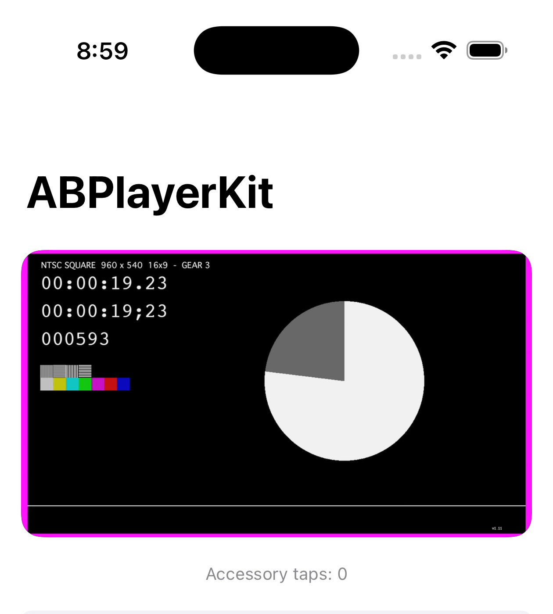
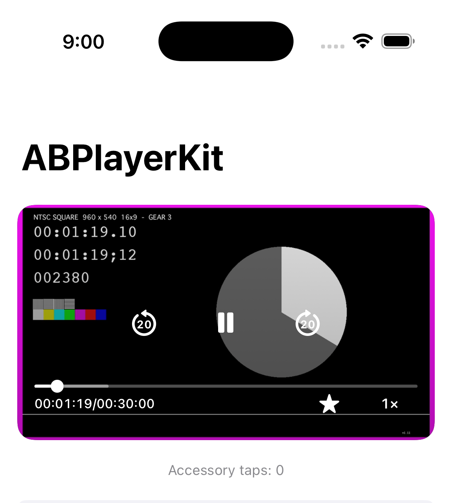
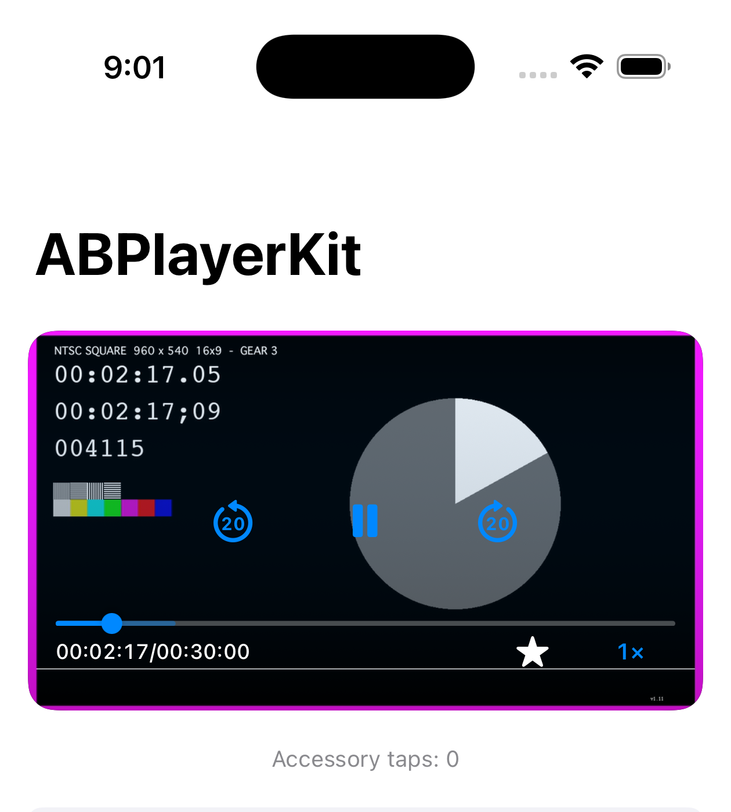
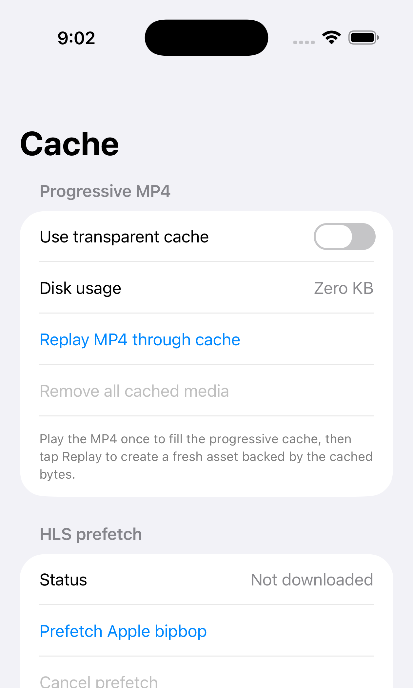
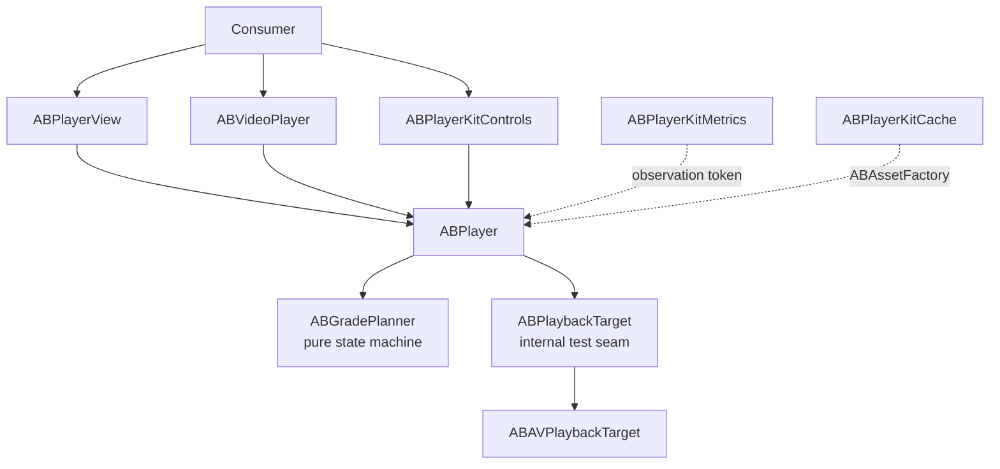

# ABPlayerKit

[한국어](README.ko.md)


[](https://github.com/AppBoong/ABPlayerKit/actions/workflows/ci.yml)
[](https://github.com/AppBoong/ABPlayerKit/actions/workflows/ci.yml)

ABPlayerKit is a thin, measurable wrapper around `AVPlayer`. It makes playback resource ownership explicit with a four-grade state machine and defines time to first frame (TTFF) precisely: the first frame is displayed only when `AVPlayerLayer.isReadyForDisplay` **and** `AVPlayerItem.status == .readyToPlay` are both true for the current item.

The package keeps AVFoundation visible, adds symmetric promotion and demotion, and separates optional controls, metrics, and cache behavior into independently linked targets.

<table>
<tr>
<td align="center" width="50%">
<br>
<sub>Playback screen</sub>
</td>
<td align="center" width="50%">
<br>
<sub>Controls overlay</sub>
</td>
</tr>
<tr>
<td align="center" width="50%">
<br>
<sub>Tinted style variant</sub>
</td>
<td align="center" width="50%">
<br>
<sub>Cache screen</sub>
</td>
</tr>
</table>

Screenshots are from the `Examples/ABPlayerKitDemo` app running the Apple HLS bipbop test stream.

## Requirements

- iOS 17+
- Swift 6 language mode
- Xcode 16+

## Installation

Add the package in Xcode with **File → Add Package Dependencies**:

```text
https://github.com/AppBoong/ABPlayerKit.git
```

Or add it to `Package.swift`:

```swift
dependencies: [
    .package(
        url: "https://github.com/AppBoong/ABPlayerKit.git",
        from: "0.3.0"
    )
],
targets: [
    .target(
        name: "YourApp",
        dependencies: [
            .product(name: "ABPlayerKit", package: "ABPlayerKit"),
            // Link only when needed:
            .product(name: "ABPlayerKitControls", package: "ABPlayerKit"),
            .product(name: "ABPlayerKitMetrics", package: "ABPlayerKit"),
            .product(name: "ABPlayerKitCache", package: "ABPlayerKit"),
            .product(name: "ABPlayerKitNowPlaying", package: "ABPlayerKit")
        ]
    )
]
```

For unreleased development, replace `from: "0.3.0"` with `branch: "main"`. Applications should prefer the version requirement shown above.

## Quick Start

Play a URL with the standard controls — this is the whole integration:

```swift
import ABPlayerKit
import ABPlayerKitControls
import SwiftUI

struct VideoScreen: View {
    var body: some View {
        ABVideoPlayerWithControls(url: URL(string: "https://example.com/video.m3u8")!)
            .aspectRatio(16 / 9, contentMode: .fit)
    }
}
```

The view creates its own `ABPlayer`, starts playback, and releases every playback resource when SwiftUI discards the view. Media type is inferred from the URL (`.m3u8` → HLS, anything else → progressive).

Without the controls overlay, use the core target alone:

```swift
import ABPlayerKit
import SwiftUI

ABVideoPlayer(url: url, videoGravity: .resizeAspect)
```

### Customizing

Controls appearance and behavior are set with view modifiers, so one modifier can cover a whole screen of players:

```swift
var style = ABPlayerControlsStyle.default
style.progressColor = .systemPink

var controls = ABPlayerControlsConfiguration()
controls.skipInterval = 15

ABVideoPlayerWithControls(url: url)
    .playerControlsStyle(style)
    .playerControlsConfiguration(controls)
```

Player-level settings (mute, loop, audio session, rate) go through `ABPlayerConfiguration` at creation time:

```swift
var configuration = ABPlayerConfiguration()
configuration.isMuted = true
configuration.audioSessionPolicy = .playback(mixWithOthers: false)

ABVideoPlayerWithControls(url: url, playerConfiguration: configuration)
```

> Playback keeps running while the view stays alive but off-screen. Screens that need visibility-driven pausing should own the player explicitly (below).

### Owning the Player Yourself

Own an `ABPlayer` when several views share it, when playback must outlive one view, or when you drive preloading across a feed:

```swift
struct VideoScreen: View {
    @State private var player = ABPlayer()

    var body: some View {
        ABVideoPlayerWithControls(player: player, videoGravity: .resizeAspect) {}
            .aspectRatio(16 / 9, contentMode: .fit)
            .task {
                player.set(source: ABMediaSource(url: url), grade: .current)
                player.play()
            }
            .onDisappear {
                player.release()
            }
    }
}
```

### UIKit with `ABPlayerView`

```swift
import ABPlayerKit
import UIKit

@MainActor
final class PlayerViewController: UIViewController {
    private let player = ABPlayer()
    private let playerView = ABPlayerView()

    override func viewDidLoad() {
        super.viewDidLoad()

        playerView.frame = view.bounds
        playerView.autoresizingMask = [.flexibleWidth, .flexibleHeight]
        playerView.player = player
        view.addSubview(playerView)

        let source = ABMediaSource(url: URL(string: "https://example.com/video.mp4")!)
        player.set(source: source, grade: .current)
        player.play()
    }
}
```

### Advanced — Grades and Preloading

Create one player and drive all source/grade changes through `set(source:grade:)` when a screen needs to prepare media before it becomes visible — a feed cell a few rows away, for example:

```swift
import ABPlayerKit

let source = ABMediaSource(
    url: URL(string: "https://example.com/video.m3u8")!,
    kind: .hls
)

let player = ABPlayer()
player.set(source: source, grade: .preloaded)

// When the media becomes visible:
player.set(source: source, grade: .current)
player.play()

// When it leaves the preload window:
player.set(source: source, grade: .instanceOnly)
```

| Grade | Resources held | Intended use |
|---|---|---|
| `.released` | Nothing | Return all playback resources |
| `.instanceOnly` | `AVPlayer`, no item | Keep identity while guaranteeing zero item network activity |
| `.preloaded` | Player + item, preload tuning | Prepare nearby media without allowing `play()` |
| `.current` | Player + item, current tuning | Visible media; playback controls are accepted |

Every release path that holds an item routes through `detachItem`. Moving between `.preloaded` and `.current` reapplies the matching tuning role, so demotion is the exact inverse of promotion.

`ABMediaSource`'s `kind:` is inferred from the URL's extension (`.m3u8` → `.hls`, anything else → `.progressive`) — pass it explicitly only for a signed/extensionless URL where that inference would guess wrong.

## Targets

| Product | What it adds | Link when |
|---|---|---|
| `ABPlayerKit` | Playback engine, UIKit rendering, SwiftUI video wrapper | Always |
| `ABPlayerKitControls` | Timeline, buttons, rate selection, auto-hide, UIKit and SwiftUI controls | The app wants the standard controls layer |
| `ABPlayerKitMetrics` | TTFF recording, sinks, and aggregation | The app measures playback |
| `ABPlayerKitCache` | Progressive caching and explicit HLS prefetch | The app owns offline/cache behavior |
| `ABPlayerKitNowPlaying` | Lock screen / Control Center integration (`MPNowPlayingInfoCenter`, `MPRemoteCommandCenter`) | The app wants remote-command/lock-screen playback |

### `ABPlayerKit` — Core

The core target owns the playback state machine, UIKit view, SwiftUI wrapper, tuning, background/audio policies, and token-based events.

Playback moves through four grades — see [Advanced — Grades and Preloading](#advanced--grades-and-preloading) above for the full table and a worked `.preloaded`/`.instanceOnly` example. Every release path that holds an item routes through `detachItem`; moving between `.preloaded` and `.current` reapplies the matching tuning role, so demotion is the exact inverse of promotion.

Events support multiple independent consumers:

```swift
let token = player.addObserver { event in
    if case .firstFrameDisplayed(let timestamp) = event {
        print("First frame displayed at \(timestamp)")
    }
}

// Retain token for as long as observation is needed.
token.cancel()
```

Treat `ABPlayerEvent` as non-exhaustive. Minor releases may add cases, so consumer switches must include a `default` branch.

#### Audio Session and Interruptions

`ABPlayer` never touches the process-global `AVAudioSession` unless you opt in — both are `off` by default:

```swift
var configuration = ABPlayerConfiguration()
configuration.audioSessionPolicy = .playback(mixWithOthers: false)
configuration.interruptionPolicy = .pauseAndResume
player.configuration = configuration
```

- **`audioSessionPolicy`** (default `.unmanaged`): when set to `.playback` or `.ambient`, the category is applied the moment this player becomes `.current` (or `play()` starts), and restored automatically. Concurrent players (a feed of `.preloaded`/`.current` cells) share one process-wide `ABAudioSessionCoordinator`, so the category is only captured before the *first* participating player applies it, and only restored once the *last* one releases — one player's `release()` never disrupts a sibling that's still relying on the session.
  - **Caveat**: if the host app had already activated `AVAudioSession` itself (its own audio was already playing) before this player's first participant applied a policy, restoring on the last release can still deactivate the session out from under the host. `AVAudioSession` exposes no public getter for "was already active," so there's no state to snapshot and this can't be distinguished from "we activated it" — plan the app's own session handling accordingly if it shares the session with a managed `ABPlayer`.
- **`interruptionPolicy`** (default `.ignore`): set to `.pauseAndResume` to have the player pause automatically when a phone call, Siri, or another app interrupts playback, and resume once the interruption ends — but only if the system reports `AVAudioSessionInterruptionOptionKey.shouldResume` and this player was actually playing beforehand. Resuming reactivates the audio session through the same coordinator `audioSessionPolicy` uses, so the two compose automatically.
- **`pausesOnRouteChangeDeviceUnavailable`** (default `true`, independent of `interruptionPolicy`): pauses when the current output device disappears (e.g. headphones unplugged), matching platform HIG expectations. Set to `false` to opt out.

Both paths broadcast through the same `ABPlayerEvent` stream: `.audioInterruptionBegan`, `.audioInterruptionEnded(resumed:)`, and `.audioRouteChangedDeviceUnavailable`.

#### Background Policy

`ABPlayerConfiguration.backgroundPolicy` controls what happens to a `.current` player when the app leaves the foreground. Default is `.pause`.

| Policy | On background entry | On foreground return |
|---|---|---|
| `.ignore` | Nothing | Nothing (besides re-marking the audio session for reactivation) |
| `.pause` (default) | Pauses if `.current` | Resumes if it was playing |
| `.pauseAndDetachLayer` | Pauses if `.current`; detaches `AVPlayerLayer.player` (releases the decoder) | Re-attaches the layer; resumes if it was playing |
| `.demoteToInstance` | Demotes to `.instanceOnly` (drops the item; blocks network entirely) | Restores the prior grade |
| `.continueAudioOnly` | Detaches `AVPlayerLayer.player` only — playback keeps running | Re-attaches the layer; resumes if the system suspended playback anyway |

`.continueAudioOnly` needs all three of the following, or it silently behaves like `.pause` (the system suspends the app, and this policy resumes playback on foreground return as a safety net):

| # | Condition | Who sets it |
|---|---|---|
| 1 | `UIBackgroundModes` includes `audio` | The host app's `Info.plist` — this library cannot do it for you |
| 2 | `configuration.audioSessionPolicy = .playback(mixWithOthers: false)` (or `.ambient`) | The app, via `ABPlayerConfiguration` |
| 3 | `configuration.backgroundPolicy = .continueAudioOnly` | The app, via `ABPlayerConfiguration` |

`ABBackgroundPolicy` is non-exhaustive — a `switch` over it outside this package should include a `default` branch.

#### Picture in Picture

Bind an `ABPictureInPictureSession` to an `ABPlayerView`, or pass one to `ABVideoPlayer`'s **explicit-ownership** initializer:

```swift
import ABPlayerKit
import SwiftUI

struct VideoScreen: View {
    let player: ABPlayer
    @State private var pictureInPicture = ABPictureInPictureSession()

    var body: some View {
        ABVideoPlayer(player: player, pictureInPicture: pictureInPicture)
            .aspectRatio(16 / 9, contentMode: .fit)
            .overlay(alignment: .topTrailing) {
                if pictureInPicture.isPossible {
                    Button(pictureInPicture.isActive ? "Stop PiP" : "Start PiP") {
                        pictureInPicture.isActive ? pictureInPicture.stop() : pictureInPicture.start()
                    }
                }
            }
    }
}
```

While a session is active, every `ABBackgroundPolicy`'s automatic background/foreground side effects are suppressed for that player — PiP keeps rendering and playing instead of being paused or detached out from under itself. The suppression only covers the *automatic* side effects; explicit calls like `release()` still end PiP.

| Prerequisite | Who provides it |
|---|---|
| `UIBackgroundModes` includes `audio` (if PiP should survive backgrounding) | The host app's `Info.plist` — this library cannot do it for you |
| `configuration.audioSessionPolicy != .unmanaged` | The app, via `ABPlayerConfiguration` |
| Device/OS supports Picture in Picture | Check `ABPictureInPictureSession.isSupported` — usually `false` in the simulator |
| The bound layer is ready for display | Reflected in `session.isPossible` |

**Picture in Picture is supported only on the explicit-ownership path** (`player:` initializers). The `url:`/`source:` convenience initializers release their owned player when the SwiftUI identity is discarded, which would cut PiP short — so they don't accept a `pictureInPicture:` parameter.

#### AirPlay

Three `ABPlayerConfiguration` properties pass straight through to the matching `AVPlayer` properties, all defaulting to `AVPlayer`'s own defaults (so existing consumers see no behavior change):

```swift
var configuration = ABPlayerConfiguration()
configuration.allowsExternalPlayback = true                          // default
configuration.usesExternalPlaybackWhileExternalScreenIsActive = false // default
configuration.externalPlaybackVideoGravity = .resizeAspect            // default
```

Check whether AirPlay is currently active with `player.isExternalPlaybackActive` — a plain computed property, not `@Observable`-tracked, since it re-reads `AVPlayer` on every access. For a reactive signal, KVO `player.avPlayer` directly, or use `AVRoutePickerView`'s own state:

```swift
import AVKit
import SwiftUI

struct AirPlayButton: UIViewRepresentable {
    func makeUIView(context: Context) -> AVRoutePickerView { AVRoutePickerView() }
    func updateUIView(_ uiView: AVRoutePickerView, context: Context) {}
}
```

A screen with several simultaneously-live players (a feed) should set `allowsExternalPlayback = false` on every instance except the current one.

#### Subtitles and Audio Tracks

Subtitle/audio track selection UI and state management are **not provided** by this library. Reach `AVMediaSelectionGroup` directly through the escape hatch:

```swift
if let item = player.avPlayerItem,
   let group = item.asset.mediaSelectionGroup(forMediaCharacteristic: .audible) {
    let options = group.options
    // Present `options`, then:
    item.select(options[0], in: group)
}
```

Three constraints apply:

1. `player.avPlayerItem` is non-`nil` only from `.preloaded` upward (`ABPlaybackGrade.holdsItem`).
2. A source change, demotion, or `release()` creates a **new** item (`ABAVPlaybackTarget` re-attaches from scratch) — a selection made on a previous item does not carry over. Re-apply on every `.itemAttached(source:)` event.
3. This library remembers no selection state across attaches; that responsibility is entirely the consumer's.

### `ABPlayerKitControls` — Opt-in Playback Controls

UIKit applications place `ABPlayerControlsView` over `ABPlayerView` and attach the same player:

```swift
import ABPlayerKit
import ABPlayerKitControls

let videoView = ABPlayerView()
videoView.player = player

let controlsView = ABPlayerControlsView()
controlsView.player = player
```

SwiftUI applications can use the ready-made composition:

```swift
import ABPlayerKit
import ABPlayerKitControls
import SwiftUI

ABVideoPlayerWithControls(
    player: player,
    videoGravity: .resizeAspect
) {}
.aspectRatio(16 / 9, contentMode: .fit)
```

The standard overlay keeps skip-backward, play/pause, and skip-forward centered over the video. Its seek bar hugs the bottom; `HH:mm:ss/HH:mm:ss` elapsed/total time sits directly below the seek bar's visible track at the left, and playback rate sits at the bottom-right. The default white/grey controls use a low-opacity dark scrim so the video remains clearly visible.

Style changes apply live to the existing controls. Track, played progress, thumb appearance, and icons are independent:

```swift
var style = ABPlayerControlsStyle.default
style.trackColor = .white.withAlphaComponent(0.2)
style.progressColor = .systemPink
style.thumbColor = .systemPink
style.thumbSize = CGSize(width: 14, height: 14)
style.playIcon = .system("play.circle.fill")
style.pauseIcon = .system("pause.circle.fill")

controlsView.style = style
```

Behavior lives in `ABPlayerControlsConfiguration`: the default periodic UI update interval is 0.25 seconds, skip icons synchronize with supported intervals, and rate selection supports menu, cycle, and hidden modes. VoiceOver suppresses auto-hide; Reduce Motion removes fades. Tapping play after playback has reached the end seeks to zero before playing (replay-from-start), instead of a bare `play()` that would do nothing at the end of an item.

Individual controls can be hidden without touching layout code — `showsPlayPauseButton`/`showsSeekBar` (both default `true`) work the same way the existing `showsSkipButtons` does; hiding the seek bar collapses the row it occupies.

While `ABPlayer.isBuffering` is true, the play/pause button's glyph gets a spinner overlay — the button itself stays enabled and hit-testable throughout, since a stall can still be paused. Controlled by `showsBufferingIndicator` (default `true`) and `ABPlayerControlsStyle.bufferingIndicatorColor` (default `nil`, follows `tintColor`); auto-hide is suppressed while buffering, without forcing controls visible.

```swift
var configuration = ABPlayerControlsConfiguration()
configuration.showsBufferingIndicator = true
configuration.touchPassthrough = .whenControlsHidden
configuration.doubleTapSeek = .edges(edgeWidthFraction: 0.3)
configuration.providesHapticFeedback = true
configuration.rateLabelFormat = .automatic
configuration.timeLabelSeparator = "/"

controlsView.configuration = configuration
```

- **`touchPassthrough`** (`ABControlsTouchPassthrough`, default `.never`): whether touches that miss every control pass through to whatever sits behind the overlay — `.never` (current behavior), `.whenControlsHidden`, or `.always`. Never overrides the existing hit-test priority order; this only applies once nothing else has already claimed the touch.
- **`doubleTapSeek`** (`ABDoubleTapSeek`, default `.disabled`): double-tapping the overlay's leading/trailing edge bands seeks by `skipInterval`. `.edges(edgeWidthFraction:)` sets each band's width as a fraction of the overlay's width (clamped `0.1...0.5`). Disabled by default so the background single-tap recognizer never has to wait out a double-tap timeout for consumers who don't opt in. `providesHapticFeedback` (default `true`) fires a light haptic on an accepted double-tap seek.
- **`rateLabelFormat`** (`ABPlayerControlsConfiguration.RateLabelFormat`, default `.automatic`): `.automatic` formats the playback rate with a locale-aware `NumberFormatter` (`"1.5"` in `en`, `"1,5"` in `de`); `.custom { rate in ... }` supplies the entire label text.
- **`timeLabelSeparator`** (default `"/"`): the string between a time label's elapsed and secondary fields.

A skip/double-tap/VoiceOver-adjustment seek streak shows a cumulative feedback badge (`"+20s"`/`"-10s"`) while it's outstanding, driven entirely by the core's `pendingSeekTime`/`seekTargetChanged` — Controls never accumulates the delta itself. Style it with `ABPlayerControlsStyle.seekFeedbackTextColor`/`.seekFeedbackBackgroundColor`/`.seekFeedbackFont`.

Beyond the single `accessoryViews` position, `ABControlsSlot` (`.topTrailing`, `.transportTrailing`, `.bottomTrailing`) lets consumer views land at additional overlay positions via `ABPlayerControlsView.accessoryViews(in:)`/`setAccessoryViews(_:in:)`. The existing `accessoryViews` property is an alias for `.bottomTrailing`, with identical behavior:

```swift
controlsView.setAccessoryViews([captionsButton], in: .topTrailing)
controlsView.setAccessoryViews([fullscreenButton], in: .transportTrailing)
```

The controls remain a separate product because many feeds and background players provide their own gestures or no UI at all. Those consumers link only the small core, while standard-player screens opt into UIKit controls and their SwiftUI wrapper with one additional import.

### `ABPlayerKitMetrics` — Opt-in by Linkage

Metrics code is absent from an app unless the `ABPlayerKitMetrics` product is linked. `ABMetricsRecorder` attaches through an observation token, and sinks decide where events go: memory, JSON Lines on an internal serial queue, or OSLog.

```swift
import ABPlayerKit
import ABPlayerKitMetrics

@MainActor
final class PlaybackSession {
    let player = ABPlayer()

    private let sink: ABInMemoryMetricsSink
    private let recorder: ABMetricsRecorder
    private var tokens: Set<ABObservationToken> = []

    init() {
        let sink = ABInMemoryMetricsSink()
        self.sink = sink
        self.recorder = ABMetricsRecorder(sink: sink)

        recorder.attach(to: player).store(in: &tokens)
        player.addObserver { [weak self] event in
            guard case .firstFrameDisplayed = event else { return }
            Task { @MainActor [weak self] in
                self?.refreshStatistics()
            }
        }.store(in: &tokens)
    }

    func play(_ source: ABMediaSource) {
        let startedAt = ABMonotonicClock().now
        player.set(source: source, grade: .current)
        recorder.beginTTFF(for: player, at: startedAt)
        player.play()
    }

    private func refreshStatistics() {
        let samples = sink.events.compactMap { event -> ABMetricSample? in
            guard case .ttff(let sample) = event else { return nil }
            return sample
        }
        let statistics = ABPlaybackStatistics.aggregate(samples)
        print(statistics.p50, statistics.p95, statistics.hitRate)
    }
}
```

Store `PlaybackSession` as a property of the screen or coordinator for the entire measurement. The sink, recorder, and observation tokens must all outlive the asynchronous first-frame event.

An abandoned TTFF sample remains in the denominator of `hitRate` and `abandonRate`; it is never silently discarded from the measurement.

#### QoE Sessions

The same `attach(to:)` also tracks whole playback sessions, not just TTFF — keyed by `(playerID, sessionStartedAt)`, since there's no separate session identifier. A session opens on `ABPlayerEvent.itemAttached(source:)` and closes on `ABPlayerEvent.itemDetached(reason:)`, emitting `ABMetricEvent.sessionStarted(_:)` and `.sessionSummary(_:)` respectively:

```swift
recorder.attach(to: player).store(in: &tokens)

// Before cancelling the token, if a final summary is needed:
recorder.endSession(for: player)

// Or read a live, still-open summary at any point:
let inProgress = recorder.snapshot(for: player)
```

- `attach(to:)`'s returned token has no cancellation hook the recorder can observe, so cancelling it alone produces no final `.sessionSummary` — call `ABMetricsRecorder.endSession(for:)` first if you want one.
- `ABMetricsRecorder.snapshot(for:)` returns a live, unsunk `ABSessionSummary` for a session that's still open.
- `ABSessionSummary.rebufferRatio` is `rebufferMilliseconds / (rebufferMilliseconds + watchedMilliseconds)`, `nil` when both are `0`. Buffering before the first frame counts toward `startupBufferMilliseconds`, not `rebufferMilliseconds` — TTFF already measures that wait, so counting it as a rebuffer too would double-count the same stall.
- `ABSessionSummary.completionRatio`'s precision improves when `ABPlayerConfiguration.periodicTimeInterval` is set; `watchedMilliseconds` stays accurate regardless, since it's derived from `ABPlayerEvent.timeControlStatusChanged(_:)` transitions, not periodic position samples.
- `ABSessionAnchor.sourceURL`/`ABSessionSummary.sourceURL` carry the media URL for joining against server-side logs. A source using a signed or tokenized URL should either pass `includesSourceURL: false` to `ABMetricsRecorder.init(sink:clock:includesSourceURL:)` or mask the field in a custom `ABMetricsSink` — this package bakes in no masking policy of its own.

New public types back these sessions: `ABSessionAnchor` (session identity), `ABBufferingInterval`/`ABFailureRecord` (raw per-session records), `ABSessionSummary` (one session's rollup), `ABQoESummary` (aggregate across sessions), and `ABLatencyDistribution` (a p50/p95/max/waited distribution — `ABPlaybackStatistics.waited` is the same shape over `.waited` TTFF samples only, alongside the legacy `p50`/`p95`/`max`, which keep folding `.hit` in as `0` ms).

`ABMetricEvent` is non-exhaustive, the same convention as `ABPlayerEvent`: a `switch` outside this package should include a `default` branch, since minor releases may add cases (`.sessionStarted`, `.buffering`, `.failure`, and `.sessionSummary` were the four most recently added).

`ABAccessSnapshot` also folds fields across the *entire* access log, not only its last entry — `totalBytesTransferred`, `totalStallCount`, `droppedVideoFrameCount`, `bitrateSwitchCount`, `mediaRequestCount`, `durationWatchedSeconds`, `observedBitrateAverage`, `initialStartupTimeSeconds`, `entryCount`, plus `segmentsDownloadedCount` (always `0` — `AVPlayerItemAccessLogEvent.numberOfSegmentsDownloaded` has been API-unavailable in Swift since iOS 7; kept in the schema for forward compatibility). `ABClock.wallClockEpoch` (default `Date().timeIntervalSince1970`) maps a session's monotonic timeline onto a wall-clock instant once, at session open, for joining against server-side logs.

`ABJSONLinesMetricsSink.flush()` is `public`. Pass `init(fileURL:maxFileSizeBytes:maxRotatedFiles:)` to rotate the file once it crosses `maxFileSizeBytes`, keeping `maxRotatedFiles` rotated copies (`.1`, `.2`, …). A persistent write failure no longer fails silently — check `writeFailureCount`/`lastWriteErrorDescription`.

### `ABPlayerKitCache` — Progressive Cache and HLS Prefetch

The cache target deliberately has two different scopes:

| Media | Behavior |
|---|---|
| Progressive MP4 | Transparent `AVAssetResourceLoader` interception using a custom scheme, HTTP range handling, sequential disk fill, and LRU eviction |
| HLS | Explicit full-asset prefetch through `AVAssetDownloadURLSession`; only completed downloads are used for local playback |

```swift
import ABPlayerKitCache

let cache = try ABMediaCache()
let hlsPrefetcher = ABHLSPrefetcher()

// Build and retain this factory. Release the current item before replacing it.
let assetFactory = cache.makeAssetFactory(hlsPrefetcher: hlsPrefetcher)
player.release()
var configuration = player.configuration
configuration.assetFactory = assetFactory
player.configuration = configuration

let handle = hlsPrefetcher.prefetch(hlsSource)
if await handle.result == .completed {
    player.set(source: hlsSource, grade: .current)
    player.play() // the factory resolves the completed local HLS asset
}
```

Transparent HLS segment caching is intentionally outside v1. `AVAssetResourceLoader` cannot intercept ordinary HTTP(S) HLS master/media playlists; transparent caching would require a local reverse proxy that rewrites playlists and handles relative URLs, encryption keys, and background lifetime. That has a different and much larger failure surface, so the accepted [Q1 design decision](docs/DESIGN-OPEN-QUESTIONS.md) keeps it separate. See also [DESIGN-ABPlayerKit §9](docs/DESIGN-ABPlayerKit.md).

Progressive MP4 caching is a **linear prefix**, not sparse ranges: a single sequential fill grows the cached file from byte 0 forward, and `load(_:range:)` normally waits for that fill to reach a requested offset. A distant seek in a non-faststart file would otherwise wait for the fill to sequentially crawl there. To bound that, a request whose offset sits `ABCacheConfiguration.passthroughGapThreshold` (default 2MB) or more ahead of the current fill prefix skips waiting entirely and is served by a direct network passthrough instead — capped to ≤1MB per round trip so it streams back in bounded chunks rather than buffering the whole gap in memory. The background fill keeps crawling forward untouched; this is a one-off fallback for that request, not a jump-start of the cache itself. Full sparse-range caching remains out of scope.

### `ABPlayerKitNowPlaying` — Now Playing and Remote Commands

This target bridges `ABPlayer` to `MPNowPlayingInfoCenter` and `MPRemoteCommandCenter`. Like `audioSessionPolicy`, it is a process-wide resource this library never touches until you opt in — nothing is read or written until the first `attach` call.

```swift
import ABPlayerKit
import ABPlayerKitNowPlaying

let token = ABNowPlayingCenter.shared.attach(
    player,
    metadata: ABNowPlayingMetadata(title: "Episode 12", artist: "My Show"),
    configuration: ABNowPlayingConfiguration(skipInterval: 15),
    artwork: ABStaticArtworkProvider(image: episodeArtwork)
)

// Retain `token` for as long as this player should be eligible to own
// Now Playing. Cancelling it (or letting it deinitialize) detaches.
```

Ownership is exclusive and automatic, following one rule: **only a player at `ABPlaybackGrade.current` may own the surface, and the most recently promoted eligible player wins** (last-eligible-wins, LIFO). This matters for feeds with multiple `ABPlayer` instances:

- A player becomes eligible the moment it reaches `.current`, and loses eligibility the moment it leaves.
- If two players are simultaneously `.current`, the one that became `.current` more recently owns Now Playing; the other waits on a stack.
- When the current owner loses eligibility (or its token is cancelled, or the instance itself is deallocated), the next-most-recent eligible player on the stack takes over automatically.
- When the last eligible player relinquishes, whatever `MPNowPlayingInfoCenter`/`MPRemoteCommandCenter` state existed before the first `attach` is restored exactly — this library leaves no trace once nobody is using it.

A remote command reaches the lock screen only when **both** of these hold: (a) it's included in `ABNowPlayingConfiguration.commands` (an `ABRemoteCommandSet`), and (b) the action it maps to actually exists — a lock-screen button that does nothing is worse than no button. `commands` defaults to `ABRemoteCommandSet.default`, which is `[.play, .pause, .togglePlayPause, .skipForward, .skipBackward, .changePlaybackPosition]`; it **excludes** `.changePlaybackRate`, `.nextTrack`, and `.previousTrack`. Passing `ABNowPlayingConfiguration()` unchanged, plus a handler or a rates list, is not enough to enable those three — `commands` has to be expanded explicitly:

```swift
var configuration = ABNowPlayingConfiguration()
configuration.commands = .default.union([.nextTrack, .previousTrack, .changePlaybackRate])
configuration.supportedPlaybackRates = [1, 1.5, 2] // still required, see the table below

let token = ABNowPlayingCenter.shared.attach(player, metadata: metadata, configuration: configuration)
ABNowPlayingCenter.shared.setTrackNavigationHandlers(
    // This library has no queue or playlist concept — these bodies are yours
    // to fill in, typically by advancing your own queue and attaching the
    // next player.
    next: { /* advance your queue */ },
    previous: { /* step back in your queue */ },
    for: player
)
```

| Command | In `.default`? | Also requires |
|---|---|---|
| Play / Pause / Toggle Play-Pause | Yes | Nothing further — always enabled |
| Skip Forward / Backward | Yes | Nothing further — interval from `ABNowPlayingConfiguration.skipInterval` |
| Change Playback Position | Yes | The current item's duration to be finite |
| Change Playback Rate | **No** | `commands` must include `.changePlaybackRate`, **and** `ABNowPlayingConfiguration.supportedPlaybackRates` must be non-empty |
| Next / Previous Track | **No** | `commands` must include `.nextTrack`/`.previousTrack`, **and** a handler must be installed via `setTrackNavigationHandlers(next:previous:for:)` |

Update metadata (e.g. on a track change) with `ABNowPlayingCenter.shared.update(_:for:)` — it republishes immediately if the player currently owns Now Playing, or takes effect the next time it acquires ownership otherwise.

## Tuning

ABPlayerKit models preload and current playback as two distinct tuning roles. Keep `preloadTuning` conservative, choose `currentTuning` for visible playback, and let every grade transition apply the correct role.

| Preset | Peak bitrate | Forward buffer | Resolution | Recommended role |
|---|---:|---:|---|---|
| `.conservativePreload` | 2 Mbps | 5 seconds (soft AVFoundation hint) | Uncapped | `preloadTuning` |
| `.displayCapped` | Unlimited | Automatic | Current display pixel size | Default `currentTuning` |
| `.resolutionCapped` | 2 Mbps | 5 seconds | 960×540 | Cellular-oriented current tuning |
| `.unrestricted` | Unlimited | Automatic | Uncapped | Explicit opt-in when no cap is desired |

```swift
var configuration = ABPlayerConfiguration()
configuration.preloadTuning = .conservativePreload
configuration.currentTuning = .displayCapped

let player = ABPlayer(configuration: configuration)
player.set(source: source, grade: .preloaded) // applies preloadTuning
player.set(source: source, grade: .current)   // applies currentTuning
player.set(source: source, grade: .preloaded) // restores preloadTuning
```

This symmetry prevents a demoted item from retaining the unrestricted/current policy by accident.

## Architecture



- UI and `ABPlayer` are `@MainActor` isolated.
- Grade planning and configuration are `Sendable` values.
- AVFoundation callbacks capture timing at the callback boundary, then hop to the main actor and revalidate item identity.
- Metrics and cache are optional products with independent ownership and failure modes.

## Design Rationale

### Why observers and tokens instead of a delegate or `AsyncStream`?

A single delegate slot would force application behavior and metrics to compete for ownership. Multiple observers allow both to attach independently, while `ABObservationToken` guarantees explicit cancellation and automatic cancellation on deinitialization. An `AsyncStream` would add fan-out, buffering/drop policy, backpressure, and `for await` task-lifetime decisions; its scheduling can also blur the callback-boundary timestamp that TTFF depends on. A stream can be added later without breaking the token API.

### Why no dependency-injection container?

The package uses initializer injection and `ABPlayerConfiguration`. A container would hide ownership and lifecycle in a library whose primary job is to make resource state visible.

### Why protocols only at test seams?

ABPlayerKit intentionally remains a thin AVFoundation wrapper. Protocols exist where substitution is valuable—playback target, asset factory, observer, metrics sink, and clock—while `avPlayer` and `avPlayerItem` remain available as escape hatches. This avoids an abstraction layer that merely renames AVFoundation.

The complete rationale is recorded in [DESIGN-ABPlayerKit](docs/DESIGN-ABPlayerKit.md) and [DESIGN-OPEN-QUESTIONS](docs/DESIGN-OPEN-QUESTIONS.md).

## API Stability

While this package is `0.x`, replacement APIs are always added additively and deprecated (never silently removed) in the same minor release, with at least one minor release of overlap before removal — nothing is removed before `1.0.0`. `ABPlayerEvent`/`ABPlayerError` stay non-exhaustive `enum`s for the same reason: consumer `switch` statements should include a `default` branch. The full policy, and the deprecation of the array-based `accessoryViews:` initializers in favor of `@ViewBuilder accessories:` as a worked example, is in [POLICY-api-stability](docs/POLICY-api-stability.md).

> If you don't pass `accessoryViews` today, a bare `ABPlayerControls(player: player)` / `ABVideoPlayerWithControls(player: player)` call now resolves to the deprecated initializer and warns. Add an empty trailing closure — `ABPlayerControls(player: player) {}` — to route to the new one instead; see the CHANGELOG's `[0.3.0]` **Migration notes** for why there's no default that avoids this.

## Demo App

The standalone iOS 17 demo exercises HLS/MP4 playback, all four grades, tuning roles, TTFF statistics, progressive caching, and explicit HLS prefetch.

```bash
open Examples/ABPlayerKitDemo/ABPlayerKitDemo.xcodeproj
```

Select the **ABPlayerKitDemo** scheme and run on an iOS simulator. The project references this package through `../..`, so a clone opens without package-path setup.

Command-line build:

```bash
xcodebuild \
  -project Examples/ABPlayerKitDemo/ABPlayerKitDemo.xcodeproj \
  -scheme ABPlayerKitDemo \
  -destination 'platform=iOS Simulator,name=iPhone 16 Pro' \
  build
```

For a vertical short-form feed and preload-window orchestration, see [ABShortsKit](https://github.com/AppBoong/ABShortsKit).

## License

ABPlayerKit is available under the [MIT License](LICENSE). Copyright © 2026 AppBoong.
