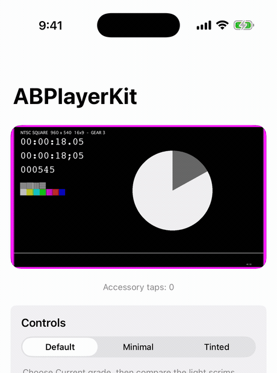
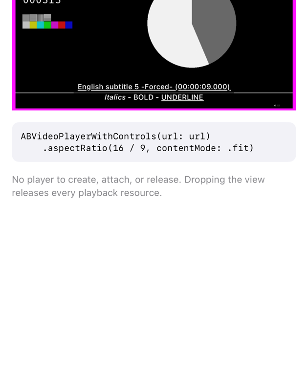
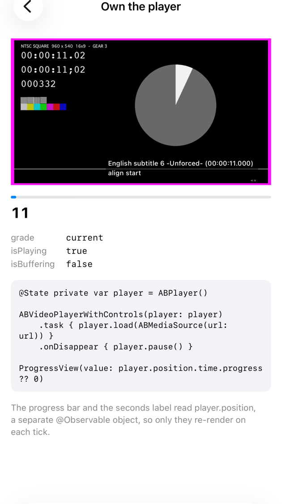
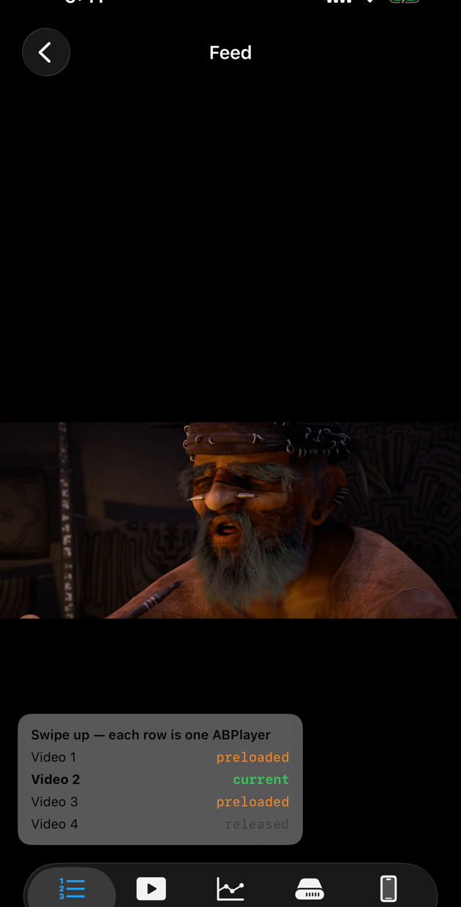

# ABPlayerKit

[한국어](README.ko.md)


[](https://github.com/AppBoong/ABPlayerKit/actions/workflows/ci.yml)
[](https://github.com/AppBoong/ABPlayerKit/actions/workflows/ci.yml)
[](https://appboong.github.io/ABPlayerKit/documentation/)

**Drop-in video playback for SwiftUI, built on `AVPlayer`.**

One line plays a video with standard controls. A few more let you own the player, show its progress, or preload a feed, and `AVPlayer` stays reachable the whole time.

```swift
ABVideoPlayerWithControls(url: url)
```

<p align="center">
<br>
<sub>That one line, running. Tap to reveal the overlay, pick a rate, scrub — and it gets out of the way on its own.</sub>
</p>

## Installation

iOS 17+ · Swift 6 · Xcode 16+

In Xcode, choose **File → Add Package Dependencies** and enter `https://github.com/AppBoong/ABPlayerKit.git`. Or in `Package.swift`:

```swift
.package(url: "https://github.com/AppBoong/ABPlayerKit.git", from: "0.5.1")
```

Link `ABPlayerKit`, plus `ABPlayerKitControls` for the standard controls.

## Quick Start

Each step runs in the demo app's **Usage** tab ([`UsageScreen.swift`](Examples/ABPlayerKitDemo/ABPlayerKitDemo/UsageScreen.swift)):

<table>
<tr>
<td align="center" width="33%">
<br>
<sub>1. One line</sub>
</td>
<td align="center" width="33%">
<br>
<sub>2. Own the player, show its position</sub>
</td>
<td align="center" width="33%">
<br>
<sub>3. A feed: one <code>.current</code>, neighbours <code>.preloaded</code></sub>
</td>
</tr>
</table>

### 1. Play a URL

```swift
import ABPlayerKit
import ABPlayerKitControls
import SwiftUI

struct VideoScreen: View {
    let url: URL

    var body: some View {
        ABVideoPlayerWithControls(url: url)
            .aspectRatio(16 / 9, contentMode: .fit)
    }
}
```

The view creates the player, starts playback, and releases everything when SwiftUI discards the view. Without controls, use `ABVideoPlayer(url:)` from the core product.

### 2. Own the player

Own the player when a screen needs to pause it, observe it, or share it:

```swift
struct VideoScreen: View {
    let url: URL
    @State private var player = ABPlayer()

    var body: some View {
        VStack {
            ABVideoPlayerWithControls(player: player)
                .aspectRatio(16 / 9, contentMode: .fit)
            ProgressView(value: player.position.time.progress ?? 0)
        }
        .task { player.load(ABMediaSource(url: url)) }  // a no-op on later appearances
        .onDisappear { player.pause() }               // pause, don't release
    }
}
```

`ABPlayer` is `@Observable`, so `isPlaying`, `isBuffering` and `duration` work in SwiftUI directly. `player.position` is a separate observable object, so time updates re-render only the views that read it. Picture in Picture, Now Playing and metrics all start from this step.

### 3. Customize the controls

```swift
var style = ABPlayerControlsStyle.default
style.progressColor = .systemPink

var controls = ABPlayerControlsConfiguration()
controls.skipInterval = 15

ABVideoPlayerWithControls(url: url)
    .playerControlsStyle(style)
    .playerControlsConfiguration(controls)
```

The modifiers apply to every player beneath them. Player settings (mute, loop, rate, audio session) go in `ABPlayerConfiguration`: `ABVideoPlayerWithControls(url: url, playerConfiguration: configuration)`.

### 4. Feeds and preloading

Each player moves through four grades (`.released`, `.instanceOnly`, `.preloaded`, `.current`), so a feed can buffer the next video before it is swiped to and release the ones far away. [Choosing an Ownership Model](https://appboong.github.io/ABPlayerKit/documentation/abplayerkit/choosinganownershipmodel/) has a complete paging feed.

## Optional Products

| Product | Adds |
|---|---|
| [`ABPlayerKitControls`](https://appboong.github.io/ABPlayerKit/documentation/abplayerkitcontrols/) | The standard controls overlay, for SwiftUI and UIKit |
| [`ABPlayerKitMetrics`](https://appboong.github.io/ABPlayerKit/documentation/abplayerkitmetrics/) | Time to first frame and QoE session summaries |
| [`ABPlayerKitCache`](https://appboong.github.io/ABPlayerKit/documentation/abplayerkitcache/) | Progressive MP4 caching and explicit HLS prefetch |
| [`ABPlayerKitNowPlaying`](https://appboong.github.io/ABPlayerKit/documentation/abplayerkitnowplaying/) | Lock screen and remote commands |

Code from a product you don't link stays out of your app.

## Learn More

- [API documentation](https://appboong.github.io/ABPlayerKit/documentation/) covers UIKit, background audio, Picture in Picture, AirPlay, tuning and [troubleshooting](https://appboong.github.io/ABPlayerKit/documentation/abplayerkit/troubleshooting/).
- The demo app is at `Examples/ABPlayerKitDemo/ABPlayerKitDemo.xcodeproj` and opens without setup.
- [How ABPlayerKit is built](docs/ARCHITECTURE.md) explains the design decisions. [Engineering Notes](docs/ENGINEERING-NOTES.md) covers three AVFoundation defects that a green test suite missed.

## Contributing

Issues and pull requests are welcome; see [CONTRIBUTING.md](CONTRIBUTING.md). Report security issues through [SECURITY.md](SECURITY.md).

## License

ABPlayerKit is available under the [MIT License](LICENSE). Copyright © 2026 AppBoong.
