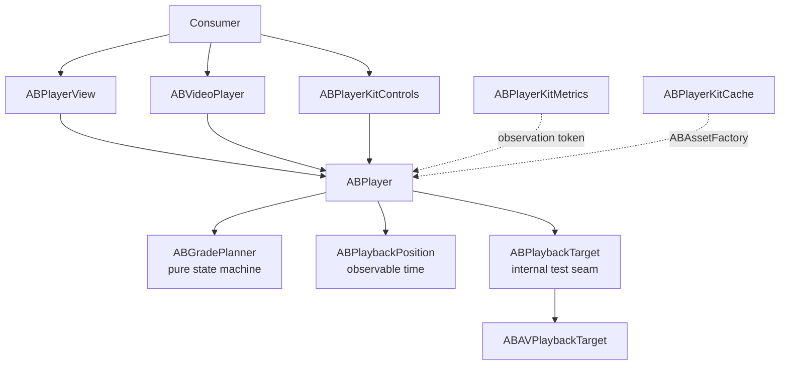

# How ABPlayerKit Is Built

Design notes for readers who want to know why the package looks the way it does. Using it needs none of this — start with the [README](../README.md).

## Why ABPlayerKit?

**Compared to `AVKit.VideoPlayer`** — AVKit gives you a player and system controls in one line, which is the right answer for a single video on a detail screen. It gives you no say over resource ownership, no way to prepare media before it appears, no styling beyond the system look, and no measurement hook. ABPlayerKit keeps the one-liner and adds all four.

**Compared to using `AVPlayer` directly** — you keep the same `AVPlayer` (it stays reachable as `player.avPlayer`), but stop hand-writing the parts that are easy to get subtly wrong: KVO on item status and layer readiness, item teardown ordering, audio-session activation shared across several players, background/foreground side effects, and the difference between "playback started" and "a frame is on screen."

**When you probably don't need it** — a single video, system controls, no preloading, no metrics. `AVKit.VideoPlayer` is less code and one less dependency.

This library deliberately stays thin. It does not abstract AVFoundation away, does not provide a queue or playlist model, and does not manage subtitle selection state — see [Design Rationale](#design-rationale).

## Design Highlights

The decisions worth reading the source for, each with where to verify it:

- **Observation is scoped to what changes.** Playback time lives in its own `@Observable` object, `player.position`, instead of on the player, so four ticks a second never re-evaluate a view that only reads `isPlaying`. It starts no periodic observer until something reads it. `ABPlaybackPositionTests` proves the invalidation boundary with `withObservationTracking`. → [Why a separate object](#why-is-the-playback-position-a-separate-object)
- **Resource ownership is a state machine, not a convention.** Four grades, with every transition planned by a pure function that has no AVFoundation import and is table-tested over all 16 pairs. Demotion re-applies the preload tuning, so it is the exact inverse of promotion. → [Grades and Preloading](https://appboong.github.io/ABPlayerKit/documentation/abplayerkit/choosinganownershipmodel/)
- **Process-wide resources are treated as process-wide.** `AVAudioSession` goes through one coordinator that snapshots the host app's session before the first player changes it, and restores it when the last player leaves. Background HLS downloads share the single `AVAssetDownloadURLSession` a session identifier allows, and one screen can't tear down another's downloads. Now Playing has exactly one owner at a time.
- **"Playing" and "a frame is on screen" are different events.** Time-to-first-frame ends only when `AVPlayerLayer.isReadyForDisplay` and `AVPlayerItem.status == .readyToPlay` are both true for the same item.
- **Tested on hardware, not only in CI.** A green suite of 743+ tests missed three AVFoundation defects: two were found on a device and one in review. The write-up covers why each test aimed at the bug still passed. → [Engineering Notes](ENGINEERING-NOTES.md)
- **The public API is held to a written policy.** Nothing is removed before 1.0; replacements ship first and the old API is deprecated. Overload resolution is pinned by tests that compile under warnings-as-errors, and the SwiftUI samples for each ownership step are compiled as tests. → [API Stability](#api-stability)

## Architecture

- UI and `ABPlayer` are `@MainActor` isolated.
- Grade planning and configuration are `Sendable` values.
- AVFoundation callbacks capture timing at the callback boundary, then hop to the main actor and revalidate item identity.
- Metrics and cache are optional products with independent ownership and failure modes.

## Design Rationale

### Why observers and tokens instead of a delegate or `AsyncStream`?

A single delegate slot would force application behavior and metrics to compete for ownership. Multiple observers allow both to attach independently, while `ABObservationToken` guarantees explicit cancellation and automatic cancellation on deinitialization. An `AsyncStream` would add fan-out, buffering/drop policy, backpressure, and `for await` task-lifetime decisions; its scheduling can also blur the callback-boundary timestamp that TTFF depends on. A stream can be added later without breaking the token API.

### Why is the playback position a separate object?

Observation tracks access per object and per property. If the position were a property of `ABPlayer`, every tick would mutate the object that every player-bound view is watching. As its own object, a tick invalidates only the views that read `position`. It is also equality-gated, so a paused player re-renders its readers only when the buffered range or duration changes. And it is created lazily, so a player that never reads `position` adds no periodic observer. `.periodicTime` events and the position share one `AVPlayer` periodic observer at the finer of their two intervals. The full reasoning is in [DESIGN-ABPlayerKit §5.4a](DESIGN-ABPlayerKit.md).

### Why no dependency-injection container?

The package uses initializer injection and `ABPlayerConfiguration`. A container would hide ownership and lifecycle in a library whose primary job is to make resource state visible.

### Why protocols only at test seams?

ABPlayerKit intentionally remains a thin AVFoundation wrapper. Protocols exist where substitution is valuable — playback target, asset factory, observer, metrics sink, and clock — while `avPlayer` and `avPlayerItem` remain available as escape hatches. This avoids an abstraction layer that merely renames AVFoundation.

The complete rationale is recorded in [DESIGN-ABPlayerKit](DESIGN-ABPlayerKit.md) and [DESIGN-OPEN-QUESTIONS](DESIGN-OPEN-QUESTIONS.md).

## API Stability

While this package is `0.x`, replacement APIs are always added additively and deprecated (never silently removed) in the same minor release, with at least one minor release of overlap before removal — nothing is removed before `1.0.0`. `ABPlayerEvent`/`ABPlayerError` stay non-exhaustive `enum`s for the same reason: consumer `switch` statements should include a `default` branch. The full policy is in [POLICY-api-stability](POLICY-api-stability.md), and every release is recorded in the [CHANGELOG](../CHANGELOG.md).
